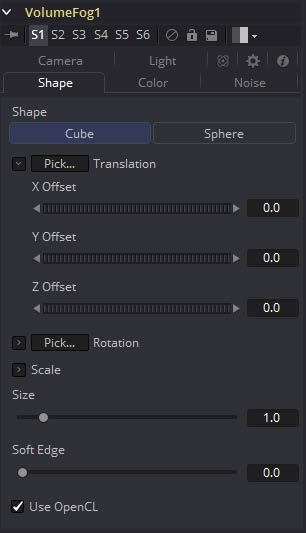
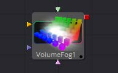
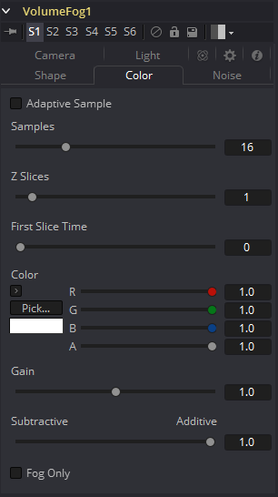
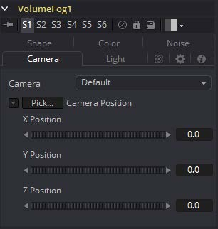
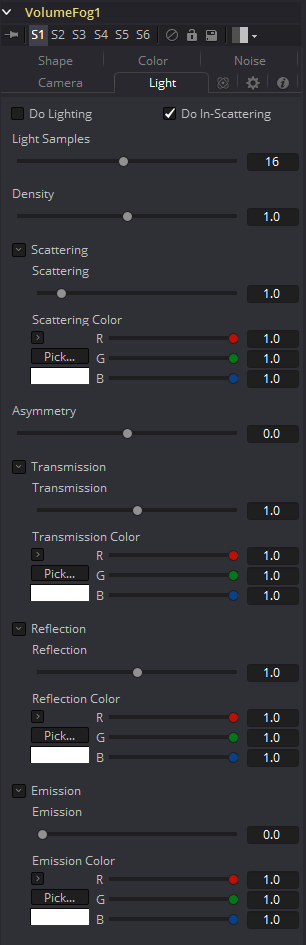
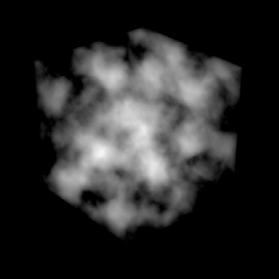
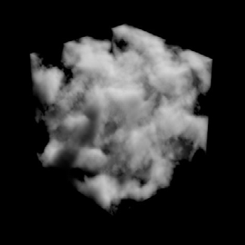
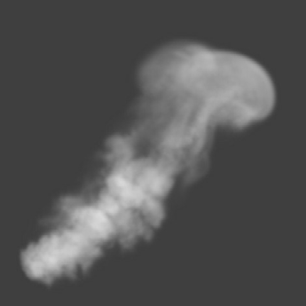
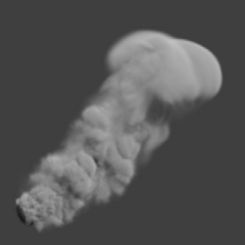
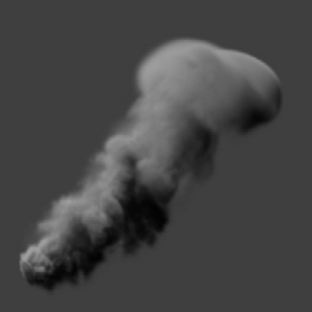

### Volume Fog [VlF]

Volume Fog工具用于在包含XYZ坐标通道的图像上创建复杂的体积雾。

与3D渲染的体积雾相反，它工作于3D图像并能在建立雾时给出快得多的结果和交互式反馈。关于该技术如何工作以及学习相关的图形学见“WPP概念 WPP Concepts”一节。

#### Shape Tab 形状选项卡

#### External Inputs 外部输入

下列输入出现在流程编辑器的工具块上。

- **VolumeFog.Image 图像：**[橙色，必需的]该输入需要一个在XYZ位置通道中包含World Position Pass的图像。
- **VolumeFog.FogImage 雾图像：**[绿色，可选的]用于创建可变深度和范围的体积雾，可将图像序列连接到此处。
- **VolumeFog.EffectMask 效果遮罩：**[蓝色，可选的]在其他Fusion工具中也可找到的标准效果遮罩。
- **VolumeFog.SceneInput 场景输入：**[粉色，可选的]该输入需要一个包含3D Camera的3D场景。

##### Shape 形状

在要放入你图像中的基础圆形或矩形体积中切换。这些体积也可通过后续MaskImage或MaskImage序列的方法来进一步优化。

##### Translation Pick 平移拾取

左键单击并拖动来从任何3D场景或包含XYZ值的图像（例如渲染的World Pass）中拾取，来定位体积物体的中心。

当从2D图像中拾取时，确保它是以32位浮点渲染的，来获取完整的精度。

##### X, Y, Z Offset X、Y、Z偏移

这些空间可以用于手动定位体积雾的中心或是用于添加动画或连接至Fusion中的其他工具。

##### Rotation Pick 旋转拾取

左键单击并拖动来从任何3D场景或包含XYZ值的图像（例如XYZ-Normal-Pass）中拾取，来重定向体积。

当从2D图像（例如XYZ-Normal-Pass）中拾取时，确保它是以32位浮点渲染的，来获取完整的精度和准确的旋转值。

##### X, Y, Z Rotation X、Y、Z旋转

使用该控件来绕它的中心旋转体积。

##### X, Y, Z Scale X、Y、Z缩放

在任何方向自它的中心缩放体积，来进一步优化在下面指定的整个Size值。

##### Size 大小

创建的体积的整个值。

##### Soft Edge 柔边

控制体积自它的周围向中心淡入多少来得到一个更柔化的外观。

##### Use OpenCL 使用OpenCL

与Fusion的OpenCL超级计算一起引入，这一选项使用GPU而不是CPU来渲染效果。取决于该电脑使用的图形卡，这可以至少提升该工具30倍或更多的速度。

#### Color Tab 色彩选项卡

##### Samples 采样

决定了一个射入体积“射线”在最终图像创建前将会被核算几次。与光追差不多，更高的值会产出体积中更多的细节，但也同时会增加渲染时间。

##### Z Slices Z切片

该值越高，越多来自连接MaskImage序列的图像将会被用于产生体积的深度。

例如，你可以使用带有高Seethe Rate的FastNoise来创建这样的图像序列。不过要小心图像的分辨率。较高的分辨率会需要非常大量的内存。作为一个经验法则，带有256Z Slice的256×256分辨率（即形成一个256×256×256的立方体积，这会使用多达256MB来创建全色彩浮点数据）会给你一个好的开始。

##### First Slice Time 第一个切片的时间

决定了Global Range中的哪一帧用于传递连接的MaskImage序列的第一个切片。

确保GlobalIn和GlobalOut以及源工具的有效范围都落在FirstSliceTime + Z Slices的范围内。

##### Color 颜色

允许你修改生成Fog的颜色。这会与由连接的MaskImage提供的任何颜色相乘。

##### Gain 增益

增加或减少创建的雾的密度。更多的增益会导致雾中有更强的发光和更少的透明度。更低的值位时雾看起来更稀疏。

##### Subtractive/Additive 减性/加性

与Merge工具中的类似，该值控制将雾合成进图像中应该使用加性还是减性模式，会导致雾的外观更明亮或更暗淡。

##### Fog Only 仅雾

输出黑背的生成的雾，来用于之后手动合成或用于Color Corrector的遮罩来进一步优化。

#### Camera Tab 摄像机选项卡

为了体积的完美核算，你可以连接一个摄像机或3D场景到该工具的场景输入中。

##### Camera 摄像机

如果连接的场景输入中有多个摄像机的话，这个下拉菜单会让用户选择用于核算体积的正确的摄像机。并不需要连接摄像机，位置值可以手动提供或通过将XYZ值连接到其他控件。

##### Translation Pick 平移拾取

左键单击并拖动来从任何3D场景或包含XYZ值的图像（例如渲染的World Pass）中拾取，来定位体积物体的中心。

当从2D图像中拾取时，确保它是以32位浮点渲染的，来获取完整的精度。

##### X, Y, Z Offset X、Y、Z偏移

这些空间可以用于手动定位体积雾的中心或是用于添加动画或连接至Fusion中的其他工具。

#### Light Tab 光照选项卡

要利用该特性，你需要在你的3D场景中有真实的光照。将包含摄像机和光照的那个场景连接到工具的3D输入上。

##### Do Light 执行光照

启用或禁用光照计算。记住当没有使用OpenCL时（即，使用CPU渲染时），这些计算会有一些小慢。

##### Do In-Scattering 执行入散射

启用或禁用光照散射计算。根据Do Light复选框的状态，体积仍会被照亮，但是不会表现任何散射。

##### Light Samples 光照样本

决定了光照的计算有多少精确。更高的值意味着更精确的计算，也会花费更多的时间。

##### Density 密度

这在使雾看起来更浓方面与Scattering有些相似。若Scattering的值较高，尽管光会从体积中散射，但是它还是有很多的机会穿过雾，这意味着它不会携带很多的透射颜色。而若是较高的Density的话，雾仍会看起来更浓，但是光只有一点机会来投射，因此它会在散射出去之前携带透射颜色。当Asymmetry不为0.0时，Scattering会受到光方向的影响。而Density就根本不会受到光方向的影响。

##### Scattering 散射

决定了有多少在体积周围反弹的光会以从雾中散射出去结束。如果光散射更多或更精确，那么就有更多的几率使光从雾中散射出去，因此更少的值会留下继续穿过雾。该选项可以使雾看起来更浓。

##### Asymmetry 不对称性

决定了光向哪个方向散射。值为0会产生一致、各向同性的散射，这意味着所有方向都拥有相同的几率。大于0的值会导致“前向散射”，意味着光会更多地向光线的方向散射。这与云中的雨滴发生的事有一些相像。小于0的值会产生“后向散射”，也就是光辉更多地向光源的方向散射。

##### Transmission 透射

定义透射过雾的颜色。没有从雾中散射出去的光会倾向于介意这一颜色。不过它只是一个乘数，所以如果你有红色的光而透射是蓝色的，那么你将不会看到任何蓝色。

##### Reflection 反射

更改散射出去的光的密度。它可以用于在Emission之前修改整体的颜色。这会与体积贴图的色彩通道结合并缩放值。色彩选项和体积贴图的色彩通道会被乘在一起，所以如果体积贴图是红色的，设置Reflection颜色选项为蓝色不会让结果变得一点点蓝色。在这种情况下，它们会被乘在一起产生黑色。

##### Emission 发射

这会向雾添加一点点“发光”，或者向计算加回能量/光实际上，如果场景中没有光的话且雾发射设置为1.0，那么结果将会与没有光照相似，就像关闭了Do Lighting选项一样。将Transmission设置为大于1可以在产生一个不同的外观的同时完成发光。不过呢，这永远也不会在现实时间中发生。

##### Examples 示例

在这些示例中我们从外部来看一个体积。在右侧你可以看到使用了直接卷积的VolumeFog的外观。也就是“Do Lighting”选项是关闭了的。

在右侧，你会看见开启了光照/散射并拥有单个点光源的相同体积。于是我们得到了有一些更加复杂的体积。

左侧的是使用了直接卷积，中间的使用了光照、散射和单个点光源，右侧的是移动了场景中的实际光照，这也会影响体积的外观。