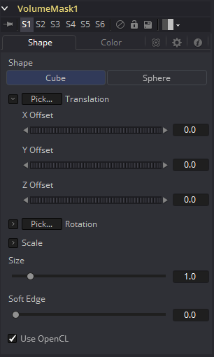
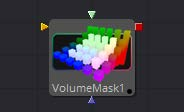
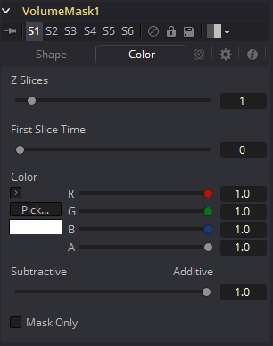

### Volume Mask [VlM] 体积遮罩

Volume Mask用于从包含XYZ位置通道的图像中创建体积遮罩。

举个例子，这可以用于在色彩校正中隔离物体而不需要跟踪或roto场景。关于该技术如何工作以及学习相关的图形学见“WPP概念 WPP Concepts”一节。

#### Shape Tab 形状选项卡

#### External Inputs 外部输入

下列输入会出现在流程编辑器中的工具块上。

- **VolumeMask.Image 图像：**[橙色，必需的]该输入需要一个XYZ位置通道中包含World Position Pass的图像。
- **VolumeMask.MaskImage 遮罩图像：**[绿色，可选的]为了优化遮罩，可以连接一个图像在此处。
- **VolumeMask.EffectMask 效果遮罩：**[蓝色，可选的在其他Fusion工具中也可找到的标准效果遮罩。
- **VolumeMask.SceneInput 场景输入：**[粉色，可选的]该输入需要一个包含3D Camera的3D场景。

##### Shape 形状

在要放入你图像中的基础圆形或矩形体积中切换。这些体积也可通过后续MaskImage或MaskImage序列的方法来进一步优化。

##### Translation Pick 平移拾取

左键单击并拖动来从任何3D场景或包含XYZ值的图像（例如渲染的World Pass）中拾取，来定位体积物体的中心。

当从2D图像中拾取时，确保它是以32位浮点渲染的，来获取完整的精度。

##### X, Y, Z Offset X、Y、Z偏移

这些空间可以用于手动定位体积雾的中心或是用于添加动画或连接至Fusion中的其他工具。

##### Rotation Pick 旋转拾取

左键单击并拖动来从任何3D场景或包含XYZ值的图像（例如XYZ-Normal-Pass）中拾取，来重定向体积。

当从2D图像（例如XYZ-Normal-Pass）中拾取时，确保它是以32位浮点渲染的，来获取完整的精度和准确的旋转值。

##### X, Y, Z Rotation X、Y、Z旋转

使用该控件来绕它的中心旋转体积。

##### X, Y, Z Scale X、Y、Z缩放

在任何方向自它的中心缩放体积，来进一步优化在下面指定的整个Size值。

##### Size 大小

创建的体积的整个值。

##### Soft Edge 柔边

控制体积自它的周围向中心淡入多少来得到一个更柔化的外观。

##### Use OpenCL 使用OpenCL

与Fusion的OpenCL超级计算一起引入，这一选项使用GPU而不是CPU来渲染效果。取决于该电脑使用的图形卡，这可以至少提升该工具30倍或更多的速度。

#### Color Tab 色彩选项卡

##### Samples 采样

决定了一个射入体积“射线”在最终图像创建前将会被核算几次。与光追差不多，更高的值会产出体积中更多的细节，但也同时会增加渲染时间。

##### Z Slices Z切片

该值越高，越多来自连接MaskImage序列的图像将会被用于产生体积的深度。

例如，你可以使用带有高Seethe Rate的FastNoise来创建这样的图像序列。不过要小心图像的分辨率。较高的分辨率会需要非常大量的内存。作为一个经验法则，带有256Z Slice的256×256分辨率（即形成一个256×256×256的立方体积，这会使用多达256MB来创建全色彩浮点数据）会给你一个好的开始。

##### First Slice Time 第一个切片的时间

决定了Global Range中的哪一帧用于传递连接的MaskImage序列的第一个切片。

确保GlobalIn和GlobalOut以及源工具的有效范围都落在FirstSliceTime + Z Slices的范围内。

##### Color 颜色

允许你修改生成Fog的颜色。这会与由连接的MaskImage提供的任何颜色相乘。

##### Gain 增益

增加或减少创建的雾的密度。更多的增益会导致雾中有更强的发光和更少的透明度。更低的值位时雾看起来更稀疏。

##### Subtractive/Additive 减性/加性

与Merge工具中的类似，该值控制将雾合成进图像中应该使用加性还是减性模式，会导致雾的外观更明亮或更暗淡。

##### Fog Only 仅雾

输出黑背的生成的雾，来用于之后手动合成或用于Color Corrector的遮罩来进一步优化。

