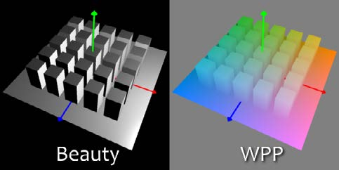
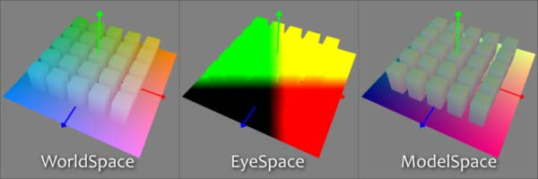
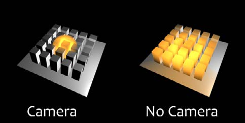
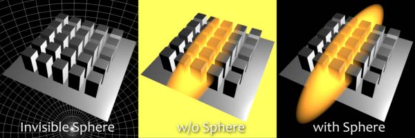

### **WPP Concept WPP概念**

Fusion中的位置工具为包含XYZ位置通道的场景提供了一种使用遮罩和体积工作的新方法。Z to WorldPos提供了从Z通道和3D摄像机信息中创建这些通道的选项。出于概述的原因，我们将使用WPP来指代World Position Pass。

#### What is a WPP？ WPP是什么？

WPP反映原始场景中的每个像素的XYZ通道为RGB色彩值。

所以如果原始场景中派生出像素的面位于0/0/0，那么结果像素会有0/0/0的RGB值，也就是黑色。如果上述的面在原始场景中位于1/0/0，那么救国像素将是全红色。当然如果我们面的坐标像是-60/75/123，那么像素也会同样有这些值。

如你在此处所见，由于3D场景可以拥有巨大的范围，所以WPP通道应当总是被渲染为32为浮点来提供我们所需求的准确。这幅图像展示了一个3D空间内中心位于0/0/0的场景的3D渲染和根据WPP。为了更好的视觉效果，WPP经过了归一处理。

#### Different Coordinate Spaces 不同的坐标空间

WPP可以渲染在不同的坐标空间中。这些包括World Space、Eye Space和Object Space。下方的这幅图像描绘了不同空间中的外观，尽管Fusion中的工具需要WPP渲染为World Space。

#### The Scene Input 场景输入

该工具提供了一个场景输入，它可以是3D Camera或包含摄像机的3D场景。摄像机是Z to WorldPos工具的关键，而Volume Mask、Volume Fog即使不用附加的摄像机或是将摄像机位置设置为0/0/0也可以一生成它们的输出。

然而，连接与渲染WPP的原始摄像机对齐的摄像机或手动设置摄像机位置，可以很大程度上改进准确度与结果雾或遮罩的外观。

#### The “Invisible Sphere” “不可见的球体”

到目前为止的示例场景都是空背景，也就是除了地面和立方体外没有别的东西了。

如果应用雾到比所说的地面还大的场景时，结果会看起来有些像下面所示的“w/o Sphere”那样，因为在地面外面没有WPP信息，结果将会是0/0/0，雾会同样填充这片区域。

为了解决这个问题，你可以向你的场景中添加一个不可见的边界球体来创建“虚拟的”WPP值，达到帮助Fog工具创建正确的体积的效果，如下面的“with Sphere”所示。

