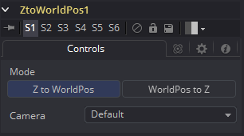

### Z To WorldPos [ZtW] Z至世界位置

Z to WorldPos工具用于从Z通道和3D摄像机中创建World Position Pass或是从World Position Pass和3D摄像机中创建Z通道。

当你的3D应用程序不支持创建WPP时，从Z深度通道中创建World Position Pass就会变得非常有用。

它也可以在3D跟踪软件输出每像素Z深度和3D摄像机时使用，因此，Volume Mask和Volume Fog可以用于实际场景。结果WPP的质量很大程度上取决于输入Z通道的质量。

关于该技术如何工作以及学习相关的图形学见“WPP概念 WPP Concepts”一节。

#### Controls 控件

#### External Inputs 外部输入

下列输入会出现在流程编辑器中的工具块上。

- **ZtoWorld.Image 图像：**[橙色，必需的]该输入需要一个XYZ位置通道中包含World Position Pass的图像。
- **ZtoWorld.EffectMask 效果遮罩：**[蓝色，可选的在其他Fusion工具中也可找到的标准效果遮罩。
- **ZtoWorld.SceneInput 场景输入：**[粉色，可选的]该输入需要一个包含3D Camera的3D场景。

##### Mode 模式

在从World Position Pass中创建Z通道或相反中切换。

##### Camera 摄像机

如果连接的场景输入中有多个摄像机的话，这个下拉菜单会让用户选择用于核算体积的正确的摄像机。
