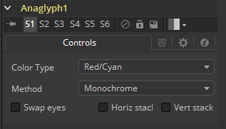
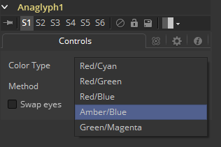
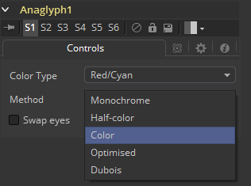
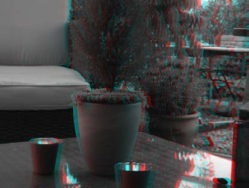
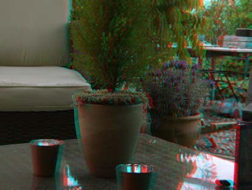
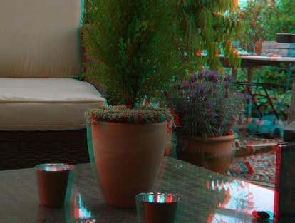
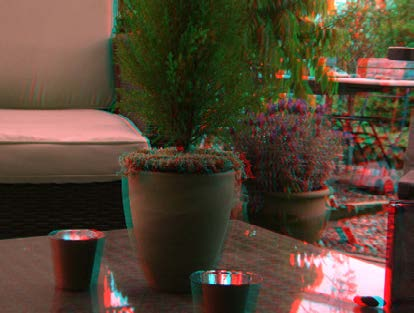
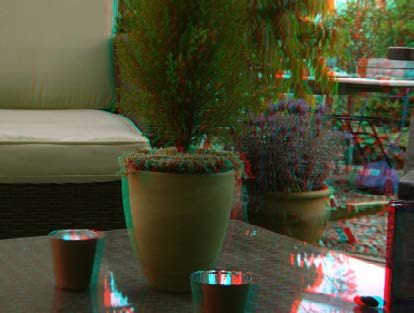

### Anaglyph [Ana]

Anaglyph工具用于通过结合分离左右眼的图像来创建立体图像。它总是用于立体工作流的结束来显示或递交最终结果。立体工具只在Fusion Studio中可用。

#### Controls 控件

当将分离的图像用于左眼和右眼时，左眼连接至橙色输入而右眼连接至工具的绿色输入。当使用水平或垂直的堆积的包含左右眼信息的图像时，只需连接至橙色输入。基于下面所要描述的一种方法，分离的图像会被结合起来创建一个立体的输出。

##### Color Type Menu 色彩属性菜单

Color Type菜单允许你在不同的色彩编码中选择来适配你偏好的显示设备。要匹配你的立体眼镜，你可用在Red/Cyan、Red/Green、Red/Blue、Amber/Blue和Green/Magenta编码之间选择，Red/Cyan时最常见的。

##### Method Menu 方法菜单

除用于编码图像的色彩外，你还可以选择五种哦那个不同的方法：Monochrome（单色）、Half-color（半色）、Color（彩色）、Optimized（优化）和Dubois。

- **Monochrome 单色：**左眼包含了左边图像的明度，而右眼包含了右边图像的明度（如左边图像的明度被放在Red通道中，而右边图像的明度被放在输出的Green和Blue通道中）。

- **Half-Color 半色：**左眼包含了左边图像的明度，而右眼包含了右边图像匹配该眼眼镜色彩的颜色通道（如左边图像的明度被放在Red通道中，而右边图像的Green和Blue通道被放在输出的Green和Blue通道中）。

  

- **Color 彩色：**左眼包含了左边图像匹配该眼眼镜色彩的颜色通道，右眼包含右边图像匹配该眼眼镜色彩的颜色通道（如左图像的Red通道被放在输出的Red通道中，而右侧图像的Green和Blue通道被放在输出的Green和Blue通道中）。

- **Optimized 优化：**例如，与red/cyan眼镜一起使用时，通过左眼显示的结果亮度会大于右眼的亮度。使用明度经典的ITU-R 601比例为指导，red的眼镜提供0.299的亮度，而cyan的眼镜提供0.587+0.114=0.701的亮度——两倍多亮。在亮度上两眼的差异会产生所谓的视网膜竞争或双眼竞争，这会破外立体效果。Optimized方法会使用与Color相同的方法生成右眼。左眼也会使用Green和Blue方法，但会结合增加的亮度来减轻视网膜竞争。因为它使用了内阁源图像中相同的两个通道，所以它不会重现其余通道（如，左边通道的1.05×的Green和0.45×的Blue通道会被放到输出的Red通道中，右边图像的Green和Blue通道被放在输出的Green和Blue通道中，而来自左右通道的Red通道都不会被使用）。

  

- **Dubois：**拥有不错饱和色彩的图像使用Half-Color、Color和Optimized方法时会产生视网膜竞争，因为该色彩只会在一只眼中可见。举个例子，带着red/cyan眼镜，饱和的绿色在red的眼镜中看起来是黑色的，而在cyan的眼镜中看起来时绿色的。Dubois方法使用了（尤其是）red/cyan眼镜和CRT（三硝基）荧光粉的光谱特性来产生更好的立体效果，最终趋于减轻由每只眼的色彩差异带来的视网膜竞争并同时趋于减轻一只眼“泄露”进另一只眼造成的重影。特定的计算矩阵是为red/cyan眼镜设计的且不适用于其他眼镜类型。因为它也派生自CRT色彩基色，所以它也许在普通的LCD上不会给出最好的结果（尽管相比于其他方法，它仍可能产生较少的视网膜竞争和重影）。

  

##### Swap Eyes 交换双眼

使得用户可以简易地交换左右眼的输入。

##### Horiz Stack 水平堆积

使用同时包含左右眼信息并将其水平堆积的图像。这类图像经常被称为“crosseyed（交叉眼）”或“straight stereo（直接立体）”。你只需连接一个图像至工具的橙色输入。它之后会创建原始输入宽度一半的图像，分别使用原始图像的左半边来创建左眼的和右半边来创建右眼的。色彩编码会在使用特定的颜色类型和方法时出现。

##### Vert Stack 垂直堆积

使用同时包含左右眼信息并将其垂直堆积的图像。你只需连接一个图像至工具的橙色输入。它之后会创建原始输入高度一半的图像，分别使用原始图像的下半边来创建左眼的和上半边来创建右眼的。色彩编码会在使用特定的颜色类型和方法时出现。

