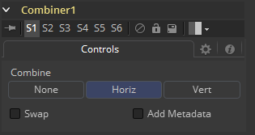

### Combiner [Com]

Combiner工具接受两个立体输入并创建包含左右眼的左右排列或上下排列的所谓堆积图像。立体工具只在Fusion Studio中可用。

#### Controls 控件

要堆积图像，左眼图像连接至橙色输入，而右眼图像连接至工具的绿色输入。

##### Combine 结合

- **None 无：**不执行任何运算。输出图像与左眼输入时完全一样的。
- **Horiz 水平：**两个图像会被水平堆积，也就是边挨边的，其中左眼输入的图像放在左边。这会导致输出图像是输入图像的两倍宽。
- **Vert 垂直：**两个图像会被垂直堆积，也就是上接下的，其中左眼输入的图像放在下边。这会导致输出图像是输入图像的两倍高。

##### Swap Eyes 交换双眼

使得用户可以简易地交换左右眼的输入。
