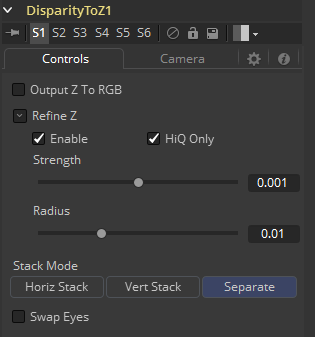
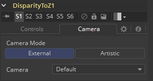
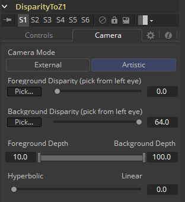

### Disparity To Z [D2Z]

Disparity To Z接受一个3D Camera和一个包含了Disparity通道的图像作为输入并输出相同的图像但是包含了一个新运算出的Z通道。立体工具只在Fusion Studio中可用。

该工具可以可选地输出Z为RGB通道。理想的话，无论是立体的Camera3D或是跟踪所得的立体摄像机都可用于Disparity To Z，然而，如果没有连接摄像机，那么该工具会提供一些艺术性控件来决定Z通道。该工具创建的深度可以用于类似雾或景深之类的后期效果。

产生的Z值会随着获取的值越大而越不正确。原因是当Z接近于负无穷时视差会接近于一个常量。所以Z=-1000和Z=-10000和Z=-100000也许会被映射到D=142. 4563、D=142. 4712和D=142. 471。如你所见，Z中10000到100000的差异在D中仅仅只有0.0001的差异。视差产生的贴图并不足够精确来制造这样的差异。

#### Inputs/Outputs 输入/输出

##### Left Input 左输入

连接左眼图像或堆积图像。

##### Right Input 右输入

连接右眼图像。该输入只在Stack Mode设置为Separate时才会可见。

##### Left Output 左输出

这会向左眼图像并添加一个新的Z通道，或Stacked Mode图像与一个新的Z通道。

##### Right Output 右输出

这会向右眼图像并添加一个新的Z通道。该输出只在Stack Mode设置为Separate时才会可见。

#### Controls 控件

##### Output Z To RGB 输出Z至RGB

除了在Z通道中输出Z值外，该选项还会提升色彩通道为float32并向色彩通道输出Z值为`{z, z, z, 1}`。该选项在想看一下Z通道长啥样的时很有用。注意三维空间中的Z值是负的，离摄像机越远负的越多，因此要正确地查看它们之前需要先浏览Normalization On。

不仅是将Z输出值相关联的辅助通道中，它们也会被复制至RGB通道以便任何Fusion的工具来做后续修改。

##### Refine Z 优化Z

该选项会优化基于RGB通道优化深度贴图。优化会导致光流中的边缘与色彩通道中的边缘对齐得更紧密。不利的一面是，色彩通道中不需要的细节也开始在光流中显示。你也许会想尝试使用此选项来减轻Z通道后期效果（例如景深或雾化）的粗糙边缘。

##### HiQ Only 仅HiQ

该选项仅在HiQ中处理。

##### Strength 强度

增加该滑块会执行两件事。它会平滑的恒定颜色区域中的深度，并会在移动Z通道中的边缘来于RGB通道中的边缘相关联。

增加该优化也会产生由色彩通道中的纹理出现在Z通道中而导致不期望的效果。你会想要在这两者之间找到平衡的。

##### Radius 半径

这是平滑算法的半径。

#### Camera tab 摄像机选项卡

如果你因为尝试匹配一个现存场景的效果而需要校正真实世界中的Z值，你应该使用External Camera选项来反求精确的Z值。如果你只是想要Z缓冲区而并不在意偏移和缩放的确切细节，或者没有可用的相机，那么Artistic选项会很有帮助。

##### External Mode 外部模式

在流程中会出现一个用于连接到现存立体Camera3D的输入。它可以是一个单独的立体Camera3D（即眼分离设置为非零），或通过*Camera3D > Stereo > RightCamera*输入连接在一起的一对（跟踪的）Camera3D。

##### Artistic Mode 艺术性模式

如果你没有摄像机，你可以调整这些控件来产生一个“艺术性的”Z通道，它的值也许是会让牛顿掀棺材板的，但仍会是非常有用的。要重建Disparity的Z曲线，为前景中的一个点和背景中的一个点选择`(D, Z)`值。

如果你觉得Artistic Mode有一点太过于“艺术性”，而你更想调整一些基于物理的参数（如收敛和眼分离），你可以创建一个虚假的Camera3D，将它连接至Disparity To Z的Camera输入，然后调整Camera3D的控件。

##### Foreground Disparity (pick from left eye) 前景视差（从左眼拾取）

这是最接近的前景对象的视差。它将映射到由Foreground Depth控件指定的深度值。视差超出`[ForegroundDisparity, BackgroundDisparity]`范围的所有对象的视差值都将被裁剪到此范围，这会导致Z通道中的区域变得平坦，因此，需确保你拾取的值足以包含实际视差范围的值。

##### Background Disparity (pick from left eye) 背景视差（从左眼拾取）

这是最接近的背景对象的视差。它将映射到由Foreground Depth控件指定的深度值。可以尝试将该对象作为负无穷处视差值的上限。该值应该用于左眼。右眼中对应的值也应该由相同的大小，但是为负。

##### Foreground Depth 前景深度

这是Foreground Disparity应该映射的深度。将其考虑为最近物体的深度。注意该值拥有负深度。

##### Background Depth 背景深度

这是Background Disparity应该映射的深度。将其考虑为最远物体的深度。

##### Falloff 衰减

Falloff控制了请求的前景和背景深度之间深度曲线的形状。当这是为Hyperbolic（双曲）时，视差深度会大致上表现得像`depth = constant/disparit`。当设置为Linear（线性）时，曲线会表现得像`depth = constant*disparity`。Hyperbolic会倾向于加大前景中的Z通道，而Linear会给前景/背景中的Z通道相同的权重。除非有什么特殊的原因，不然最好还是用Hyperbolic，因为它在物理上更加精确一些，而Linear不对应自然而纯粹是为了艺术性效果。