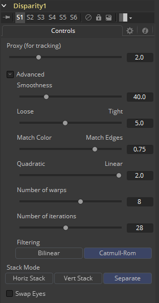

### Disparity [Dis]

立体工具只在Fusion Studio中可用。

Disparity生成在立体对中的左/右移。它还会在左/右图像之间生成垂直视差，该视差通常比水平视差小得多，并且理想情况下应为0以最小化观看不适感。在视图中查看Disparity工具的输出时，最好应通过X视差或Y视差的灰阶，而不是看将XY视差结合起来的Red/Green彩色图像来让人眼识别吃视差贴图中的质量/细节

生成的视差被存储在输出图像的Disparity辅助通道中，其中左图像包含了左>右视差而右图像保存了右>左视差。因为视差是基于匹配左眼和右眼的区域比较它们的颜色和色彩渐变来完成工作的，所以双眼颜色尽可能相似是十分必要的。因此，预先校正色彩是一个不错的选择。同样，裁剪掉帧周围的黑边也是一个不错的选择，因为这会混淆视差的追踪（如果使用Color Corrector的直方图匹配功能的画也会导致问题）。

在Stack模式中，左右输出会输出相同的图像。若左右图像拥有大于几个像素的互相的全局垂直偏移，那么如果你预先使用Transform工具将左右眼的特征大致对齐的话可以帮助视差追踪算法。当在左右眼之间右较大的垂直偏移时，小细节很有可能在追踪算法中丢失。

考虑使用Smooth Motion工具来平缓你的Disparity通道。这会有助于减轻扭曲眼睛时时间相关的闪烁。在运算视差前也思考以喜爱你是否想要移除镜头畸变。如果不想的话，你的Disparity贴图将会变成结合了Disparity和Lens Distortion的贴图。这有好处也有坏处。其中一个坏处是如果你之后做垂直对齐的的话，同时也会移除镜头畸变效果。当尝试减少运算时间时，首先调整Proxy和Number of Iterations滑块。

Disparity工具不支持RoI or DoD。

#### Inputs/Outputs 输入/输出

##### Left Input 左输入

连接左眼图像或堆积图像。

##### Right Input 右输入

连接右眼图像。该输入只在Stack Mode设置为Separate时才会可见。

##### Left Output 左输出

这会向左眼图像并添加一个新的Disparity通道，或Stacked Mode图像与一个新的Disparity通道。

##### Right Output 右输出

这会向右眼图像并添加一个新的Disparity通道。该输出只在Stack Mode设置为Separate时才会可见。

#### Controls 控件

##### Proxy (for tracking) 代理（追踪用）

输入图像会使用代理比例缩小，追踪来产生视差然后将结果视差重新放大。这一选项纯粹是为了加速视差的运算（比较慢）。运算时间大致上是与图像的像素数量成比例的。这意味着2的代理缩放就能给出4x的加速，而3的代理缩放能给出9x的加速。大体上来说，1：1的代理会给出最多细节的光流，但是要机制这是与噪声和胶片颗粒的数量是高度相关的，也就是如果它大量存在的话会完全消除2：1至1：1之间的任何颗粒，在一些情况下甚至会让事情变得更加糟糕（从某种意义上来说，你可以认为Proxy设置起到了消除噪声/颗粒的简化了的低通滤镜的作用）。

##### Stack Mode 堆积模式

决定了输入图像如何堆积。

当设置为Separate时，Right Input和Output会出现并分离需要连接的左右通道。

##### Swap Eyes 交换双眼

使用Stacked Mode时，图像立体对、左右眼图像可以被交换。

#### Advanced 高级

Advanced Controls部分拥有调整视差贴图的参数控件。默认设置是从多个不同的镜头的实验中筛选出来的 ，可以作为一个不错的标准。在大多数情况下，我们并不需要调整高级设置。

##### Smoothness 平滑度

这控制了视差的平滑度。更高的Smoothness会有助于处理噪声，而更低的Smoothness会引入更多细节。

##### Edges 边缘

该滑块是另一个控制平滑度的滑块，但是是基于颜色通道来应用平滑的。它会趋于拥有确定边缘如何跟随彩色图像中边缘的效果。设置为Loose时，视差会变得平滑并趋于超出边缘。设置为Tight，视差中的边缘会与彩色图像中的图像对齐地更紧密，而且来自颜色通道中的细节会开始滑入到视差中，而这通常是不被期望的。

一个粗略的准则：如果你使用视差来产生用于像景深等后期效果的Z通道，那么你需要尝试将它变得更紧密一些，但如果你使用视差来进行插值的话，你需要把它变得更松散一些。

通常，如果太紧的话，将视差用于插值时可能会出现边缘斑纹的问题。

##### Match Weight 匹配权重

这控制了如何匹配左边图像的邻近部分和右边图像的邻近部分。当设置为Match Color（匹配色彩）时，会匹配较大的构造色彩特征。当设置为Match Edge时，会匹配色彩上较小的突变。一般来说，该滑块较合适的值应该在[0.7, 0.9]范围内，尽管在一些镜头上值接近于0.0时也能正常工作。将该选项设置得更高会趋于提升根据平滑变化的阴影或局部光照变化而导致的左右图像的差别匹配质量。用户仍应在初始的图像上执行Match Color，使它们尽可能相似。该选项通常会有助于局部变化（如由于光穿过镜架产生的光照差异）。

##### Mismatch Penalty 不匹配惩罚

这控制了不匹配的区域变得越来越不相似的惩罚。滑块可以在Quadratic（二次）和Linear（线性）惩罚之间进行选择。Quadratic极大地惩罚了较大的差异，而Linear对于不相似的匹配则更具健壮性。将此滑块移向Quadratic时，往往会产生差异，并且其中的随机变化较小，而Linear可产生更平滑、更悦目的结果。

##### Number of Warps 扭曲数量

关闭该选项会使视差运算变得更快。实际上，运算时间是与该选项线性相关的。要理解该选项做了什么，你需要理解Disparity算法是如何逐步扭曲左边图像直至匹配右边的图像。在一些点后就达到了收敛，而额外的那些扭曲只是纯粹浪费时间罢了。Fusion中的默认值设置得足够高所以总是能达到收敛。所以你可以修改该值来加速运算，但最好还是观察视差同时在质量上的降低。

##### Number of Iterations 迭代数量

关闭该选项会使视差运算变得更快。实际上，运算时间是与该选项线性相关的。就像调整Number of Warps一样，一定程度之后调高该选项会得到更差的收益而不会产生显著更好的结果。默认地，该值应该是足够在所有可能的镜头中收敛并可以合适地调整低一些而通常不会降低视差效果。

##### Filtering 滤镜

这控制了光流生成中是否使用Filtering运算。Catmull-Rom滤镜会乘胜更好的结果，但与此同时，开启Catmull-Rom会非常显著的增加运算时间。