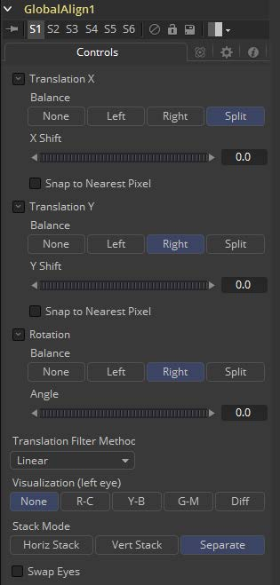

### Global Align [GA]

与Stereo Align相反，该工具根本不利用光流。它的目的是使用快速且便捷的方法来为X和Y以及旋转做一些简单的立体对齐。立体工具只在Fusion Studio中可用。

Global Align在工具链的开始时可用于计算Disparity之前在视觉上校正左右眼之间的主要差异。

手动校正左右眼之间的较大差异以及应用初始色彩匹配会有助于Disparity生成更精确的结果。

#### Controls 控件

##### Translation X and Y 平移X和Y

##### Balance

决定了全局偏移如何应用至立体场景中。

- **None 无：**不应用平移。
- **Left Only 仅左眼：**移动左眼而右眼保持未改动。
- **Right Only 仅右眼：**移动右眼而左眼保持未改动。
- **Split Both 拆分两者：**左眼和右眼都项反方向移动。

##### Snap to Nearest Pixel 吸附至最近的像素

调整平移滑块时，该选项可确保仅以全像素量移动图像来保持最佳质量。这避免了图像的亚像素渲染，这可能导致细微的模糊。

##### Rotation

##### Balance

决定了全局偏移如何应用至立体场景中。

- **None 无：**不应用旋转。
- **Left Only 仅左眼：**旋转左眼而右眼保持未改动。
- **Right Only 仅右眼：**旋转右眼而左眼保持未改动。
- **Split Both 拆分两者：**左眼和右眼都项反方向旋转。

##### Angle 角度

旋转的角度。记住该结果取决于Balance设置。如果仅旋转一只眼睛，比如说10度，则对该眼睛应用完整的10度旋转。

当使用Split模式来应用旋转时，一个眼镜会接收到-5度的旋转而另一支眼5度的旋转。

##### Translation Filter Mode 旋转滤镜模式

一个下拉菜单，用于选择根据你的镜头内容递交最佳结果的滤镜模式。

##### Visualization 可视化

此控件允许左右眼使用不同的色彩编码，以便检查上述控件的结果，而无需添加额外的Anaglyph或Combiner工具。

最终输出时应将它设置为None。

##### Stack Mode 堆积模式

决定了输入图像如何堆积。

当设置为Separate时，右输入和输出会出现，此时需要连接分离的左右眼图像。