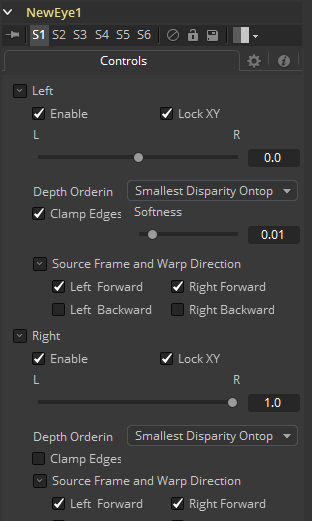
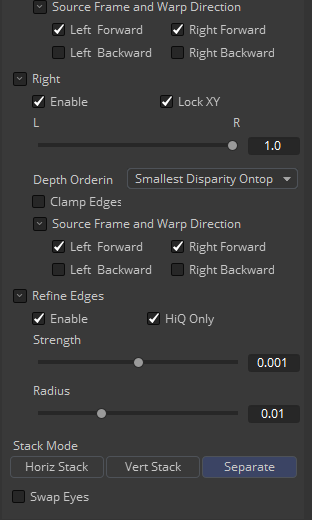

### New Eye [NE]

该选项通过使用内嵌的Disparity通道向现存的双眼直接插值来构建一个新的眼睛。该工具也可用于将一个视图替换为另一视图的变形版本。在Stack Mode中，L和R输出会输出相同的图像。立体工具只在Fusion Studio中可用。

你可以将左眼映射至右眼并替换它。这会有助于在帧的某些区域移除错误。

New Eye不会为辅助通道插值，反而会破坏它。实际上，Disparity通道被消耗/破坏了。如果你想为重对齐的镜头生成Disparity，就在New Eye工具之后再添加一个Diaparity工具。

#### Inputs/Outputs 输入/输出

##### Left Input 左输入

连接左眼图像或堆积图像。

##### Right Input 右输入

连接右眼图像。该输入只在Stack Mode设置为Separate时才会可见。

##### Left Output 左输出

这会向左眼图像并添加一个新的Disparity通道，或Stacked Mode图像与一个新的Disparity通道。

##### Right Output 右输出

这会向右眼图像并添加一个新的Disparity通道。该输出只在Stack Mode设置为Separate时才会可见。

#### Controls 控件

##### Enable 启用

当启用一只眼镜时，New Eye将使用一只插值的眼镜来替换它。例如，如果左眼是你的“主”眼且你在重新创建右眼，你会需要禁用左眼并启用右眼。

##### Lock XY 锁定XY

锁定X和Y插值参数。将它们解锁后你可以俄日X和Y视差提供分离的插值因数。例如，如果你工作于右眼并将X Interpolation滑块设置为1.0，Y Interpolation设置为-1.0，那么就可以有效地将左眼插值到右眼，但是与左眼垂直对齐的。

##### Interpolation 插值

Interpolation确定了我们要插值的帧相对于两个源帧（左和右）的位置。插值参数为-1.0将使帧靠近左，而参数1.0将使帧靠近右。参数0.0的结果介于左和右之间。

##### Depth Ordering 深度顺序

Depth Ordering用于确定再图像的哪一部分应该被渲染于顶层。当变形图像时，总是会出现重叠的情况。当图像于自身重叠时，有两个选项会用于确定哪个被绘制再顶层。

- **Largest Disparity Ontop 最大的视差位于顶部：**在图像重叠部分处，最大的视差值会被渲染在顶部。
- **Smallest Disparity Ontop 最小的视差值位于顶部：**在图像重叠部分处，最小的视差值会被渲染在顶部。

##### Clamp Edges 夹拢边缘

在特定的情形下，该选项可用于移除可能出现在插值帧的边缘处的透明间隔。Clamp Edges会导致在帧边缘有一种拉伸的伪影，尤其在物体移动过它或摄像机移动时特别显眼。

由于这些伪影，最好还是只使用Clamp Edges来校正插值帧边缘的小间隔。

##### Softness 柔度

帮助减轻可能由Clamp Edges引入的拉伸痕迹。

如果你拥有不止一个开启的Source Frame和Warp Direction复选框，这可能会导致加重边缘处的拉伸效果。在这种情况下你会想要将柔度保持在0.01左右的较小值。如果你只启用了一个复选框那么你可以使用0.03左右的较大值。

##### Source Frame and Warp Direction 源帧和变形方向

该工具的输出通过结合四个不同的变形来生成。你可以选择使用来自左或右帧的色彩值与前向（左>右）视差或反向（右>左）视差结合。又是你会想要替换掉现有的一只眼睛。例如，如果你想要重新生成右眼，你会只使用左眼变形。

建议尝试各种选项来查看哪一个提供了最佳的效果。同时使用左右眼可以帮助填补图像左右两侧的间隔。同时使用Forward/Backward视差可以在视差彼此不同的地方加深效果。

- **Left Forward 左前向：**这会接受左帧并使用前向视差来插值新帧。
- **Right Forward 左前向：**这会接受右帧并使用反向视差来插值新帧。
- **Left Backward 左反向：**这会接受左帧并使用前向视差来插值新帧。
- **Right Backward 左反向：**这会接受右帧并使用反向视差来插值新帧。