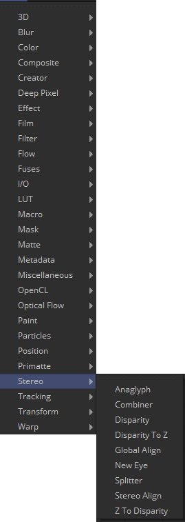

## 第二十六章 Stereo Tools 立体工具

- [Anaglyph [Ana]](./Anaglyph%20[Ana].md) 
- [Combiner [Com]](./Combiner%20[Com].md) 
- [Disparity [Dis]](./Disparity%20[Dis].md) 
- [Disparity To Z [D2Z]](./Disparity%20To%20Z%20[D2Z].md) 
- [Global Align [GA]](./Global%20Align%20[GA].md) 
- [New Eye [NE]](./New%20Eye%20[NE].md) 
- [Splitter [Spl]](./Splitter%20[Spl].md) 
- [Stereo Align [SA]](./Stereo%20Align%20[SA].md)
- [Z To Disparity [Z2D]](./Z%20To%20Disparity%20[Z2D].md)  

<table id="img">
  <tr>
	<td rowspan="5"></td>
    <td></td>
    <td></td>
  </tr>
  <tr>
    <td></td>
    <td></td>
  </tr>
  <tr>
    <td></td>
    <td></td>
  </tr>
  <tr>
    <td></td>
    <td></td>
  </tr>
  <tr>
    <td></td>
  </tr>
</table>

