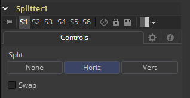

### Splitter [Spl]

Splitter接受堆积的输入图像，例如使用Combiner创建的，并提供两个输出图像：一个左眼和一个右眼。立体工具只在Fusion Studio中可用。

#### Controls 控件

##### Split 拆分

- **None 无：**不会执行任何运算。两个输出图像都是与输入图像一样的。
- **Horiz 水平：**该工具需要输入一个水平堆积的图像。这会导致两个输出图像，每一个的宽度都是输入图像的一半。
- **Vert 垂直：**该工具需要输入一个垂直堆积的图像。这会导致两个输出图像，每一个的高度都是输入图像的一半。

##### Swap Eyes 交换双眼

使得用户可以简易地交换左右眼的输入。