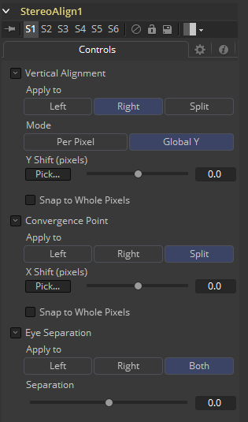
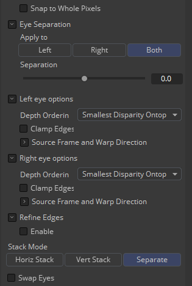
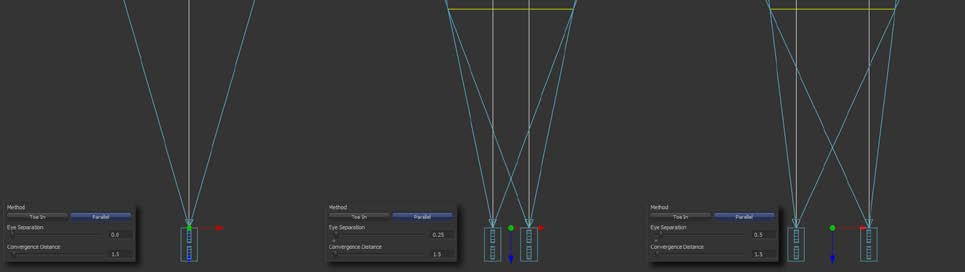
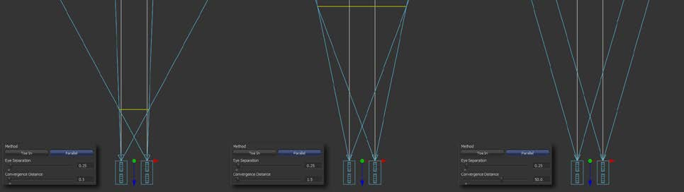

### Stereo Align [SA]

这个功能非常强大的工具，可解决一些可用于下列任意操作或其组合来解决的立体问题：

- 一个眼睛与另一个眼睛的垂直对齐
- 改变收敛点
- 改变眼分离

通过在一个工具中结合这些操作，你可以执行它们而只需单次图像重采样。本质上讲，可以将该工具当作对视差应用缩放和平移，然后使用修改后的视差在视图之间进行插值。

改变眼分离可能会导致出现很多可能无法填补的孔，因为所需信息可能不在任何一张图像中。即使信息存在，视差也可能无法与孔匹配。你可能需要手动填补这些孔。目前，此工具只会修改RGBA通道。

Stero Align不会为辅助通道插值，反而会破坏它。实际上，Disparity通道被消耗/破坏了。如果你想为重对齐的镜头生成Disparity，就在Stero Align工具之后再添加一个Diaparity工具。

#### Inputs/Outputs 输入/输出

##### Left Input 左输入

连接左眼图像或堆积图像。

##### Right Input 右输入

连接右眼图像。该输入只在Stack Mode设置为Separate时才会可见。

##### Left Output 左输出

这会向左眼图像并添加一个新的Disparity通道，或Stacked Mode图像与一个新的Disparity通道。

##### Right Output 右输出

#### Controls 控件

##### Vertical Alignment 垂直对齐

此选项确定垂直对齐如何在双眼之间拆分。通常，左眼被声明为弯曲的而右眼与之对齐，以避免重采样伪像。

它可能会有助于进行每像素垂直对齐时，视差计算前通过全局Y位移的粗略预对齐图像，因为视差生成算法可能会遇到解决移动距离较大的小对象的问题。

同时注意你必须得关注镜头畸变，因为即使两台摄像机完全垂直对齐，由于镜头畸变它们仍然会有垂直差异。在运算Disparity之前，最好先来移除镜头畸变，因为通过在右眼执行垂直对齐实际上是移除了右眼的镜头畸变的Y分量，所以以后当你重新畸变时看起来会出错。

##### Apply To 应用至

- **Right 右：**仅调整右眼。
- **Left 左：**仅调整左眼。
- **Both 两者：**在左右眼之间均匀地拆分垂直对齐。

##### Mode 模式

- **Global 全局：**通过Y位移将眼睛简单地向上或向下平移来对齐。
- **Per Pixel 每像素：**眼睛通过Disparity来逐像素变形。记住这可能会引入和采样伪像和边缘伪像。

##### Y-shift Y位移

Y-shift只在Global模式中可用。您可以手动调整Y-shift来匹配或拖动从左眼的Disparity通道进行拾取的拾取按钮。同时要记住，如果使用此工具修改视差，那么无法从该工具的输出中进行拾取。

##### Snap to Whole Pixels 吸附至完整像素

你可以使用该选项将全局偏移吸附至完整像素。在该模式下，不会对图像进行重采样，而是进行了简单的位移，因此不会出现柔化或图像质量下降的情况。

##### Convergence Point 收敛点

Convergence只是L/R图像的全局X平移。

##### Apply To 应用至

这确定了哪些眼睛会受收敛的影响。在大多数情况下，这将设置为Both。若设置为Both，则收敛将在两只眼睛之间共享50-50。共享两只眼睛之间的收敛点意味着每只眼睛的偏移量为一半，这又意味着需要在以后修复的较小洞和伪像。折衷方案是您现在已经对两只眼睛进行了重采样，而不是只留一只眼睛作为纯粹的参考。

##### X-shift X位移

可以从Disparity通道中选取X-shift，来方便点到特征的对齐。

##### Snap to Whole Pixels 吸附至完整像素

你可以使用该选项将全局偏移吸附至完整像素。在该模式下，不会对图像进行重采样，而是进行了简单的位移，因此不会出现柔化或图像质量下降的情况。

##### Eye Separation 眼分离

Eye Separation改变了左右眼之间的距离，导致左右眼中的物体收敛或分离，具体取决于它们与摄像机之间的距离。

这与Camera3D中的Eye Separation有着相同的效果。

##### Separation 分离

这是用于眼分离的缩放因子。

- 当设置为0.0时，这会保持眼不受改变。
- 设置为0.1会每只眼以10%的因子增加场景中所有物体的位移。
- 设置为0.1会缩放所有物体的位移小10%。

与Vertical Alignment中在两只眼睛之间将对齐效果拆分为50-50的Split选项不同，Both选项将对两只眼睛同时应用100-100的眼睛分离。如果要改变眼分离，则最好启用每像素的垂直对齐，否则两个帧的插值结果可能会加倍。

##### Stack Mode 堆积模式

在Stack Mode中，L和R输出会输出相同的图像。

如果关闭了HiQ，插值会使用最近的邻近采样，从而导致更加“杂乱的”结果。

##### Clamp Edges 夹拢边缘

在特定的情形下，该选项可用于移除可能出现在插值帧的边缘处的透明间隔。Clamp Edges会导致在帧边缘有一种拉伸的伪影，尤其在物体移动过它或摄像机移动时特别显眼。

由于这些伪影，最好还是只使用Clamp Edges来校正插值帧边缘的小间隔。

##### Softness 柔度

帮助减轻可能由Clamp Edges引入的拉伸痕迹。

如果你拥有不止一个开启的Source Frame和Warp Direction复选框，这可能会导致加重边缘处的拉伸效果。在这种情况下你会想要将柔度保持在0.01左右的较小值。如果你只启用了一个复选框那么你可以使用0.03左右的较大值。

#### Example 示例

Eye Separation的不同设置：

以及Convergence的：

