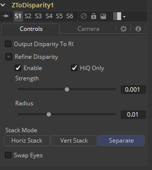
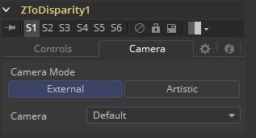
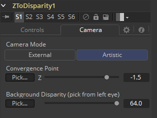

### Z To Disparity [Z2D]

Z To Disparity接受一个3D Camera和一个包含了Z通道的图像作为输入并输出相同的图像但是包含了一个新的Disparity通道。这有助于从CG渲染器中构建Disparity贴图，这会比从Disparity工具生成工具中创建的更精确。立体工具只在Fusion Studio中可用。

#### Inputs/Outputs 输入/输出

##### Left Input 左输入

连接左眼图像或堆积图像。

##### Right Input 右输入

连接右眼图像。该输入只在Stack Mode设置为Separate时才会可见。

##### Left Output 左输出

这会向左眼图像并添加一个新的Z通道，或Stacked Mode图像与一个新的Z通道。

##### Right Output 右输出

这会向右眼图像并添加一个新的Z通道。该输出只在Stack Mode设置为Separate时才会可见。

#### Controls 控件

##### Output Disparity To RGB 输出Disparity至RGB

除了将视差值输出至Disparity通道之外，该选项还会导致Z To Disparity将视差值输出至色彩通道为`{x, y, 0, 1}`。启用时，该选项还会自动提升RGBA色彩通道至float32。该选项在想看一下Z通道长啥样的时很有用。

##### Refine Disparity 优化Disparity

这会基于RGB通道优化Disparity贴图。

##### Strength 强度

增加该滑块会执行两件事。它会平滑的恒定颜色区域中的深度，并会在移动Z通道中的边缘来于RGB通道中的边缘相关联。

增加该优化也会产生由色彩通道中的纹理出现在Z通道中而导致不期望的效果。你会想要在这两者之间找到平衡的。

##### Radius 半径

这是平滑算法的半径。

#### Camera tab 摄像机选项卡

如果你因为尝试匹配一个现存场景的效果而需要校正真实世界中的视差值，你应该使用External Camera选项来反求精确的视差值。如果你只是想要视差而并不在意偏移和缩放的确切细节，或者没有可用的相机，那么Artistic选项会很有帮助。

##### External Mode 外部模式

在流程中会出现一个用于连接到现存立体Camera3D的输入，并使用Camera设置来决定Disparity设置。

##### Artistic Mode 艺术性模式

如果你没有摄像机，你可以调整这些控件来产生一个“艺术性的”Z通道，它的值也许是会让牛顿掀棺材板的，但对于一些合成技巧来说时非常好的。它有两个控件可供调整：

##### Convergence Point 收敛点

这是收敛平面的Z值。这对应了在Camera 3D工具中出现的Convergence Point控件的负值。在这一距离上，左右眼中的物体恰好位于同一位置上（即，没有视差）。更近的物体会从屏幕中弹出来，而更远的物体会出现在屏幕后面。

##### Background Disparity (pick from left eye) 背景视差（从左眼拾取）

这是最接近的背景对象的视差。它将映射到由Foreground Depth控件指定的深度值。可以尝试将该对象作为负无穷处视差值的上限。该值应该用于左眼。右眼中对应的值也应该由相同的大小，但是为负。