### Camera Tracker [CTra] 摄像机跟踪器

摄像机跟踪是一种匹配运动而且是2D和3D之间关键的联系，允许合成者将3D渲染集成到现实拍摄的实景当中。Camera Tracker工具就是用于计算现实拍摄摄像机的路径并生成一个3D空间中的一个虚拟摄像机。该虚拟摄像机的运动应该是要与拍摄场景的实际的摄像机的运动一致。使用计算出的虚拟摄像机的位置和移动可以时添加3D元素到实景中灵活多变。Camera Tracker还会创建3D空间中的点云，用于对齐物体和其他3D模型至实景中。

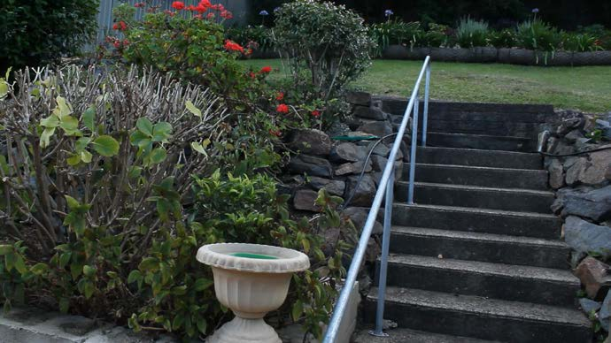

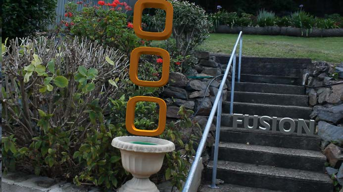

#### How It Works? 它是如何工作的？

Camera Tracker是一个工具中集成了完整的工作流程。通过跟踪摄像机在场景中运动的帧可以重建位置的3D环境和摄像机的运动。为此，轨迹必须是具有固定参考的帧中的跟踪特征的场景。需要从跟踪器中遮罩划出移动的物体或人以获得良好的反求，因为这些错误的轨迹会在反求虚拟摄像机时会导致不准确。反求虚拟摄像机时，提供某些其他信息很有帮助，例如相机传感器尺寸、镜头焦距以及已知跟踪标记的测量距离。这将有助于引导反求器生成更精确的3D摄像机和点云。

Camera Tracker的任务是创建添加动画的3D摄影机和场景的点云。要生成相机，相机跟踪的基本方法有两个步骤。跟踪是对场景的分析，而反求是计算虚拟摄像机和点云。一旦采取了这些步骤，就可以从该工具中导出添加了动画的摄像机。

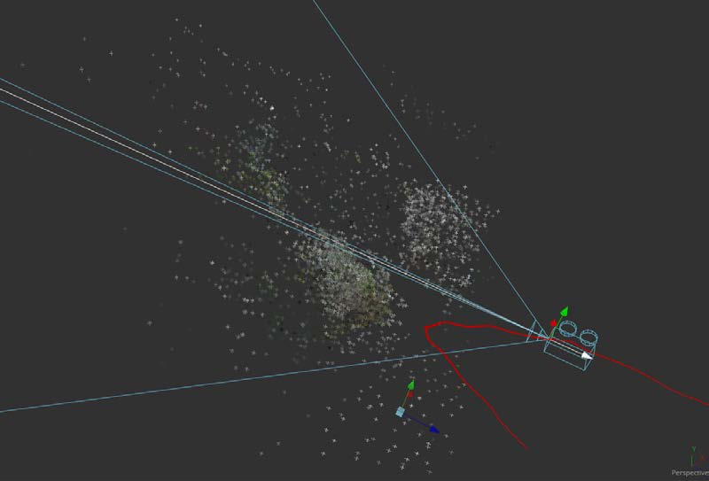

在Camera Tracker工具中有五个选项卡：Track、Camera、Solve、Export和Options。要定义要跟踪图像序列的工作流程，设置基本的摄像机参数，反求，然后导出3D虚拟摄像机和点云。每个选项卡部分的顶部按钮时运算的处理，可以触发每个处理的动作。

##### Track 跟踪

Track是用于描述观察或分析镜头的任务的术语。Camera Tracker工具需要先考虑源素材的移动，然后才能确定虚拟摄像机的位置和移动。 为此，该工具会搜索特征（即镜头中的高对比度图案），并自动为这些特征分配跟踪器。跟踪点遍布整个场景中将产生最佳的跟踪效果，而如Minimum Feature Separation等调整控件将有助于在场景中填充更多的点。建议在跟踪场景时避免特征位于移动物体上或由不同深度的视差差异引起的特征。

避免出现这些问题区域的一种方法是画遮罩。将遮罩应用于Camera Tracker将隔离它可以分析的场景区域。例如，假设用移动摄像机拍摄的一些镜头的主体站在需要进行摄像机跟踪绿色屏幕前。将一个遮罩应用于对象，将该遮罩反转（即对象为黑色，环境为白色），并将其附加到Camera Tracker的Track Mask输入。这样，该工具将在遮罩区域内而不是对象上寻找特征。或者，可以从查看器中选择并删除轨迹。

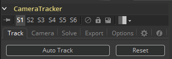

##### Camera 摄像机

这部分是设置如胶片门尺寸、焦距和镜头畸变等参数的摄像机基本设置的地方。如果不知道实际上的值，那猜一猜也是不错的。反求器会尝试寻找在这些参数赴京的摄像机，所给的参数尽可能地接近现实拍摄会有助于反求器的运算。

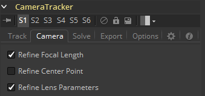

##### Solve 反求

反求是工具使用现存的轨迹并从中计算实际拍摄摄像机的运动。从用户的视角来看，反求应该呗认为是用户不断执行的反复处理：

1. 运行反求器。
2. 删除糟糕的轨迹并/或调整初始在Camera选项卡中猜测的内容。

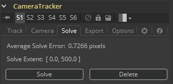

重复这些步骤直至反求出的相机运动路径足够好。有时最开始的第一次反求就已经足够好了。但很多时候需要花费好几个小时来清理轨迹来获取较好的反求，甚至一些时候根本无法完成。有了经验之后，就会很容易地感觉到应该删除或保留哪些轨迹，哪些镜头容易、困难或根本无法反求。注意删除过多轨迹之后也会导致反求质量下降，由于反求器会得到过少的信息来工作。实际上，如果任何帧上的轨迹如果小于八个，那么在数学上就没有足够的信息来反求镜头，不过还是强烈建议使用多于8个轨迹来获取健壮并准确的反求。

不熟悉摄像机跟踪器的用户可能会很想尝试直接编辑最终摄像机的3D样条曲线，来改善反求出的摄像机的运动路径。相反，你应该将此选项用作绝对的最后选择，而最好修改输入到反求器中的2D轨迹。

通过显示覆盖在实际拍摄镜头上的轨迹，可以清理错误的轨迹。在Options选项卡下，可以延长这些轨迹的长度来显示更多路径。也可以单独选择轨迹或将其选中，然后使用Delete按钮将其删除。了解错误的轨迹是什么样子并将轨迹数据清除为一组精确的清晰轨迹将产生更准确的反求。

总而言之，清理轨迹的时候，<b>保留完全由实际拍摄的摄像机的运动决定的2D轨迹</b>。在移动物体或人上的跟踪和存在视差问题的轨迹则需要被删除。反射窗户或水以及有高光在表面上移动的轨迹也同样要被清理掉。不能很好得跟随某特征的轨迹以及跟踪了由于前景和背景层叠加而产生的虚假的幻影角落的轨迹也应一并删除。同时也要考虑删除反求器在错误Z深度处重建的定位器所对应的轨迹。

删除轨道时，最好注意当前的“Average Solve Error 平均反求错误”，然后重新运行反求器，并注意更改是增加还是减少了平均反求错误。除了查看平均反求错误来判断相机求解的质量外，还可以：

- 观察3D视图中的摄像机轨迹来看它是否包含了预料之外的跳跃、间断或抖动。
- 浏览3D点云中的定位器的3D视图中的摄像机，来发哈看它们是否好好地吸附在了实际拍摄的镜头中。

Solve选项卡上的过滤器可用于根据轨迹长度、轨道错误和反求错误来删除轨迹。这些可用于快速删除效果不佳可能会误导结果摄像机的轨迹，从而留下一组简单的准确轨迹。

为了使反求器准确地三角化并重建摄像机和点云，重要的是：

- 在不同深度的对象之间的轨迹保持了良好的平衡，在远处的背景或天空中没有太多的轨迹（这些轨迹不会为反求器提供任何其他的透视信息）。
- 轨迹均匀分布在图像上，并没有高度聚集在一些物体或图像的一侧。
- 轨迹的开始和结束时间错开，同一帧中没有太多轨迹结束。

如果某些镜头没有足够的相机运动来对特征位置进行三角化特征位置，则无法以任何有用的精度进行重建。要确保镜头可以被摄像机跟踪，首先要正确使用的轨迹标记，并确保摄像机移动具有足够的视角以使反求器能够“锁上”。

提供准确的实际拍摄摄影机信息（如焦距和胶卷门尺寸）非常重要，这可以大大提高摄影机反求的精度。 例如，如果提供的焦距与正确的物理值相距太远，则反求器可能无法收敛，从而导致无用的反求。

##### Export 导出

导出之前，最好将Fusion 3D环境中的虚拟地平面与实际拍摄的镜头中的物理地平面对齐。Camera Tracker提供了各种平移、旋转和缩放控件来完成此操作。通过选择屏幕上的跟踪点，地平面可以与这些点以及旋转对齐。通过使用两个已知距离的点，可以设置场景的比例。

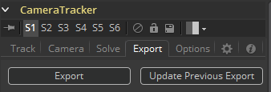

> **注意：**Camera Tracker将其所有2D轨迹保存到合成中，有时这会在磁盘上产生相当大的文件。如果远景中的2D轨道过多，则保存的合成甚至可能会超过1GB。在某些情况下，这会使包含Camera Tracker工具的合成难以加载和使用。虽然可以通过3D输出的摄像机直接使用Camera Tracker工具，但是，如果反求的质量足以令人满意了，则可以考虑使用Export功能来拍摄“低内存”快照，该快照可以剪切并粘贴到别的合成中。

##### Viewing 2D, 3D and Onscreen Controls 查看2D、3D和屏上控件

Camera Tracker工具有两个输出：基础输出是2D，还有用于查看3D空间中的摄像机路径和点云的一个3D输出。 当优化轨迹以提高反求的准确度时，同时并排查看2D和3D输出可能会有所帮助。请注意，在2D视图中选择的轨迹及其在3D视图中对应的定位器（在点云中）是同步的。在Viewer菜单上还可以停靠在2D和3D视图的侧面，以快速控制此工具的功能。

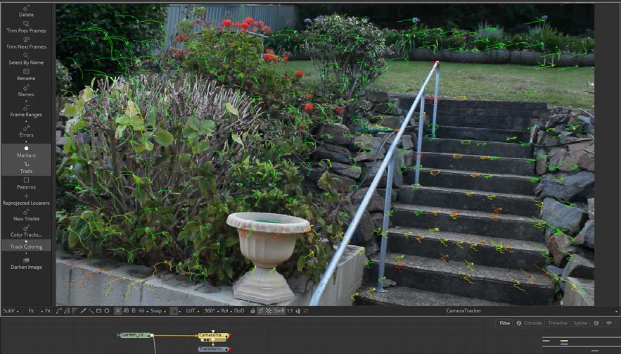

##### 2D View 2D视图

2D视图时该工具的基础显示，通过将工具拖拽至视图中，它会显示被跟踪的图像以及覆叠的跟踪器标记和根据绘制出的跟踪器运动的路径。

有一个专用的工具栏将停靠在视图的侧面，使你可以访问用于跟踪和反求镜头的常用功能。

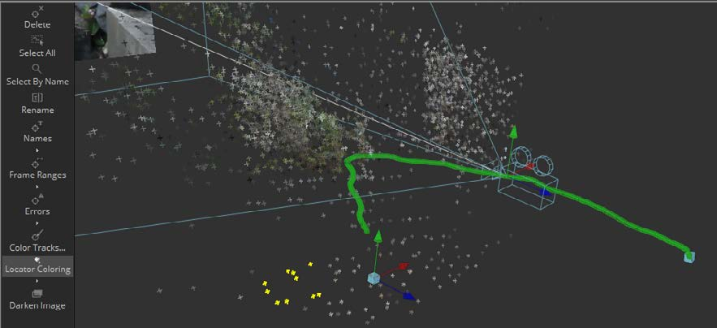

##### 3D View 3D视图

Camera Tracker工具的第二个输出显示了一个3D场景。要查看它，将3D输出连接至一个3D Transform节点并查看该工具。3D输出会显示点云和带有所连图像的摄像机。

选择点会唤醒给你屏上菜单，该菜单会给你多种功能的控件，如显示Frame Ranges（帧范围）、Solve Error（反求错误）和Name（名称），以及重命名、删除以及改变颜色。

#### Track Tab 跟踪选项卡

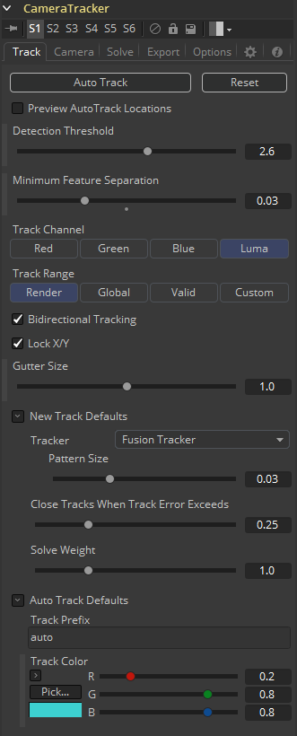

##### Auto Track 自动跟踪

自动检查可跟踪的特征并在源镜头中跟踪它们。跟踪会在跟踪错误过高需要创建新的轨迹时自动终止。Detection Threshold和Minimum Feature Separation滑块可用于控制自动轨迹的散布。

##### Reset 重置

删除所有Camera Tracker的内部数据——包括跟踪数据和反求数据（相机运动路径和点云）。要只删除反求数据，使用Solve选项卡上的“Delete”按钮。

##### Preview AutoTrack Locations 预览自动跟踪位置

开启该复选框会显示自动跟踪会分布在镜头的哪些位置，这会有助于决定是否需要调整Detection Threshold和Minimum Feature Separation来获得均匀分布的跟踪器。

##### Detection Threshold 检测阈值

确定了检测特征的敏感度。自动生成的轨迹会分配给场景，检测阈值会强制它们要么在高对比度要么在低对比度中。

##### Minimum Feature Separation 最小特征分离

确定了自动生成的跟踪点之间的间距。减少该滑块会导正生成更多的自动跟踪。记住跟踪点的值越大还会导致更长的反求。

##### Track Channel 跟踪通道

用于指定一个用于跟踪的轨道：Red、Green、Blue或Luminance。当指定一个通道时，选择具有高级别对比度和细节的那个。

##### Track Range 跟踪范围

用于确定要跟踪的帧：

- **Global 全局：**全局范围，即时间线上整个持续时间。
- **Render 渲染：**时间线上的渲染持续时间。
- **Valid 有效：**源媒体持续时间的有效范围。
- **Custom 自定义：**用户确定的范围。当选中它时，会出现一个分离的范围滑块来设置跟踪范围的起始和结束。

##### Bidirectional Tracking 双向跟踪

启用这个会强制跟踪器从开始的正向跟踪之后反向跟踪。反向跟踪时，不会开始新的轨迹，而是随时间反向延长现存的轨迹。推荐将该选项保持为开，因为较长的轨迹会更好地帮助反求摄像机和点云。

##### Gutter Size 沟大小

当靠近图像边缘并且漂移或抖动或完全丢失其图案时，跟踪器会变得不稳定。Camera Tracker将自动终止进入沟区域的所有跟踪。沟大小以图案大小的百分比给出。默认情况下，它是图案大小的100％，因此0.04图案表示0.04的沟。

##### 新的跟踪默认为：

Camera Tracker工具可以通过三种方法分析场景，每种方法在处理某些类型的摄像机移动时都有其自身的优势。

##### Tracker 跟踪器

在内部，所有跟踪器都使用光流跟踪器随时间跟踪功能，然后使用受信任的Fusion Tracker或Planar Tracker进一步完善跟踪。 平面跟踪器方法允许图案通过各种类型的变换随时间变形以找到最佳拟合。 这些转换是：

- 位移
- 位移和旋转
- 位移、旋转和缩放
- 仿射
- 透视

推荐在使用Planar Tracker 时使用默认的TRS（平移、旋转、缩放）设置。因为仿射和透视设置需要较大的图案来进行准确的跟踪。

##### Close Tracks When Track Error Exceeds 当跟踪错误超出时关闭跟踪

跟踪会在跟踪错误时自动终止。跟踪一个特征时，特征周围的像素会在跟踪的参考时间处拍摄一个快照——这便叫做”图案“——并会在后面的时间中搜索这相同图案的像素。当前帧时间处的图案和参考时间处的图案之间的差异被称为“跟踪错误”。将该值设置得更高会产生更长但会逐渐不准确的轨迹。

##### Solve Weight 反求权重

默认情况下，每个跟踪在反求过程中都有均匀的权重。增加一个跟踪的权重意味着它会在反求摄像机路径中有更重的权重。这也是一个很少被更改的高级选项。

##### Auto Track Defaults 自动跟踪默认值

为自动生成的跟踪设置前缀名称和/或颜色。该自定义颜色可以在Options选项卡中的Track Colors设置为“User Assigned”时可见。

#### Camera Tab 摄像机选项卡

使用该部分来指定现实拍摄摄像机的物理方面，这会在开始搜索匹配实际世界中摄像机的反求参数时作为一个开始点。该部分中的信息提供地越准确，摄像机反求也会越准确。

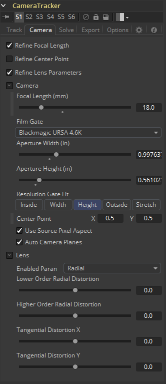

最上面的三个复选框定义了反求器可以使用哪些参数来完成反求作业。

##### Refine Focal Length 优化焦距

这会允许反求器调整镜头的焦距来匹配跟踪点。

##### Refine Centre Point 优化中心点

默认是不勾选的，摄像机镜头默认居中在胶片门的中心，不过也会因摄像机而异。举个例子，一个电影摄像机被设置为Academy 1.85，这会有一条音频在左侧并使用super35拍摄，镜头就是偏移向右侧了。

##### Refine Lens Parameters 优化镜头参数

这会优化镜头的畸变和扭曲。这会在宽角度摄像机上导致更大的畸变。

##### Focal Length 焦距

指定已知的用于拍摄场景的固定焦距或在Refine Focal Length勾选时猜测一下。

##### Film Gate 胶片门

在下拉菜单中选择一个胶片门预设或在Aperture Width和Aperture Height中手动输入胶片底的大小。注意，这些值都是以英寸为单位的。

##### Aperture Width 光圈宽度

如果用于拍摄场景的摄像机不在预设下拉菜单中，那么需要手动输入光圈宽度（英寸）。

##### Aperture Height 光圈高度

如果用于拍摄场景的摄像机不在预设下拉菜单中，那么需要手动输入光圈高度（英寸）。

##### Resolution Gate Fit 分辨率门像素适配

这定义了图像如何适配传感器尺寸。通常胶片传感器的尺寸足以涵盖数种格式，并且只有传感区域的一部分可以记录到图像中。作为例子，16：9的图像被保存在全光圈尺寸的传感器之外。

一般来说最好设置为适配为宽度或高度。其他的设配模式为Inside、Outside或Stretched。

##### Center Point 中心点

这是摄像机镜头对齐至摄像机的位置。默认值为`(0.5, 0.5) `是传感器的中间。

##### Use Source Pixel Aspect 使用源像素宽高比

这会使用在图像中载入的加载的压缩宽高比。HD是方形像素而NTSC的像素宽高比为0.9:1，Anamorphic影院是2:1宽高比。

##### Auto Camera Planes 自动相机平面

当这个启用的时候，在完成反求时摄像机图像平面和远平面会自动移动至包含所有点云。反求器可以会异常地将点放到场景非常深的地方，并将图像平面推到很远的地方，导致结果场景难以在3D视图中工作。在这些情况下，使用该选项来覆写这一默认行为（或删除出问题的轨迹）。

##### Lens 镜头

当反求摄像机的运动路径时，Camera Tracker在内部会创建并使用模拟镜头来模拟源镜头中的镜头畸变。该模拟的镜头模型比现实生活中的镜头要简单得多但是可以捕捉到重要的镜头畸变特征来获取更准确的摄像机反求。Camera Tracker能模拟的两种镜头畸变是：

- **Radial Distortion 径向畸变：**该类型畸变的强度根据到镜头中心的距离变化。该类型包括枕形（pincushion）、桶形（barrel）和胡须形（mustacle）畸变。较大的值对应了较大的镜头扭曲。径向畸变的建模对于广角镜头和鱼眼镜头尤其重要（因为它们会捕获很大的畸变，因为它们捕获了180度的环境，然后将其光学挤压到扁平的矩形传感器上）。
- **Tangential Distortion 切向畸变：**这种类型的畸变会在相机的成像传感器和物理镜头不相互平行时出现。它倾向于在素材中产生偏斜畸变，类似于通过在Fusion中拖动角落固定的角落而产生的失真。这种畸变发生在非常便宜的消费类相机中，而实际上在胶卷相机、DSLR和几乎任何用于电影或广播中的相机中都不存在。建议禁用它。

##### Enable Parameters 启用参数

决定使用什么镜头参数来建模和反求。没有启用的参数会保持为默认的值。下列选项时可以使用的。

- **None 无：**不使用任何镜头扭曲模拟。这应该在没有什么镜头畸变或镜头畸变已经在预处理步骤从源素材中移出时选择。
- **Radial 径向：**仅建模径向镜头扭曲。这会导致需要反求的高低次序畸变值。

##### Lower Order Radial Distortion 低次序径向畸变

决定二次镜头的曲率。

##### Higher Order Radial Distortion 高次序径向畸变

决定二次镜头的曲率。

##### Tangential Distortion X/Y 切向畸变X/Y

决定偏斜畸变。

#### Solve Tab 反求选项卡

Solve部分时及那个跟踪数据重建为摄像机的运动路径和点云的地方。在这里也可以清理较差或错误的跟踪，或者表现一些与跟踪有关的其他操作，例如定义向Point Cloud 3D导出什么标记。这些标记也可以将它们的权重设置为影响反求运算。例如，也许已经生成了一个好的摄像机反求，但是在需要放置物体区域的点云中没有足够的定位器，所以需要添加更多的跟踪并将Solve Weight设置为零使之不会影响到反求出的摄像机但会在点云中给出更多的点。

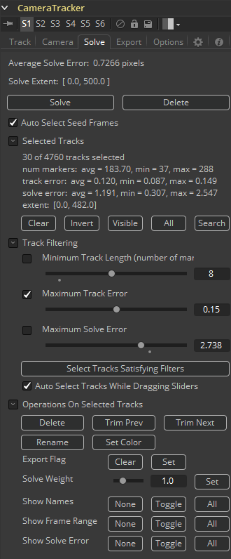

##### Average Solve Error 平均反求误差

摄像机反求完之后，此处便会出现Average Solve Error。该数字可以很好地指示摄像机反求是否成功。它可以被认为是2D图像中的跟踪和将重建的3D定位器通过重建的摄像机投影回的图像之间的差异（以像素为单位）。不断尝试降低反求误差（值小于一个像素），最终会生成较好的跟踪。0.6到0.8之间的值被认为是非常棒的。

##### Solve Extent 反求区域

显示要被重建的摄像机运动的帧范围。反求器会重建所有其上有跟踪的帧。

##### Solve 反求

按下Solve按钮会启动反求器，它会使用跟踪信息和摄像机规格来生成虚拟的摄像机路径和点云，近似于实际拍摄的物理摄像机运动。此时，控制台会自动打开，显示反求器的进度。

##### Delete 删除

Delete会移除任何反求出的信息，例如摄像机和点云，但是会保留所有跟踪数据。

##### Auto Select Seed Frames 自动选择种子帧

种子帧是用于初始化反求处理的参考图像。这两个图像会最先开始反求及重建摄像机，之后渐渐在这个种子帧上“生长”出结果。种子帧的选择很大地影响了整个反求并可以很容易地导致反求失败。种子帧可以自动寻找可以手动定义。手动定义种子帧是高级用户的选择。当选择种子帧时，重要的是要满足两个冲突的需求：种子帧应该有很多共同的跟踪，但是在透视上相隔较远（两个相关联的摄像机的基线距离较远）。

##### Selected Tracks 选择跟踪

该区域显示跟踪点或一组点的属性，它有这些选项：

- **Clear 清除：**取消选择所有跟踪并清除区域。
- **Invert 反转：**取消选择当前选中的跟踪并选择其他跟踪。
- **Visible 可见：**选择当前帧上的所有跟踪器。
- **All 所有：**选择所有帧上的所有跟踪器。
- **Search 搜索：**选择所有名称中包含子字符串的跟踪。

> **注意：**可以直接用鼠标在2D视图中选择跟踪，或也可在3D视图中选择点云中对应的定位器。

##### Track Filtering 跟踪过滤

Camera Tracker会产生非常多自动生成的跟踪。与其将大把时间花在单独地校验每个跟踪的质量上，还不如花更少的时间使用紧凑的方法来过滤掉大量很可能较差的跟踪。下列输入滑块用于基于特定的质量矩阵和一些不同的可能用于它们的运算选择大量的跟踪。例如，较弱的跟踪可以选择并删除，给更强的一组跟踪来反求。每个过滤器可以独立地勾选和取消选择。

##### Minimum Track Length (number of markers) 最小跟踪长度（标记的数量）

选择比滑块值更短持续时间的跟踪。较短的跟踪通常不会有移动很远的机会并且相对于较长的跟踪给反求器提供不了什么有用的透视信息，虽然较短和较长的跟踪在反求处理中权重是相同的，使得较长的跟踪比较短的跟踪更有价值。与较短的跟踪相对应的3D空间中的定位器在3D空间中的位移也会比那些对应较长跟踪的更不准确一些。如果一个镜头有很多较长的跟踪，那么最好还是删除那些较短的跟踪。对于典型的镜头，建议使用范围5到10。如果没有很多较长的跟踪（如，镜头快速旋转，导致很快地开始并离开帧），推荐使用接近3的值。

##### Maximum Track Error 最大跟踪误差

选择平均跟踪误差大于滑块值的跟踪。跟踪时，跟踪会在它们的跟踪误差超过一些阈值时自动终止。这一自动终止会控制最大跟踪误差，而该滑块控制平均跟踪误差。例如，跟随树上树叶的跟踪一般不会怎么准确，并又是可能由于它们的高平均误差检测到。

##### Maximum Solve Error 最大反求误差

选择反求误差大于滑块值的跟踪。最简单的一种增加摄像机反求准确度的方法时选择高反求误差的20%跟踪并删除（尽管这有时会变得更糟）。

##### Auto Select Tracks While Dragging Sliders 拖动滑块时自动选择跟踪

当勾选这个时，拖动上面的滑块（最小跟踪长度、最大跟踪长度、最大反求误差）会导致对应的跟踪在视图中交互地选中。

##### Select Tracks Satisfying Filters 选择满足过滤器的跟踪

选择场景中满足上面Track Filtering值的跟踪。注意当按下该按钮时，满足过滤器值的跟踪会显示在Solve选项卡的Selected Tracks区域并在查看器中被着色。该按钮会在“Auto Select Tracks While Dragging Sliders”关闭或选择由于不小心在视图中点击而意外丢失时有用。

##### Operations On Selected Tracks 选中跟踪的操作

使用鼠标在视图中直接选择或通过跟踪过滤器选择的跟踪可以选择应用下列操作：

- **Delete 删除：**会移除集合中的跟踪。当存在较差的跟踪时，最简单方便的选项就是把它们删了。
- **Trim Previous 修剪先前：**会剪切自当前帧至跟踪起始的所有跟踪帧。有时修剪跟踪要比删除它更有用。例如，被跟踪的特征逐渐被遮挡或跟踪特征移动到太靠近图像边缘时，高质量的长跟踪会逐渐变得不准确。
- **Trim Next 修剪后续：**会剪切自当前帧至跟踪结束的所有跟踪帧。
- **Rename 重命名：**会使用新名称替换当前自动生成的名称。
- **Set Color 设置颜色：**会允许用户指定跟踪点的颜色。
- **Export Flag 导出标记：**这控制了对应选中跟踪的定位器是否导出至点云。默认所有定位器都被标记为可导出。
- **Solve Weight 反求权重：**默认所有使用的跟踪器都在反求摄像机运动路径时有均等的权重该选项最常见的用途是设置跟踪的权重为零使其不影响摄像机的运动路径但仍有一个重建的3D定位器。设置跟踪的权重为1.0或0.0以外的值是只有高级用户才会干的事。

跟踪名称和值的屏上显示由这些功能控制：

- **None 无：**会清理/隐藏选中的跟踪。
- **Toggle 切换：**会交换选中和未选中的跟踪。
- **All 所有：**会选中所有跟踪。
- **Show Names 显示名称：**会显示跟踪名称，默认它们是数字。
- **Show Frame Range 显示帧范围：**会显示轨迹的开始和结束帧。
- **Show Solve Error 显示反求误差：**会显示每个选中跟踪拥有的反求误差量。

#### Export Tab 导出选项卡

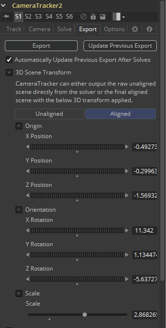

##### Export 导出

Export按钮会创建基础的可用于3D匹配运动的设置：

- 一个拥有添加动画的匹配实际拍摄摄像机的位移和旋转的Camera 3D和一个附加的图像平面。
- 一个包含重建的跟踪的3D位置的Point Cloud 3D。
- 一个设置为生成地平面的Shape 3D。
- 一个将摄像机、点云和地平面合并在一起的Merge 3D。当使用3D视图中的摄像机查看Merge 3D时，3D定位器应会跟随跟踪素材。
- 一个设置为匹配输入素材的Renderer 3D。

独立工具的导出可以在Options选项卡中设置启用/禁用。

##### Update Previous Export 更新先前导出

当点击该按钮时，先前导出的工具会使用任何新生成的数据更新。这些先前导出的工具会在该部分底部的Previous Export部分中记忆。这里有一个示例：

1. 反求摄像机并导出。
2. 基于导出的工具构建一个复杂的流程，以用于集合扩展。
3. 摄像机不如需要的那么准确则使用重新运行反求器添加额外的跟踪来生成更密集的点云。与其重新导出Camera 3D和Camera Cloud 3D工具并重新连接进去，不如只需按下该按钮来在原地“覆写”现存的工具。

##### Automatically Update Previous Export After Solves 反求后自动更新先前导出

会导致现存导出的工具（Camera 3D、Point Cloud 3D、Lens Distort、Renderer 3D和地平面）在每次反求时自动更新。

##### 3D Scene Transform 3D场景变换

这定义了虚拟摄像机、点云和地平面的原点和对齐。默认情况下，反求器将始终将摄影机放置在Fusion的3D虚拟环境中，以便在第一帧上将摄影机定位在原点`(0, 0, 0)`处，且面朝-Z轴。在这种默认方向上，素材中的物理地平面通常不会与3D视图中的虚拟地平面匹配，因此3D Scene Transform提供了一种纠正该问题的机制。注意，调整3D Scene Transform不会修改摄像机的解算，而只是重新定位3D场景来最好地表示实际拍摄的摄像机的位置。还要注意，如果需要更改这些选项，一定要手动单击“Update Previous Export”来在导出的工具中查看结果。

##### Unaligned, Aligned 未对齐/已对齐

Unaligned按钮会允许调整原点和地平面设置，无论是通过手动或通过使用选中的点云中的定位器组。当处于Unaligned模式中时，3D视图中会出现一个3D变换控件，用于手动操纵来调整原点。

一旦完成对齐后，该部分会通过切换至Aligned按钮来锁定。根据坐标系统（Coordinate System），可以输出3D网格直接进入反求的摄像机的原始未对齐场景，也可可以调整3D网格至用户选择的平面的已对齐场景。

##### Set From Selection 由选择设置

从点云中获取选定的3D点，然后对齐地平面以适配这些点。可以独立地调整位移、旋转和缩放。要设置地平面，选择地面上的多个Point Cloud点——为获得最佳结果，请尝试选择尽可能多的属于地面且间隔较大的点。在Origin下拉菜单下，按下Set From Selection。这将重新放置地平面。在Orientation下拉菜单下，按下Set From Selection。这会将地平面的方向更改为选中的点。最后，按下Aligned按钮，这将重新定位3D系统，以便3D网格与地平面对齐。

当为地平面选择点时，最好并排使用2D和3D视图查看Camera Tracker工具。通过选中2D视图中的多帧来选择输出地平面的跟踪要比在3D视图中尝试框选定位器要容易的多。

##### Ground Plane Options 地平面选项

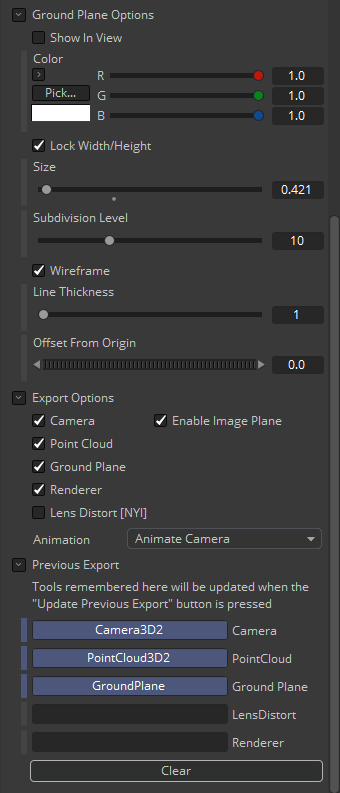

##### Color 颜色

设置地平面的颜色。

##### Size 尺寸

控制地平面可以设置的多大。

##### Subdivision Level 细分级别

设置地平面中有多少多边形。

##### Wireframe 线框

设置地平面在3D中显示时是否为线框或实表面。

##### Line Thickness 线粗细

调整在视图中绘制的线宽度。

##### Offset 偏移

默认情况下，地平面的中心被放置在原点`(0, 0, 0)`。这可以用于沿Y轴上下移动地平面。

##### Export Options 导出选项

提供了一个复选框列表，其中包含按下Export按钮时将导出为工具的内容。这些选项包括Camera、Point Cloud、Ground Plane、Renderer、Lens Distortion和摄像机中的Enable Image Plane。

##### Previous Export 先前导出

当单击Update Previous Export按钮时，列于此处的先前导出的工具会使用任何新生成的数据更新（包含摄像机路径和属性、点云和渲染器）。

#### Options Tab 选项选项卡

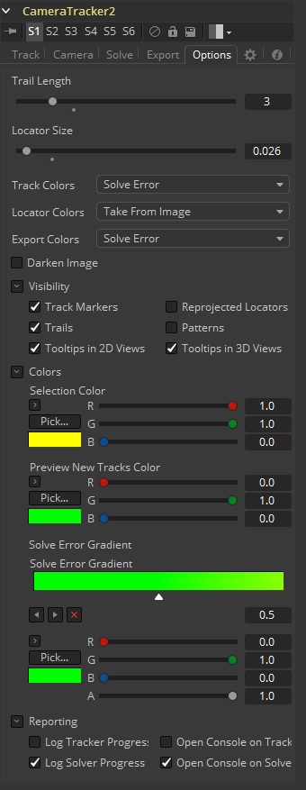

##### Trail Length 尾迹长度

会显示覆盖显示在视图中的尾迹线。当前帧和之前和之后的帧数量由该长度设置。

##### Locator Size 定位器大小

在3D视图中，点云定位器可以通过该控件设置大小。

##### Track Colors, Locator Colors, and Export Colors 跟踪颜色、定位器颜色和导出颜色

它们都有设置将它们的颜色设置为下列之一的选项：User Assigned（用户分配）、Solve Error（反求错误）、Take From Image（从图像中获取）和White（白色）。

Track Colors是2D视图中的屏上跟踪的颜色。

Locator Colors是3D视图中的点云定位器的颜色。

Export Colors是随Point Cloud工具导出定位器的颜色。

##### Darken Image 变暗图像

使视图中的亮度变得更暗淡，以更好地查看覆叠的跟踪。这同时会影响2D和3D视图。

##### Visibility 可见性

切换在2D和3D视图中哪些覆叠可见。选项有Tracker Markers（跟踪器标记）、Trails（尾迹）、2D视图中的Tooltips（工具提示）、3D视图中的Tooltips（工具提示）、Reprojected Locators（重投影定位器）和Tracker Pattern（跟踪器图案）。

##### Colors 颜色

设置覆叠的颜色。

- **Selection Color 选择颜色：**控制选中的跟踪/定位器的颜色。
- **Preview New Tracks Color 预览新轨迹颜色：**控制启用“Preview AutoTrack Locations”选项时显示在视图中的点的颜色。
- **Solve Error Gradient 反求误差渐变：**默认情况下，轨迹和定位器被着色为绿-黄-红渐变来指示它们的反求误差。该反求误差是完全可以由用户调整的。

##### Reporting 报告

输出多种参数和信息至控制台。

##### Understanding Camera Tracking 理解摄像机跟踪

在大型的故事片中，Camera Matchmoving（摄像机匹配运动）通常会交给由很多处理这类镜头的跟踪和反求的专家来完成。基本上很少镜头可以自动完成——按下几个按钮等待处理完成就解决了。它通常需要理解整个处理过程和获取好的反求的轨迹的重点。

Camera Tracker必须解决上万未知的变量，这实在是一项复杂的任务，创建准确反求的重点是获取存在时间较长的精确的轨迹。错误或较差的轨迹会搞乱你的结果。该章节解释了如何清理错误的轨迹及其他理论来获取较好的反求。

##### Workflow 工作流程

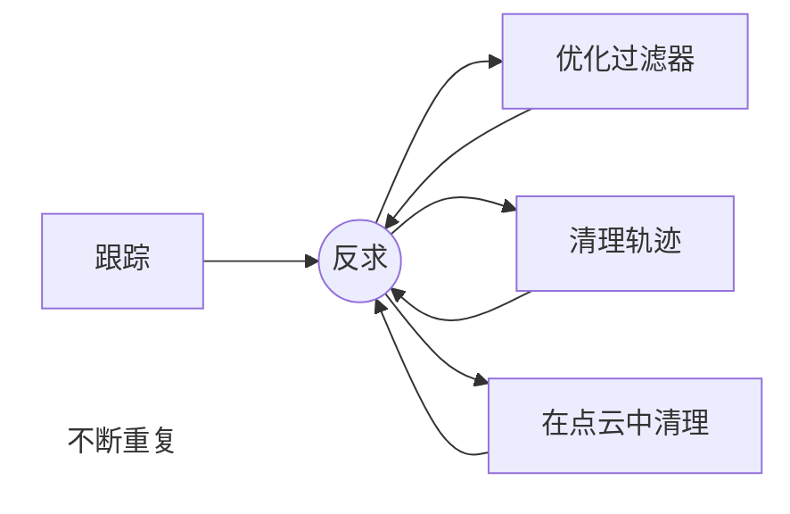

反求是一个不断重复来获取较好结果的过程。最开始可能有很多轨迹，它们不全是良好的，所以需要有过滤并清理不想要的跟踪的过程。在每个清理阶段的末尾，按下Solve会给你一个Solve Error的结果。这需要小于1来表示可正常使用，越低越好。优化跟踪会给出更好的结果。

##### False Tracks 错误的轨迹

错误的轨迹是偏移或不正确的轨迹，它们是在多种条件下形成的，例如：场景中移动的人或物体，或来自车的反射或高光。也有其他类型的错误轨迹，例如视差错误，也就是两个对象的深度不同而相交处被跟踪了。这些摩尔（Moire）效应会导致轨道爬动。建筑物玻璃上的反射会变形，风中的树木会扭曲，识别并消除这些错误的轨迹是Solve处理中最重要的一步。

##### Track Length 跟踪长度

获取一组长跟踪非常重要，越长会让反求适配得更好。双向跟踪用于随时间延展轨迹的起始处。轨迹存在的时间越长，镜头中重叠的轨迹越多，反求就越一致、准确。

##### Seed frames 种子帧

在Solve过程中会用到两个种子帧，该算法会选择相距较远但使用了相同轨迹的两个帧，因此更长的轨迹会在在种子帧的选择上出现更大的差异。

这两个种子帧起到了参考帧的作用，它们应为同一场景中的不同角度。Solve过程会将它们作为主要起始点来适配序列中的其他轨迹。

有一个自动检测种子帧的选项，这会花费一些时间。在反求的工作流程中，自动检测是一个不错的主意。优化跟踪器和求解的时候，最好设置为手动模式并使用先前反求的种子帧，这会显示在反求对话框窗口中。

##### Refine Filters 优化过滤器

在第一次反求之后，所有的跟踪器都会有额外生成的数据。当然也会有反求误差以及跟踪误差。

使用Refine Filters来减少不想要的轨迹，例如设置Minimum Tracker Length至8帧。调整每个过滤器的值之后，Solve对话框窗口会指示过滤器影响了多少轨迹。再次反求。

##### Onscreen Culling 屏上裁剪

在Options选项卡下设置轨迹至20，这会显示素材中的每个轨迹的+-20帧的尾迹。可以在屏幕上看见并选择错误的轨迹，以及可以使用按下删除按钮来删除。该过程需要一双富有经验的眼睛来寻找哪些会出错的跟踪。再次反求。

以透视模式（Perspective）查看3D视图，可以看见点云。移动观察点云，选择并删除那些看起来在图形和场景空间之间没有什么内在联系的点。

重复该过程直至反求误差低于1.0，然后再导出。

##### Selecting Points for Ground plane 为地平面选择点

选择点云中的点会允许地平面的对齐和适配。