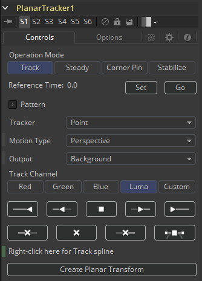
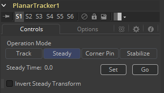
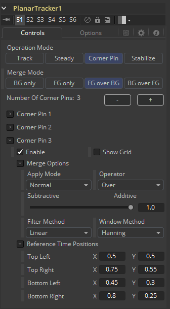
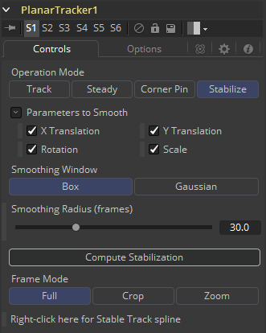

### Planar Tracker [PTra]

Planar Tracker工具被设计用于解决经常会在后期制作中遇到的匹配移动问题。包含平面表面的实景镜头，如车牌、路标或砖墙等并需要替换车牌中的数字、路标中的城市名称或在空白砖墙上放置广告牌海报等等。问题是摄像机在镜头中移动时，车牌、路标或砖墙的视角不断变化。艺术工作者不能简单地不考虑透视图的失真就在现有背景上合并进新的车牌。解决此问题的一种耗时的方法是使用Fusion的Corner Pin工具并手动为四个角设置关键帧来匹配透视图变形。Planar Tracker可自动执行此关键帧处理过程，来随时间推移跟踪背景板中平面的透视变形，然后将这些相同的透视变形重新应用于不同的前景。

使用Planar Tracker的部分原因还在于，知道何时该放弃并退而使用Fusion的Tracker工具或手动进行关键帧设置。某些镜头根本无法跟踪，或者所产生的轨迹会遭受过多的抖动或漂移。Planar Tracker是艺术工作者工具箱中一种有用的省时工具，尽管它可以跟踪大多数镜头，但也并不是100％的解决方案。

#### Controls 控件

##### Operation Mode 运算模式

Planar Tracker拥有四种跟踪模式。

- **Track 跟踪：**用于选择一个平面并随时间跟踪它。
- **Steady 平稳：**从平面中移除所有的运动和畸变。
- **Corner Pin 角落固定：**计算并应用一个匹配的透视至前景并将它合并到跟踪镜头的顶部。
- **Stabilize 稳定：**允许随时间平滑平移、旋转和缩放。

后三种模式（Steady、Corner Pin和Stabilize）使用Track模式中生成的跟踪数据。注意这些模式都不可以被结合在一起。例如，既不能同时完成Corner Pin和Stabilize，也不能在Corner Pin模式中完成Track模式。

虽然Planar Tracker将最终的结果跟踪保存在磁盘中的合成里，它不会保存例如独立的点跟踪器（与保存独立的点跟踪器的Camera Tracker相对）的临时跟踪信息。这样的后果有：

- 包含Planar Tracker工具的合成被保存并重新载入时点跟踪器不再出现在视图中。
- 跟踪也许不能够在包含Planar Tracker工具的合成被保存并重新载入之后恢复。实际上，这也会应用于自动保存。由于这个原因，最好在一个Fusion会话中完成所有的跟踪。
- 合成文件应保持合理的大小（某些情况下Planar Tracker会产生几百MB的临时跟踪数据）。
- 合成的保存并加载变得更快且更具交互性了。

#### External Inputs 外部输入

- **Background 背景：**包含要跟踪的平面。
- **Corner Pin 1 边缘固定1：**要固定在背景顶部的图片。可能有多个Corner Pin，它们被命名为Corner Pin 1、Corner Pin 2…
- **Occlusion Mask 遮挡遮罩：**用于掩盖不需要跟踪的区域。此遮罩为白色的区域将不会被跟踪。例如，一个人在该图案前面移动并遮挡了一部分可能就会使跟踪器感到困惑，并且可以使用围绕该人快速创建的粗糙rotomask来告诉跟踪器忽略被屏蔽掉的那部分。
- **Effect Mask 效果遮罩：**用于遮罩工具的输出。

#### Track Mode 跟踪模式

使用Planar Tracker的标准跟踪流程是：

1. <b>移除镜头畸变：</b>镜头中的镜头畸变越多，结果轨迹就会变得更多滑动和摆动。
2. <b>镜头内连接：</b>连接一个镜头中有可随时间跟踪平面的Loader并在视图中查看Planar Tracker。
3. <b>选择参考帧：</b>移动至要随时间跟踪平面没有被遮挡的帧并将其设置为参考帧。
4. <b>选择图案：</b>在视图中围绕要追踪平面绘制一个多边形。这个就叫做“图案”。在大多数情况下，这可能会是一个矩形但也可以使用仍以闭合的多边形。被该区域包围的像素会被当作在其他帧中被搜索的图案。注意该图案是要绘制在参考帧上的，这非常重要。不要将图案与Corner Pin的区域混淆（它总是有四个角落并独立地在Conrner Pin模式中指定）。
5. <b>调整渲染范围：</b>在时间线上调整渲染范围来与平面可见的帧范围匹配。
6. <b>调整跟踪选项：</b>频繁更改的选项有Tracker、Motion Type和Track Channel。
7. <b>遮罩划出遮挡：</b>如果有移动的物体部分地盖住了平面，你也许会希望向Planar Tracker连接一个遮挡遮罩。当使用Hybrid跟踪器时，必须提供一个遮罩来处理遮挡对象，而Tracker跟踪器建议还是不要使用遮罩进行跟踪。
8. <b>跟踪：</b>回到参考帧，按下Track To End按钮并等待跟踪完成。再次返回到参考帧，按下Tracker To Start按钮并等待跟踪完成。注意视图中的轨迹不像Camera Tracker里那样可以被选中或删除。
9. <b>检查跟踪品质：</b>用双眼检查以下该轨迹有多精确。它是否吸附到了表面？切换为Steady模式在这里可能会有所帮助。
10. <b>使用轨迹：</b>Steady、Corner Pin和Stabilize运算模式会使用Track模式中产生的跟踪数据。此时，你也可以选择导出一个Planar Transform工具来将被跟踪的透视畸变镜像到遮罩上。

##### Reference Time 参考时间

Reference Time决定了图案会从哪个帧上获取。它也是跟踪开始的时间。Refence Time自被设置后就不能更改了，除非销毁所有预先存在的跟踪信息，所以要浏览跟踪的镜头并细心选择。Reference帧必须仔细地选择来给予可被跟踪的最好质量的图案。

##### Pattern Polygon 图案多边形

要跟踪的图案根据在参考帧上绘制的多边形指定。确保所选的区域在物理上属于镜头中的平面。有时只能使用大致平坦的平面。总而言之，表面越不平坦，结果轨迹的质量越差。

经验之谈，图案的像素越多，轨迹的质量就会越好。尤其是在参考帧上，要跟踪的图案应该：

- 尽可能地大。
- 尽可能多地在帧内。
- 尽可能地未被如移动的前景物体等遮挡。
- 在它的最大尺寸时。例如，在跟踪接近中的路牌时，最好选择较后面的帧，因为400x200的像素肯定要比80x40的像素要大。
- 相对来说没有畸变。例如，在摄像机环绕一个平坦的停止告示牌时，最好选择告示牌与相机平行的时候而不是它处于很大的倾斜角时。

如果图案包含的像素过少或者没有什么可跟踪的特征，则可能会导致结果轨迹抖动、摆动或滑动等问题。有时，使用更简单的运动类型可以对该情况起到帮助。

##### Tracker 跟踪器

由两种可用的跟踪器可供选择。

- **Point 点：**在帧之间跟踪点。在内部实现中，该跟踪器实际上并不会跟踪每秒内的点，而是跟踪Fusion的可靠的Tracker工具中的小图案。该Point跟踪器拥有自动创建自己的内部遮挡遮罩来检测并拒绝不属于主导运动的异常轨迹。轨迹根据Point跟踪器是否认为他们是否术语主导运动或已被拒绝而在视图中被着色为绿色或红色。用户也可以选择提供一个外部遮挡遮罩来引导Point跟踪器。
- **Hybrid Point/Area 混合点/区域：**使用该Area跟踪器来跟踪图案中的所有像素。不同于Point跟踪器，Area跟踪器不拥有自动拒绝不属于主导运动的能力，所以你必须手动给它提供一个遮挡遮罩。注意由于性能原因，Hybrid跟踪器内部会先运行一次Point跟踪器，这就是为什么点的轨迹依然在视图中可见。

没有最好跟踪器。他们拥有各自的优点和缺点：

- **艺术家的精力（遮挡遮罩）：**Point跟踪器会自动创建自己的内部遮挡遮罩，而Hybrid跟踪器需要使用更多的时间花在手动创建遮挡遮罩上面。
- **准确度：**Hybrid跟踪器相对来说更准确一些，也相对来说不会倾向于出现摆动、抖动和漂移，这是因为它会跟踪图案中所有的像素而不只是一些具有显著特征的点。
- **速度：**Hybrid跟踪器要比Point跟踪器慢。

总的来说，推荐先使用Point跟踪器快速跟踪一遍镜头并检验结果，如果结果不够好的话，那么就改用Hybrid跟踪器。

##### Motion Type 跟踪类型

决定了Planar Tracker在内部如何对要跟踪平面的畸变进行建模。五个畸变模型是：

- **Translation 位移**
- **Translation, Rotation 位移、旋转：**僵硬的运动。
- **Translation, Rotation, Scale 位移、旋转、缩放：**方形至方形，在X&Y上均匀缩放。
- **Affine 仿射：**包含位移、旋转、缩放、扭转（将方形映射为平行四边形）
- **Perspective 透视：**将方形映射为一般的四边形。

这些模型都是递进的，一个比一个更加普遍，并包含前一个为特殊情况。

对场景有疑惑时，选择Perspective作为初始跟踪尝试。如果被跟踪的镜头中又有透视畸变，而Planar Tracker使用了较简单的运动类型，那么最终会导致轨迹的滑动和摆动。

有时会有一些比较麻烦的镜头，选择使用更简单的运动模型会更好一些。例如，当很多跟踪点聚集在要跟踪区域的一侧或跟踪Planar Tracker在此处没有足够跟踪像素的时候，就会发生这种状况。

##### Output 输出

控制Planar Tracker在Tracker运算模式中会输出什么。

- **Background 背景：**输出未经更改的输入图像。
- **Background-Preprocessed 已预处理的背景：**Planar Tracker会在跟踪之前对输入图像执行多种预处理操作（例如转换至亮度）。这会有助于决定选择上面Track Channel。
- **Mask 遮罩：**将图案输出为黑白遮罩。‘
- **Mask over Background 背景为底的遮罩：**输出合并在背景之上的图案遮罩。

##### Track Channel 跟踪通道

决定了要跟踪背景图像中的哪个图像通道。最好选择一个拥有高对比度、很多可跟踪的特征且没什么噪声的通道。允许的值有Red、Green、Blue和Luminance。

##### Tracking Controls 跟踪控件

这些控件用于控制跟踪器。注意跟踪时如果当前帧已被跟踪或时参考帧的话只会跟踪新的一帧。

- **跟踪至起始：**从当前帧开始向之前的时间跟踪至起始位置（由当前渲染范围指定）。
- **跟踪器步退一帧：**从当前帧向前跟踪一帧。
- **停止跟踪：**停止所有进行中的跟踪。
- **跟踪器步进一帧：**从当前帧向后跟踪一帧。
- **跟踪至结束：**从当前帧开始向之后的时间跟踪至结束位置（由当前渲染范围决定）。
- **删除：**删除所有时间上的所有跟踪数据。使用它来销毁所有的结果并从头开始跟踪。
- **修剪至结束：**从当前帧起移除所有的跟踪数据。例如图案开始移除帧外时变得不准确时修剪轨迹的末尾会挺有用的。

##### Show Splines 显示样条

打开样条编辑器并显示与Planar Tracker工具关联的样条。这会在手动删除Track和Stable Track样条上的点时发挥作用。

##### Right-click here for Track spline 右键此处来创建Track样条

跟踪时会创建一个每个关键点中包含4x4矩阵的样条。这被认作是“Track Spline 跟踪样条”或简称为“Track”。这件矩阵完整地描述了跟踪图案的畸变。

##### Create Planar Transform 创建平面变换

跟踪镜头之后，该按钮会可以按下来在流程中创建一个Planar Transform工具。当前编码于Track样条中的信息会被共享给Planar Transform，来达到复制由Planar Tracker工具跟踪得到的品平面畸变。

#### Steady Mode 平稳模式

在Steady模式下，Planar Tracker会变换背景板来保持图案尽可能地没有移动。在这之后还残余的运动则是因为跟踪器没能准确地跟上图案或是因为图案其实并不在物理上属于这个平面。Steady模式在实际的稳定中并不会非常有用，但是会在检查轨迹质量上大展身手。如果轨迹不错的话，在回放中图案应该是完全不会移动的，而其余的背景板随之畸变。放大图案的一部分并将鼠标指针放在其特征上来观察这个特征会多久之后会随时间漂移。

##### Steady Time 平稳时间

这是图案的位置被快照定住冻结在一个位置上的时间。通常都是吧这个设置为参考时间。

##### Invert Steady Transform 反转平稳变换

导致Planar Tracker工具反转平稳变换的效果。这也就意味着两个Planar Tracker背对背地连接而第二个设置为反转第一个，那么仍会得到原始的图像。如果你在这两个之间放置一个效果工具，那么该效果就会被锁定在那个位置上。这只应被用来完成不能通过Corner Pin完成的效果，因为两次重采样会倒是背景图像的劣化（变柔）。

##### Clipping Mode 裁剪模式

决定了当背景图像的部分由于平稳变换而移出帧之外时会发生什么。

- **Domain 域：**保留帧外部分。
- **Frame 帧：**丢弃帧外部分。

Domain模式会在Steady模式用于将一个效果“锁定”到图案上时发挥用处。作为例子，考虑在移动的车的通行证板上绘画。一种方法是使用Planar Tracker来稳定通行证板，之后使用Paint工具在通行证板上绘画，然后用第二个Planar Tracker来撤销稳定变换。如果Clipping Mode设置为Domain，那么计算出的离开帧的部分会被第一个Planar Tracker保留所以第二个Planar Tracker得以将他们重新映射回帧当中去。

#### Corner Pin Mode 角落固定模式

在Corner Pin模式中，可以将一个或多个材质附加至先前跟踪的平面上并于平面执行相同的透视畸变。

使用Planar Tracker的角落固定工作流程为：

1. <b>跟踪：</b>在镜头中选择你想附加材质或更换材质的平面。
2. <b>将Operation Mode切换至Corner Pin：</b>从Track模式进入Corner模式时，在视图中会隐藏图案多边形而显示角落固定控件。
3. <b>连接材质：</b>在流程视图中，连接包含材质的Loader至Planar Tracker的Corner Pin 1输入。
4. <b>调整角落固定：</b>拖动视图中角落固定的角落直至正确定位图案。有时Show Grid选项会在定位材质的时候起到作用。另外，如果有助于更准确地放置的话，拖动到其他帧并调整角落固定。
5. <b>重新审阅：</b>回访镜头，确保材质“粘”在平面上了。

##### Merge Mode 合并模式

控制前景（角落固定的材质）如何合成到背景（被跟踪的镜头）上。如果有多个角落固定的话，该选项会被它们所有共享。这里可以选择四种选项：

- **BG only 仅背景**
- **FG only 仅前景**
- **FG over BG 前景覆盖背景**
- **BG over FG 背景覆盖前景**

##### Number of Corner Pins 角落固定的数量

使用+和-按钮来增加或减少角落固定的数量。每新建一个额外的角落固定，就会有一个对应的输入出现在流程视图上。

##### Corner Pin 1 Input Group 角落固定1输入组

每一个角落固定都有一组相关的输入：

##### Enable 启用

控制视图中角落固定的可见性。

##### Show Grid 显示网格

在角落固定上方显示一个网格，这会在定位角落时起到作用。

##### Merge Options 合并选项

控制角落固定材质在背景上的合并——见Merge工具的文档。

##### Reference Time Positions 参考时间位置

参考时间处四个角落的位置。如果轨迹不够完美的话，这些位置可以添加动画来在轨迹之上做出调整。

#### Stabilize Mode 稳定模式

Stabilize模式用于通过应用部分抵消相机抖动的变换来消除相机中的抖动。该稳定变换（包含在Stable Track样条中）是通过平滑相邻帧上的跟踪变换来计算的。注意，Stabilize模式只能使运动平滑，而Steady模式才会尝试完全“锁定”所有运动。

要注意的一件事是，Planar Tracker是基于据图案的运动来稳定的，因此，仔细选择图案非常重要。如果图案的运动无法代表摄像机的运动，则可能会产生预期之外的结果。例如，如果镜头中有一辆卡车在道路上行驶，而摄像机在与卡车并驾的载具上，而跟踪图案被选为卡车的侧面，那么Planar Tracker最终将使摄像机挂在在卡车和载具结合而成的运动上。在某些情况下，这可能是不希望的，最好将图案选择在某个固定对象（如道路或建筑物的侧面）上，这样只会导致相机的运动变得平滑。

稳定处理的一个无法避免的副作用是会引入沿图像边缘的透明边缘。之所以会出现这些边缘，是因为稳定器并没有帧之外的信息所以它无法填充这些部分。Planar Tracker提供了裁剪或缩放去除这些边缘的选项。在拍摄时如果有后期制作稳定的需求的话，最好还是拍摄更高的分辨率（或更低倍的变焦）。

使用Planar Tracker的稳定工作流程为：

1. <b>跟踪：</b>对于图像，选择镜头中一个可以代表你想跟踪运动的粗略平面区域。
2. <b>切换Operation Mode为Stabilize：</b>在计算稳定之前，Planar Tracker只会输出输入的镜头。
3. <b>调整稳定选项：</b>频繁调整的选项是Parameters to Smooth和Smoothing Radius。
4. <b>计算稳定：</b>按下Compute Stabilization按钮并等待稳定计算完成。回放Planar Tracker工具的输出来查看稳定的效果。注意稳定变换会在图像边缘引入透明边缘。
5. <b>优化：</b>调整稳定选项并根据需要重新计算稳定。
6. <b>处理透明边缘（可选）：</b>根据需要将Frame Mode设置为Zoom或Crop并单击Auto Zoom或Auto Crop按钮。回放镜头来观察效果。如果存在过度缩放或图像被裁剪得过小了，尝试减少平滑量。

##### Parameters to Smooth 要平滑的参数

指定下列哪些参数需要平滑。

- **X Translation X平移**
- **Y Translation Y平移**
- **Rotate 旋转**
- **Scale 缩放**

##### Smoothing Window 平滑窗口

当稳定某一帧时，这决定了相邻帧的权重如何计算。可用的选项为Box和Gaussian。

##### Smoothing Radius (frames) 平滑半径（帧）

确定平均在一起来计算稳定的帧数。较大的Smoothing Radius会导致更平滑的结果但是也会引入更多透明边缘。

##### Compute Stabilization 计算稳定

单击该按钮来运行稳定器，这会覆写先前稳定的结果。稳定一旦完成，Planar Tracker的输出会自动更新至应用稳定之后的样子。

> **注意：**该稳定器使用了Track样条（由跟踪器创建）来产生Stable Track样条。这些样条关键帧中都包含了4x4的矩阵，而且这些样条在样条编辑器中都是可编辑的。

##### Clipping Mode 裁剪模式

确定当背景图像的一部分由于稳定而移出帧的时候会发生什么：

- **Domain 域：**保留帧外部分。
- **Frame 帧：**丢弃帧外部分。

##### Frame Mode 帧模式

这控制如何处理透明边缘。可用的选项有：

- **Full 全部：**不做任何事，将透明边缘原封不动地保留下来。
- **Crop 裁剪：**裁剪掉透明边缘。当选择该选项时，Planar Tracker输出图像的储存会比输入图像的要小一些。不会发生的图像重采样。
- **Zoom 缩放：**将图像缩放得更大一些来使透明边缘离开帧。选择该选项会导致发生图像重采样。该方法的缺陷是它会降低输出图像的质量（轻微柔化）。

##### Crop 裁剪

在Crop模式下，使用Auto Crop或通过改变这些滑块手动调整裁剪窗口：

- **X Offset X偏移**
- **Y Offset Y偏移**
- **Scale 缩放**

##### Auto Crop 自动裁剪

当点击该按钮时，Planar Tracker会检查所有的帧并选择其中最大可能的裁剪窗口来移出所有的透明边缘。该计算出的裁剪窗口总是会在帧内居中国并像素对齐。当点击时，Auto Crop会更新X/Y Offset和Scale滑块。

##### Zoom 缩放

在Zoom模式下，使用Auto Zoom或通过改变这些滑块手动调整缩放窗口：

- **X Offset X偏移**
- **Y Offset Y偏移**
- **Scale 缩放**

##### Auto Zoom 自动缩放

当点击该按钮时，Planar Tracker会检查所有的帧并选择其中最大可能的缩放窗口来移出所有的透明边缘。该计算出的缩放窗口总是会在帧内居中国并像素对齐。当点击时，Auto Zoom会更新X/Y Offset和Scale滑块。

##### Right-click here for Stable Track spline 右键此处创建Stable Track样条

提供对关键帧包含表示稳定变换的4x4矩阵的访问。这主要是为了完整性以及一些高级用户。

#### Options Page 选项页面

##### Darken Image 变暗图像

在Track模式中变暗图像来更好地在视图中查看控件和轨迹。Shift+D键盘快捷键会触发这个。

##### Show Track Markers 显示轨迹标记

触发标记当前时间处跟踪器位置的点的显示。

##### Show Trails 显示尾迹

触发跟随跟踪器位置的尾迹的显示。

##### Trail Length 尾迹长度

允许改变跟踪器尾迹的长度。如果图案移动得非常慢，增加该长度有时会使尾迹在视图中更容易被跟随。而如果图案移动得非常快，那么轨迹在视图中看起来可能会向一团意大利面一样。这时候也许就该减少长度了。

##### Inlier/Outlier Colors 内在/外在颜色

在跟踪的时候，跟踪器会分析帧并检测众多轨迹中哪些是属于主导运动而哪些是异常、无法解释的运动。默认情况下，属于主导运动的轨迹着色为绿色（并叫做inlier）而那些不属于的着色为红色（并叫做outlier）。只有inlier轨迹才会用于最终的结果轨迹中。