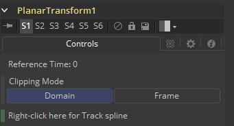

### Planar Transform [PXf] 平面变换

Planar Transform工具将Planar Tracker工具计算出的透视畸变应用至任意输入遮罩。Planar Transform工具可以用于减少艺术家画在roto物体上的时间。此处的工作流程将Planar Tracker工具只可以用于跟踪大致一个平面这一注意为中心。跟踪物体之后，Planar Transform可以在之后用于包装roto样条，使之随时间大致跟随物体。之后还需要对于roto样条精细等级的清理作业。根据Planar Tracker跟踪物体的好坏，这也可能会使得节省需要完成的roto繁琐工作的大量时间。使用该技巧的关键是认识到Planar Tracker会很好的跟踪需要被roto的物体的情况。

这一工作流程的大致轮廓包含：

1. <b>跟踪：</b>使用Planar Tracker工具选择一个表示要被roto的物体。跟踪一个镜头（见Planar Tracker工具的Track章节中的跟踪工作流程）。
2. <b>核算：</b>检查结果轨迹的质量。如果它没能好好地跟随物体那么你还是放弃吧，老老实实用旧方法去慢慢roto吧。
3. <b>创建Planar Transform工具：</b>按下Planar Tarcker工具上的Create Planar Tracker按钮来完成这一工作。新创建的Planar Transform工具可以自由地剪切并粘贴到另一个合成中，正如我们所期望的那样。
4. <b>roto物体：</b>移动任何被Planar Tracker跟踪的帧。当不确定一个帧是否被跟踪的时候，在样条编辑器中寻找Planar Tracker上的跟踪关键帧。练连接一个Polygon工具到Planar Transform工具上。然后查看Planar Transform工具的时候roto物体。
5. <b>优化：</b>拖动时间线来查看Polygon是否好好地跟随在了物体上。在脱离物体的位置随时间调整Polygon。也可以添加新的点进一步优化Polygon。

##### Reference Time 参考时间

从Planar Tracker中获取过来图案的Reference Time用于产生Planar Transform。

##### Right-click here for Track spline 右键此处来创建Track样条

Track样条包含了存储在4x4矩阵中有关透视畸变的信息。当Planar Transform工具从Planar Tracker工具中导出时，Track样条也会通过将其连接至Planar Transform工具共享Planar Tracker工具产生的Track样条。共享Track样条的一个后果是，如果Planar Tracker中的跟踪被改变了，那么Planar Transform也会自动更新。注意该样条可以在在样条编辑器中检查，这会在查看跟踪帧范围时有用。