### Tracker [Tra] 跟踪器

Tracker时用于探测并在移动的视频中跟随一个或多个像素图案。跟踪数据可以在之后用于控制位置或合成中其他工具的值（例如Drip的中心）。另外，跟踪器可以用于平稳图像或基于一个图像的移动来向另一图像应用取消平稳。

请同样参考在User Manual中的Tracking Explained章节。

#### Tracker Tab 跟踪器选项卡

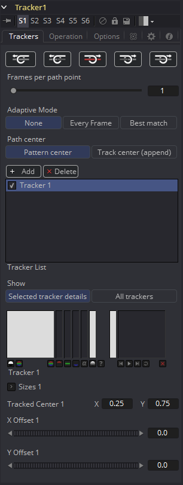

##### Tracker Buttons 跟踪器按钮

有四个用于启动跟踪的按钮，而正中间的那个用于停止当前正在进行的跟踪。这些按钮可以在时间上向前或向后跟踪当前图案。将鼠标指针悬停在每个按钮上片刻，将显示带有按钮名称的工具提示。

这些按钮如下工作：

- **Track Reverse 反向跟踪：**单击该按钮会导致所有激活的跟踪器开始跟踪它们的图案，从渲染范围的结束处开始反向移动时间直至渲染范围的起始处。
  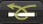
- **Track Reverse From Current Time 自当前时间反向跟踪：**单击该按钮会导致所有激活的跟踪器开始跟踪它们的图案，从当前帧开始反向移动时间直至渲染范围的起始处。
  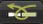
- **Stop Tracking 停止跟踪：**单击该按钮会立即停止跟踪的过程。这也可通过按下ESC达到同样的效果。该按钮只在跟踪过程中被激活。
  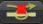
- **Track Forward From Current Time 自当前时间正向跟踪：**单击该按钮会导致所有激活的跟踪器开始跟踪它们的图案，从当前帧正向移动时间至渲染范围的结束处。
  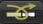
- **Track Forward 正向跟踪：**单击该按钮会导致所有激活的跟踪器开始跟踪它们的图案，从渲染的起始处正向移动时间至渲染范围的结束处。
  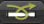

##### Frames Per Path Point 帧每路径点

该滑块的值决定了跟踪器在Path上设置关键帧的频繁程度。一般情况下默认为1，这会使每一帧上都在跟踪路径上设置一个关键帧。增加该滑块的值会导致跟踪路径变得更加不精确。这也许会产生不想要的那种不断波动的跟踪结果，不过正常情况下该控件还是应该保持为默认值。

如果项目是按场渲染的，值为1会在每一个场上设置一个关键帧。因为跟踪器是非常精确的，这会由于被跟踪图案场的位置导致一些微小的上下抖动。对于在Field模式中跟踪的场镜头，将该滑块设置为2会得到更好的结果，因为这会导致你的镜头是一帧一关键帧的。

##### Adaptive Mode 适配模式

如果有需要的话，Fusion可以重新获取跟踪图案来完成较复杂的跟踪。该按钮组决定了Adaptive跟踪会采用哪种模式。

- **None 无：**如果选中，Fusion仅在每个单帧中搜索原始选择的图案。
- **Every Frame 每一帧：**如果选中，Fusion会在每一帧中重新获取图案，这会帮助跟踪器随时间在侧面和光照上的缓慢变化中得到补偿。
- **Best Match 最佳匹配：**如果选中，跟踪器会比较每一帧上获取的图案以及原始选择的图案，如果两个图案之间的差异超过了有Match Tolerance控件定义的阈值，那么Fusion不会重新获取该帧的图案。这会有助于避免跟踪器由于穿过图案的路径的短暂伪像（如阴影）而导致的漂移。

##### Path Center 路径中心

该按钮组中的两个按钮决定了重新定位图案时跟踪器的行为。这些控件会在将路径从一种图案切换到另一图案时使用，这种情况是在图案离开帧时发生的，或者发生了巨大的变化以致无法继续跟踪。

- **Pattern Center 图案中心：**当激活Pattern Center时，跟踪的路径将从新路径的中心继续。当整个替换现存的路径时非常适合，但是当尝试使用新图案附加到路径后时会导致不连续。

- **Track Center (append) 跟踪中心（附加）：**当选中Track Center (append)时，根据新路径跟踪的路径会附加到现存的路径之后。创建的路径会自动根据获取的量偏移。如果新图案位于旧图案的附近时该技巧会工作得最好来避免一些视差或镜头畸变之类的问题。

  该模式也可以用于虚拟地继续跟踪移动到帧外或被其他物体遮挡的图案。

##### Add/Delete Tracker 添加/删除跟踪器

使用它们来向你的Tracker List添加或删除跟踪器。

- **Add 添加：**添加一个新的跟踪器。
- **Delete 删除：**删除Tracker List中当前选择的跟踪器。

##### Tracker List 跟踪器列表

Tracker List会显示在该Tracker上创建的所有图案的名称。它也可用于添加新的跟踪器。

Tracker工具也可村粗几近无限数量的跟踪图案。

- 单击列表上方的Add按钮会立即添加一个新的跟踪图案。
- 每一个图案会根据名称在列表上显示，旁边是一个小小的复选框。单击图案的名称会选择整个图案。
- 列表下方的控件会仅改变该图案。再点击一次已选中的图案会重命名该图案来变得更具描述性一些。

##### Tracker States 跟踪器状态

- **Enabled (Black Checkbox) 启用（黑色复选框）：**一个Enabled的图案会在每次启动跟踪时重新跟踪。它的路径数据可用于其他的工具，它的数据也可用于Stabilization和Corner Positioning。
- **Suspended (Gray Checkbox) 暂停（灰色复选框）：**一个Suspended的图案不会再启动跟踪时重新跟踪。它的数据被锁定来防止额外的改变。它的路径数据仍可用于其他的工具，它的数据也可用于Stabilization和Corner Positioning。
- **Disabled (Clear) 禁用（清空）：**一个Disabled的图案不会再初始化跟踪时创建路径，它的数据也不可用于其他数据，或者类似Stabilization和Corner Positioning等高级跟踪操作。

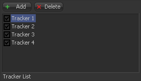

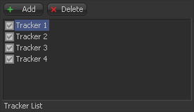

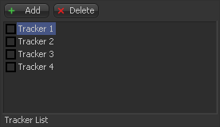

##### Show 显示

这两个按钮确定在工具控件中显示哪些控件。它们不会对跟踪器的操作产生影响，它们只会影响界面。

- **Selected Tracker Details 选中跟踪器细节：**勾选Selected Tracker Details时，显示的控件仅与当前选中的跟踪器有关。您将可以访问Pattern Window和Offset滑块。
- **All Trackers 所有跟踪器：**勾选All Trackers时，每个跟踪器的图案窗口将同时显示在Tracker List下方。

##### Left Pattern Display 左图案显示

Pattern Display有两个彼此相邻的图像窗口，以及一系列状态栏。左侧的窗口显示最初选择的图案，而右侧的窗口则显示跟踪过程中当前图案的实时显示。

当屏幕上的控件为某图案移动时，最左侧窗口中的显示将更新显示该图案。随着图案的移动，紧靠图像显示右侧的垂直条表示图像通道的清晰度和对比度。

最清晰的一个或多个通道会被自动选择来进行跟踪。这些通道在代表该通道的垂直条中具有白色背景。可以保持自动的跟踪，也可以覆盖自动选择并通过禁用标有问号的按钮并选择要跟踪的通道下方的按钮来选择用于跟踪的通道。

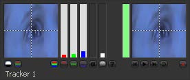

在通常情况下，选择的通道会在Pattern Display中指示出来。如果所选通道为Blue，则将显示该图案的Blue通道的灰阶表示。如果选择所有三个通道进行跟踪，则仅以全色表示图像。

通过选择Pattern Display下的Show Full Color按钮而不是Show Selected Channel按钮来替代此行为。

> Fusion会自动寻找对比度最高的通道，因此您可能最终会跟踪Blue通道，尤其是在扫描的胶片材质上。不幸的是，大多数胶卷上的Blue通道也包含最多的颗粒，这自然会导致跟踪不干净。跟踪之前，最好放大素材并分别检查RGB通道。

##### Right Pattern Display 右图案显示

右侧的图案显示指示为跟踪获取的实际图案。直到第一次真正跟踪所选图案之前，此显示一直为空。在跟踪期间，图案显示将变为活动状态，显示Fusion从帧之间获取的图案。

进行跟踪时，每个帧中的图案都会累积到Filpbook中，在使用窗口底部的传输控件进行跟踪后，可以在Pattern Display中对其进行回放。

在处理跟踪时，图案右侧的垂直条显示Fusion对当前图案与最初选择的图案匹配的信心。绿色条表示当前图案与原始图案高度相符。黄色条表示不确定，而红色条表示Fusion已检测到当前模式的极端变化，并且不再确定其准确性。

跟踪之后，Pattern Display将显示该模式的跟踪的小Flipbook，上面覆盖着帧号，以帮助识别该轨迹的问题帧。

##### Pattern Width and Height 图案宽度和高度

使用这些控件可以手动调整所选跟踪器图案的宽度和高度。跟踪器样式的大小也可以在查看器中进行调整，这是通常的方法，但是也可通过手动控制来更轻松地进行较小的调整。

##### Search Width and Height 搜索宽度和高度

搜索区域定义了Fusion将在图像中逐帧查找多远来在跟踪过程中重新获取图案。与Pattern Width and Height一样，可以在查看器中调整搜索区域，但是你可能希望使用这些控件手动进行较小的调整。

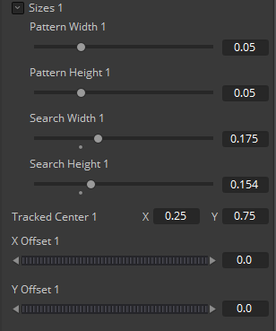

##### Tracked Center 跟踪中心

此位置控件指示跟踪器中心的位置。要从跟踪器图案中删除路径，右键单击此控件并从上下文菜单中选择Remove Path。

##### X and Y Offset X和Y偏移

您经常会需要跟踪场景中某个对象的位置，但是该对象不能提供非常可靠的图案。Offsets允许跟踪接近预期对象的物体。使用这些偏移量可以调整跟踪器的报告位置，以便为预期模式而不是实际模式报告数据。

 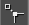

您也可以通过激活视图旁边的定位器的Offsets图标直接在视图中调整Offset。

#### Operation Tab 运算选项卡

Tracker工具可以表现广范围的功能，从匹配移动一个物体至移动的场景中、平滑抖动的相机运动或途欢告示牌的内容。使用Operation选项卡中的选项和按钮来选择Tracker工具表现的功能。请同样参考附录中的“跟踪解释 Tracking Explained”章节。

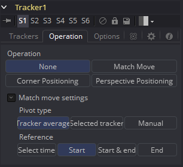

##### Opeartion Buttons 操作按钮

这四个按钮选择由Tracker表现的确切功能。该选项卡中的剩余控件用于精细调节运算的结果。

- **None 无：**Tracker在图像上不会表现除简单地定位和跟踪所选的图案以外额外的运算。这是默认的模式，用于创建之后驱动Fusion中其他控件的路径。

- **Match Move 匹配移动：**该模式用于平稳图像或匹配图层的位置、旋转及缩放来匹配移动另一元素至场景中。平稳需要至少一个跟踪器来确定位置，两个或多个确定了序列中的缩放和旋转。

  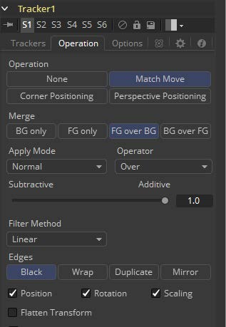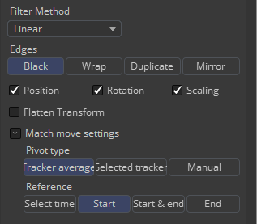
  
- **Corner Positioning 角落定位：**Corner Positioning模式用于跟踪矩形物体的四个角落并使用一个新的图像来替换其内容。该模式最少需要四个跟踪器，如果跟踪器不够的话，则会自动创建跟踪器来达到总共四个。
  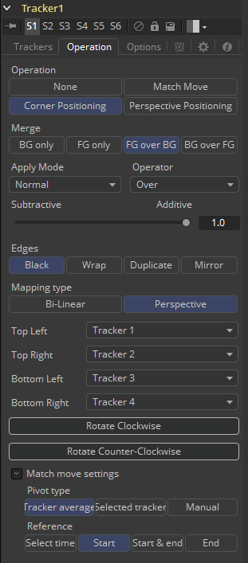

- **Perspective Positioning 透视定位：**该模式类似于Corner Positioning，但不是替换矩形的内容，而是将四个跟踪的角落映射到图像的四个角落。这通常用于从图像中移除透视。就像Corner Positioning，该模式需要四个跟踪器，并在不足够多时自动创建。

##### Merge 合并

Merge控件确定会对连接至Tracker的前景输入的图像做什么（如果有的话）。这按钮组会在Operation设置为除None之外时显示。

- **BG Only 仅背景：**忽略前景输入，只影响背景。这主要在平稳图像序列时使用。
- **FG Only 仅前景：**变换前景输入来匹配背景中的移动，而该变换的图像会透过至Tracker的输出。这一Merge技巧用于匹配移动一个图层的运动至另一图层的运动。
- **FG over BG 前景覆盖背景：**将前景图像合并进背景图像中，使用出现的Apply Mode控件中描述的Merge方法。
- **BG over FG 背景覆盖前景：**将背景合并到前景中。这一技巧经常用于当使用Alpha通道跟踪图层来获得平稳的背景来衬在背后。

##### Apply Mode 应用模式

该下拉菜单提供多种确定两个图像如何结合的选项。该菜单中的选项在Merge工具的参考章节中有更详细的解释。

##### Subtractive/Additive 减性/加性

这决定了前景图层覆叠在背景图层上使用加性还是减性合并技巧。该控件在Merge工具的文档中有更详细的解释。

##### Edges Match Move 边缘匹配移动

该按钮组只在Operation模式设置为Match Move时出现。多种选项用于选择如何处理移动图像来匹配位置和缩放时出现的边缘。

- **Black 黑：**由Stabilization显露出的边框外部的边缘保留为黑色。
- **Warp 环绕：**移出边框一侧的图像部分用于填充在另一侧显露出的边缘。
- **Duplicate 复制：**边缘的最后一个有效像素重复至边框的边缘。

##### Position, Rotation and Scaling Checkboxes 位置、旋转和缩放复选框

Position、Rotation和Scaling复选框只在模式设置为Match Move时出现。它们决定了Stabilization会尝试校正图像中运动的哪一部分。举个例子，如果只选中了Position复选框，则不会尝试校正图像中的Rotaion和Scaling。

##### Flatten Transformation 扁平化变换

该复选框只在模式设置为Match Move时出现。就像Fusion中的大多数变换一样，默认情况下Stabilization由其他有序的变换连接起来。选中这个复选框会扁平化变换，中止出现的连接并立即应用变换。

##### Mapping Type 映射类型

Mapping Type控件只在Corner Positioning模式中出现。该按钮组中有两个选项。

- **Bi-Linear 二次线性：**第一种方法是Bi-Linear，其中前景图像被映射进背景中而不会尝试校正透视畸变。这与先前版本的Fusion运算意志，这一Classic模式包含大多只是为了兼容性原因。
- **Perspective 透视：**该控件的默认设置是Perspective。

##### Corner Selector 角落选择器

这四个下拉菜单只在Tracker的Operation模式设置为Corner或Perspective Positioning时才会出现。它们用于选择哪个跟踪器映射到这些模式使用的矩形的四个角落。这在Tracker选择了多于四个图案且你必须选择使用哪个位置时有用。

##### Rotate Buttons 旋转按钮

这些控件只在Tracker的Operation模式设置为Corner或Perspective Positioning时才会出现。它们用于在应用至背景之前旋转前景90度。

##### Match Move Settings 匹配移动设置

Tracker工具会自动输出都走红平稳和不平稳的位置输出至流程中其他可连接的控件。Stable Position输出提供了X和Y的坐标来在序列中匹配或反转运动。这些控件即使在Operation模式不为Match Move时也可用，因为Stable Postion输出总是可用于与其他工具的连接。

##### Pivot Type 中心轴类型

在几乎所有情况下，用于任意平稳的轴应该是该帧所有跟踪器的平均位置，然而在一些罕见的情况下选哟跟踪器的轴位于别的位置。

该按钮组允许选择基于单个跟踪器的平稳的轴，或手动放置。

##### Reference 参考

Reference控件用于设置平稳的“快照帧”。当你平稳图像时，必须有一个被认为是正确的位置，来检测并校正后续的移动。

- **Select Time 选择时间：**Select Time参考模式确定了基于其中首次选择的图案的帧的“快照帧”。所有的平稳都意在将该图像返回到参考。

- **Start 起始：**“快照帧”将是跟踪路径中的第一帧。所有的平稳都意在将该图像返回到参考。

- **Start and End 起始和结束：**Start and End参考模式与别的模式有一些不同。其中其他的模式意在取得平稳返回的快照帧，而Start and End模式意在平滑现存的运动而不是移除它。该模式平均了路径起始到结束之间的运动，在这些点之间绘制一条直线。

  该模式激活时，它会显露出Reference Intermediate Points控件。增加该控件的值会增加Reference使用的路径上的点的数量，并平滑在起始至结束之间的直线运动使其不完全是线性的。

- **End 结束：**快照帧将是跟踪路径的最后一帧。所有的平稳都意在将该图像返回到参考。

#### Onscreen Controls 屏上控件

Tracker中的每个图案都有它自己的屏上控件，用于选择要跟踪图像的像素。

这些控件将在Tracker在流程中选中时显示在查看器中。

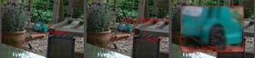

- 屏上控件由一个左上角有一个手柄的红色矩形指示。该矩形指示了图像中图案的位置。该矩形中的每个像素都被认为是用于跟踪图案的一部分。通过点击并拖动矩形边框可重设图案。
  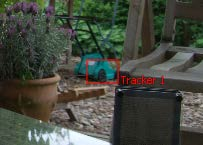
- 当鼠标一移过图案矩形时，带有虚线轮廓的第二个矩形就会出现。这代表了搜索区域，搜索区域确定了跟踪器会在下一帧中查找当前图案多远。这应该要比图案大，而且应该足够大以包含场景中最大的帧间移动。更快的移动物体也需要更大的搜索区域，而更慢的移动物体可以被更小的搜索区域处理。搜索区域越大，就会花费越长的时间来跟踪，所以尝试不要将搜索区域设置得过大，够用就行。
  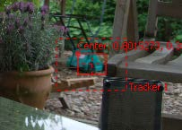
- 拖动手柄来重新放置图案。在重新放置图案的时候，视图中会出现一个放大视图的缩略图窗口，来帮助你更精确地定位图案。该缩略图会在松开鼠标按钮时消失。放大率可以在Options选项卡中调整。如果选中的跟踪器拥有自定义名称，那么该跟踪器的名称会在搜索区域的右下角显示为一个小标签。
  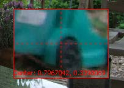

> 一个流程中可使用的跟踪器的数量是没有限制的，至跟踪器的连接也是没有限制的。本章是作为Tracker的各种控件的参考，但是我们强烈建议你阅读在“跟踪 Tracking”章节中阅读有关使用Tracker的一般信息。
>
> Tracker可以通过两种形式使用：在流程中作为工具或作为附加在控件上的修改器。当Tracker用作流程中的工具时，跟踪的图像来自Tracker工具的输入。单个Tracker工具跟踪的图案数量是没有限制的。
>
> 当Tracker用作修改器时，它的控件会显示在任何显示在所有有控件连接至该修改器的Modifiers选项卡中。Tracker修改器只可跟踪一个图案，但是图像源可以来自合成以外。该技巧通常为一个控件跟踪一个快速的位置时使用。

##### XY Path XY路径

默认情况下，Tracker会像跟踪点应用一个Displacement Path。要向跟踪点应用一个XY Path请至*Preferences > Globals > Splines*。

#### Options tab

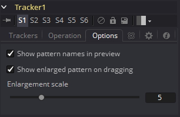

##### Show Pattern Names in Preview 在预览中显示图案名称

该选项定义Tracker的名称是否会显示在视图中。将它关闭后将只看见图案矩形。

##### Show Enlarged Pattern on Dragging 拖拽时显示放大的图案

该选项定义放置图案矩形时是否显示放大的视图。

##### Enlargement Scale 放大倍数

上述选项开启时，用于放置图案矩形的缩放倍数。Tracker的输出（在*Connect to...*菜单中可见）也可被脚本使用。它们是：

- **SteadyPosition：**平稳位置
- **UnsteadyPosition：**不平稳位置
- **SteadyAxis：**平稳轴
- **SteadySize：**平稳大小
- **UnsteadySize：**不平稳大小
- **SteadyAngle：**平稳角度
- **UnsteadyAngle：**不平稳角度
- **Position1：**跟踪器1偏移位置
- **PerspectivePosition1：**跟踪器1透视偏移位置
- **PositionX1：**跟踪器1偏移X位置（3D空间）
- **PositionY1：**跟踪器1偏移Y位置（3D空间）
- **PerspectivePositionX1：**跟踪器1透视偏移X位置（3D空间）
- **PerspectivePositionY1：**跟踪器1透视偏移Y位置（3D空间）
- **SteadyPosition1：**跟踪器1稳定位置
- **UnsteadyPosition1：**跟踪器1不平稳位置（与第一个、第二个等类似）