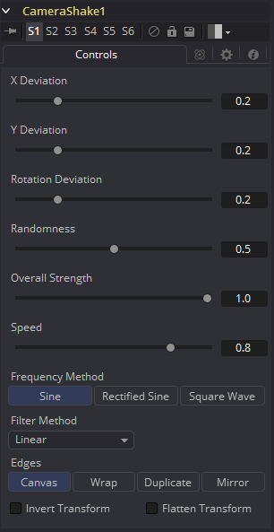

### Camera Shake [CSh] 摄像机摇晃

该工具可以模拟一些从生理到机械的摄像机抖动样式的运动。它与Shake修改器不一样，那个会为工具空间生成随机数值。有关Shake修改器的更多信息详见“Connections and Modifiers 连接与修改器”一章。

Camera Shake工具会将其结果与相邻的变换工具连接在一起。有关连接的更多信息详见“Transformations 变换”一章。

#### Controls 控件

##### Deviation X and Y 偏差X和Y

这些控件确定沿着水平（X）和垂直（Y）轴应用至图像上的抖动量。允许将值设置为0.0至1.0之间。1.0的值会生成图像边界以内任何位置的抖动。

##### Rotation Deviation 旋转偏差

这定义了应用至旋转轴上的抖动量。允许将值设置为0.0至1.0之间。

##### Randomness 随机性

该控件中更高的值会导致抖动运动变得更加没有规律或随机。更小的值会导致运动变得更好预测。

##### Overall Strength 总体强度

这会调整所有会影响入和出的参数和混合的总体振幅。值为1会使其余控件产生与描述一样的效果。

##### Speed 速度

Speed控制抖动的频率或速率。

##### Frequency Method 频率方法

这会选择抖动的大体形状。可用的频率有Sine（正弦）、Rectified Sine（方化正弦）和Square Wave（方波）。Square Wave会生成比Sine机械感更强的运动。

##### Filter Modes 滤镜模式

- **Nearest Neighbor 最邻近的：**这会根据需要跳过或复制像素。这产生了最快但最粗糙的结果。
- **Box 盒：**这是一个简单的插值比例的图像。
- **Linear 线性：**这使用了一个简单的滤镜，它产生相对干净和快速的结果。
- **Quadratic 二次：**这个滤镜产生一个标称的结果。它在速度和质量之间提供了一个很好的折中方案。
- **Cubic 立方：**这在连续色调图像中产生了更好的效果，但比Quadratic慢。如果图像中有精细的细节，结果可能比预期的更模糊。
- **Catmull-Rom Catmull-Rom：**这产生了良好的结果与连续色调图像缩小，产生了清晰的结果与精细的图像。
- **Gaussian 高斯：**这在速度和质量上与Quadratic非常相似。3
- **Mitchell Mitchell：**这类似于Catmull-Rom，但使用精细的图像可以产生更好的效果。它比Catmull-Rom慢。
- **Lanczos Lanczos：**这与Mitchell和Catmull-Rom非常相似，但是更清晰，也更慢。
- **Sinc Sinc：**这是一个先进的滤镜，可以产生非常清晰，详细的结果，然而，它可能会在某些情况下产生可见的振铃。
- **Bessel Bessel：**这类似于Sinc滤镜，但可能更快一些。

##### Edges 边缘

这决定了如何对待图像的边缘。

- **Black 黑色：**这会导致抖动揭露出来的边缘为黑色。
- **Wrap 环绕：**这会导致边缘环绕（顶部环绕至底部，左边环绕至右边，等等）。
- **Duplicate 复制：**这会导致复制边缘，导致边缘处有一些轻微的涂抹效果。

##### Invert Transform 反转变换

选中该控件来反转任何位置、旋转或缩放变换。该选项也许会在精确移除上游Camera Shake工具产生的运动时起作用。

##### Flatten Transform 扁平化变换

Flatten Transform选项防止该工具将它的变换连接至相邻工具上。该工具仍会从它的输入连接变换，但不会在输出将该工具与它的变换连接。

