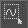
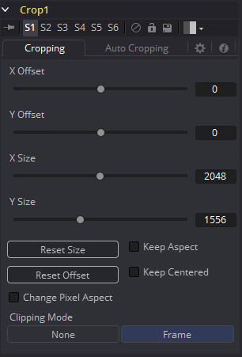
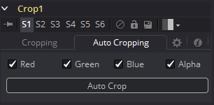

### Crop [Crp] 裁剪

Crop工具可以用于剪去图像中的一部分或将图像偏移至更大的图像区域中。该工具实际上更改了图像的分辨率，并且在一般情况下不添加动画。

也可以通过查看上游的工具并使用鼠标框选一个区域来在视图中裁剪图像。若要这么做，先通过点击你视图一侧的按钮来激活Allow Box Selection，然后拖出一个矩形来表现该操作。

#### Cropping Tab 裁剪选项卡

##### Offset X and Y 偏移X和Y

这些控件定位裁剪窗口的左上角。比被裁剪图像的实际分辨率更大的值会导致它消失在输出图像的边缘之外。小于0的值会将输入图像推向结果的右下方。该控件的值以像素为单位。

##### Size X and Y 大小X和Y

使用该控件来设置Crop工具输出图像的垂直和水平分辨率。该控件的值以像素为单位。

##### Keep Aspect 保持宽高比

当勾选时，Crop工具会保持输入图像的宽高比。

##### Keep Centered 保持居中

勾选时，Crop工具会自动调整Offset X and Y来使图像居中。

##### Reset Size 重置大小

这会将图像的尺寸重置至输入图像的大小。

##### Reset Offset 重置偏移

这会将Offset X and Y重置为它们的默认值。

##### Change Pixel Aspect 更改像素宽高比

启用该宽高比会显示一个Pixel Aspect控件，它用于更改像素的宽高比为图像应当拥有的。有关Fusion中的Pixel Aspect操作的更多细节详见“Frame Formats 帧格式”部分。

##### Clipping Mode 裁剪模式

该选项设置表现Domain of Definition渲染时用于处理图像边缘的模式。这对于Blur一类的工具的处理非常重要，因为它会需要当前域之外图像部分的样本。

- **Frame 帧：**默认的选项是Frame，这会自动将工具的Domain of Definition设置为使用图像的整个帧，有效地忽略当前的Domain of Definition。如果上游的DoD比该帧的DoD小，帧中剩余的区域则会被当作是黑色/透明的。
- **None 无：**将该选项设置为None不会表现任何源图像的裁剪，这意味着处理工具效果所需的任何数据（通常在上游DoD之外）会被当作是黑色/透明的。

#### Auto Cropping Tab 自动裁剪选项卡

##### RGBA Color Channels RGBA色彩通道

选择用于Auto Crop检验的通道。这会在自动裁剪在特定的色彩通道中有非实心背景的图像中起到作用，例如蓝色色彩渐变。将通道取消勾选使Auto Crop在下次核算图像时忽略它。

##### Auto Crop 自动裁剪

这会核算图像并试图确定图像的背景色。然后它会裁剪图像的各边至不是该颜色的像素。

