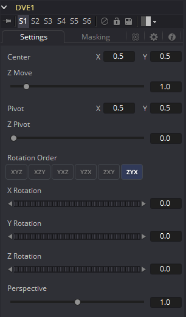
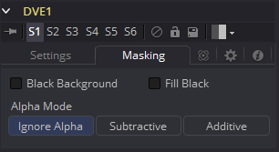

### DVE [DVE]

DVE工具是一种类似于在在线编辑套件中找到的3D图像变换。该工具包含了图像旋转、透视变化以及Z移动。可以为所有的变换定义变换轴。

#### Settings Tab 设置选项卡

##### Pivot X, Y and Z 旋转中心X、Y和Z

旋转和缩放的轴的位置。默认的X和Y是0.5和0.5，也就是图像的中心，而Z为0，Z空间的中心。

##### Rotation Order 旋转顺序

使用这些按钮来确定旋转以什么顺序应用至图像上。

##### XYZ Rotation XYZ旋转

这些控件用于沿X、Y和Z轴旋转图像。

##### Center X and Y 中心X和Y

这在屏幕上定位DVE图像的中心。默认为0.5、0.5，也就是将DVE定位于图像的中心。

##### Z Move Z移动

这沿着Z轴放大或缩小了图像。看起来的样子就是，当变化该控件时，效果就像是观察一个物体从一定距离逐渐接近。

##### Perspective 透视

这会向沿着X和Y轴旋转的图像添加额外的透视，类似于更改了摄像机的视场和缩放。

#### Masking Tab 遮罩选项卡

DVE工具允许对其输入图像进行预遮罩。这能提供从图像的遮罩区域创建变换而保留图像的其他区域不受影响的能力。

不像常规的效果遮罩，该遮罩处理会出现在变换之前。要使用该特性，将遮罩连接在DVE工具的DVE Mask输入上。另外，也可以选择DVE工具，右击视图并从上下文菜单中选择DVE Mask。所有的常见遮罩类型都可以应用至DVE遮罩。

##### Black Background 黑色背景

将其勾选来擦除遮罩的变换图像以外的区域。

##### Fill Black 填充黑色

将其勾选来从DVE的输入中擦除遮罩之内的区域（变换之前），可以有效地从图像中剪切掉遮罩区域。同时启用Black Background和Fill Black会仅显示遮罩变换的区域。

##### Alpha Mode Alpha模式

这确定DVE在将变换的图像区域合并到未变换的图像区域之上时如何处理图像的Alpha通道。

- **Ignore Alpha 忽略Alpha：**这会导致输入图像的Alpha被忽略，所以所有遮罩区域都会是不透明的。
- **Subtractive/Additive 减性/加性：**这些会导致输入图像之上的预遮罩区域的内部合并是减性或加性的。有关减性和加性的更多信息请见Merge工具。

