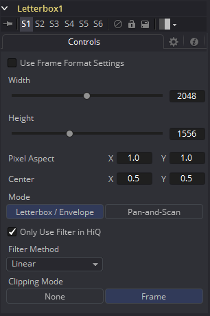

### Letterbox [Lbx]

使用Letterbox工具来将一个现存的工具适配至任何其他格式的帧尺寸和宽高比率。该工具的最常见的用途是将胶片分辨率适配至NTSC或PAL尺寸帧，来在外部电视监视器上查看。水平或垂直的黑色边缘会在必要时自动添加来适应宽高比率差异。

#### Controls 控件

##### Formats Contextual Menu 格式上下文菜单

将指针放在Aspect X或Y控件上并按下鼠标右键来显示可用帧格式的菜单，从该菜单中选择一项来自动设置Height、Width和Aspect控件，或手动输入所需的信息。

##### Width and Height 宽度和高度

这些控件的值确定了输出图像的尺寸，以像素为单位。

##### Pixel Aspect X and Y 像素宽高比X和Y

该控件确定了输出图像的像素宽高比率。

##### Center X and Y 中心X和Y

该Center控件会在Pan-And-Scan模式中的连接中重新放置图像窗口。当工具设置为Letterbox时它没有效果。

##### Mode 模式

该控件用于确定Letterbox工具的操作模式。

- **Letterbox/Envelope 信箱/信封：**这会校正输入图像的宽高比并将其调整大小至对应的宽度。
- **Pan-And-Scan 平移并扫描：**这会校正输入图像的宽高比并将其重新缩放值对应的高度。如果重新缩放的输入图像比指定的宽度宽的化，中心控件可用于为重新缩放输入的可见部分添加动画。

##### Filter Method 滤镜方法

- **Nearest Neighbor 最邻近的：**这会根据需要跳过或复制像素。这产生了最快但最粗糙的结果。
- **Box 盒：**这是一个简单的插值比例的图像。
- **Linear 线性：**这使用了一个简单的滤镜，它产生相对干净和快速的结果。
- **Quadratic 二次：**这个滤镜产生一个标称的结果。它在速度和质量之间提供了一个很好的折中方案。
- **Cubic 立方：**这在连续色调图像中产生了更好的效果，但比Quadratic慢。如果图像中有精细的细节，结果可能比预期的更模糊。
- **Catmull-Rom Catmull-Rom：**这产生了良好的结果与连续色调图像缩小，产生了清晰的结果与精细的图像。
- **Gaussian 高斯：**这在速度和质量上与Quadratic非常相似。3
- **Mitchell Mitchell：**这类似于Catmull-Rom，但使用精细的图像可以产生更好的效果。它比Catmull-Rom慢。
- **Lanczos Lanczos：**这与Mitchell和Catmull-Rom非常相似，但是更清晰，也更慢。
- **Sinc Sinc：**这是一个先进的滤镜，可以产生非常清晰，详细的结果，然而，它可能会在某些情况下产生可见的振铃。
- **Bessel Bessel：**这类似于Sinc滤镜，但可能更快一些。

