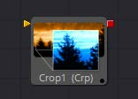
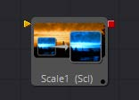
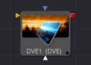

## 第二十八章 Transform Tools 变换工具

- [Camera Shake [CSh] 摄像机摇晃](./Camera%20Shake%20[CSh].md) 
- [Crop [Crp] 裁剪](./Crop%20[Crp].md) 
- [DVE [DVE]](./DVE%20[DVE].md) 
- [Letterbox [Lbx] 信封](./Letterbox%20[Lbx].md) 
- [Resize [Rsz] 调整尺寸](./Resize%20[Rsz].md) 
- [Scale [Scl] 缩放](./Scale%20[Scl].md) 
- [Transform [Xf] 变换](./Transform%20[Xf].md) 

<table id="img">
  <tr>
	<td rowspan="4"></td>
    <td></td>
    <td></td>
  </tr>
  <tr>
    <td></td>
    <td></td>
  </tr>
  <tr>
    <td></td>
    <td></td>
  </tr>
  <tr>
    <td></td>
