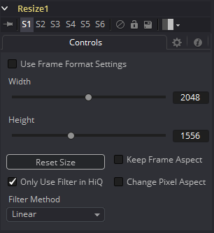

### Resize [Rsz] 调整尺寸

使用Resize工具来增加或减少输入图像的分辨率。这用于将图像从一个格式转换至另一格式（例如从胶片至视频分辨率）。

#### Controls 控件

##### Width 宽度

这控制了图像沿着X轴的新分辨率。

##### Height 宽度

这控制了图像沿着Y轴的新分辨率。

##### Keep Frame Aspect 保持帧宽高比

当勾选时，Resize工具会保持原始图像的宽高比，维持宽度和高度之间的原始比例。

##### Reset Size 重置大小

将图像的尺寸重置为图像的原始大小。

##### Only Use Filter in HiQ 仅在HiQ下使用滤镜

Resize工具一般会在非HiQ下使用快速的Nearst Neighbor滤镜，它的速度要快于完全准确性。取消勾选此复选框来强制Resize总是为所有渲染使用所选的滤镜。

##### Change Pixel Aspect 更改像素宽高比

启用该宽高比会显示一个Pixel Aspect控件，它用于更改像素的宽高比为图像应当拥有的。有关Fusion中的Pixel Aspect操作的更多细节详见“Frame Formats 帧格式”部分。

##### Filter Method 滤镜方法

- **Nearest Neighbor 最邻近的：**这会根据需要跳过或复制像素。这产生了最快但最粗糙的结果。
- **Box 盒：**这是一个简单的插值比例的图像。
- **Linear 线性：**这使用了一个简单的滤镜，它产生相对干净和快速的结果。
- **Quadratic 二次：**这个滤镜产生一个标称的结果。它在速度和质量之间提供了一个很好的折中方案。
- **Cubic 立方：**这在连续色调图像中产生了更好的效果，但比Quadratic慢。如果图像中有精细的细节，结果可能比预期的更模糊。
- **Catmull-Rom Catmull-Rom：**这产生了良好的结果与连续色调图像缩小，产生了清晰的结果与精细的图像。
- **Gaussian 高斯：**这在速度和质量上与Quadratic非常相似。3
- **Mitchell Mitchell：**这类似于Catmull-Rom，但使用精细的图像可以产生更好的效果。它比Catmull-Rom慢。
- **Lanczos Lanczos：**这与Mitchell和Catmull-Rom非常相似，但是更清晰，也更慢。
- **Sinc Sinc：**这是一个先进的滤镜，可以产生非常清晰，详细的结果，然而，它可能会在某些情况下产生可见的振铃。
- **Bessel Bessel：**这类似于Sinc滤镜，但可能更快一些。
