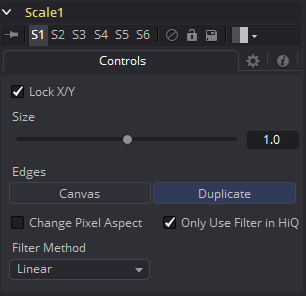

### Scale [Scl] 缩放

Scale工具几乎与Resize工具完全相同，差别只有Resize工具会使用确切的尺寸，而Scale工具使用相对的尺寸来描述源图像分辨率的更改。

#### Controls 控件

##### Lock X/Y 锁定X/Y

当选中时，只会显示Size控件，对于图像缩放的更改会被均等地应用至X和Y轴上。如果清除了该复选框，那么会为X和Y大小出现独立的大小控件。

##### Size X/Y 大小X/Y

Size控件用于设置调整源图像分辨率时所用的缩放。值为1.0表示在图像上没有效果，而2.0表示缩放图像至两倍于当前分辨率。值为0.5则会减半图像分辨率。

##### Change Pixel Aspect 更改像素宽高比

启用该宽高比会显示一个Pixel Aspect控件，它用于更改像素的宽高比为图像应当拥有的。有关Fusion中的Pixel Aspect操作的更多细节详见“Frame Formats 帧格式”部分。

##### Only Use Filter in HiQ 仅在HiQ下使用滤镜

Resize工具一般会在非HiQ下使用快速的Nearst Neighbor滤镜，它的速度要快于完全准确性。禁用该复选框来强制Resize总是为所有渲染使用所选的滤镜。

##### Filter Method 滤镜方法

- **Nearest Neighbor 最邻近的：**这会根据需要跳过或复制像素。这产生了最快但最粗糙的结果。
- **Box 盒：**这是一个简单的插值比例的图像。
- **Linear 线性：**这使用了一个简单的滤镜，它产生相对干净和快速的结果。
- **Quadratic 二次：**这个滤镜产生一个标称的结果。它在速度和质量之间提供了一个很好的折中方案。
- **Cubic 立方：**这在连续色调图像中产生了更好的效果，但比Quadratic慢。如果图像中有精细的细节，结果可能比预期的更模糊。
- **Catmull-Rom Catmull-Rom：**这产生了良好的结果与连续色调图像缩小，产生了清晰的结果与精细的图像。
- **Gaussian 高斯：**这在速度和质量上与Quadratic非常相似。3
- **Mitchell Mitchell：**这类似于Catmull-Rom，但使用精细的图像可以产生更好的效果。它比Catmull-Rom慢。
- **Lanczos Lanczos：**这与Mitchell和Catmull-Rom非常相似，但是更清晰，也更慢。
- **Sinc Sinc：**这是一个先进的滤镜，可以产生非常清晰，详细的结果，然而，它可能会在某些情况下产生可见的振铃。
- **Bessel Bessel：**这类似于Sinc滤镜，但可能更快一些。