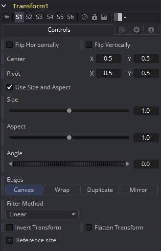

### Transform [Xf]

Transform工具可以用于图像的简单2D变换，例如平移、旋转和缩放。图像的宽高比也可通过Transform工具修改。

Transform工具会将它的结果与邻近的变换工具连接。有关连接的更多信息，详见“Transformations 变换”一章。

#### Controls 控件

##### Flip Horizontally and Vertically 水平与垂直翻转

勾选该控件来沿着X或Y轴翻转图像。

##### Center X and Y 中心X和Y

这会设置图像在屏幕上的位置。默认为`0.5. 0.5`，将图像放置在屏幕中央。显示的值总是为实际位置乘以参考大小。见下方关于参考大小的描述。

##### Pivot X and Y 旋转中心X和Y

这定位了旋转和缩放的轴。默认为`0.5, 0.5`，即图像的中心。

##### Use Size and Aspect 使用大小和宽高比

该复选框确定了Transform工具是为X和Y的缩放提供独立的Size控件还是使用Size和Aspect控件来代替。

##### Size 大小

这修改了图像的大小，或缩放。值的范围为0至5，但是任何大于0的值都可以输入到编辑框中。如果选中了Use Size and Aspect复选框，那么该控件会均等地沿两轴缩放图像。而如果没有勾选Use Size and Aspect选项，那么将为X和Y提供单独的控件。

##### Aspect 宽高比

该控件更改了图像的宽高比。将值设置为大于1.0会沿着X轴拉伸图像。0.0至1.0之间的值会沿着Y轴拉伸图像/该控件仅在启用Use Size and Aspect复选框时可用。

##### Angel 角度

该控件会沿着旋转中心旋转图像。增加Angel会沿着逆时针方向旋转图像。而减少Angel会沿着顺时针方向旋转图像。

##### Edges 边缘

Edges确定了如恶化处理图像的边缘。

- **Canvas 画布：**这会导致图像的边缘揭露出来后显示当前画布色。
- **Wrap 环绕：**这会绕着图像的边界环绕图像的边缘。这会在平移无缝图像时起到作用，制作出无限移动的背景图像。
- **Duplicate 复制：**这会导致图像的边缘尽可能好地复制，在原始大小之外延续图像。

##### Filter Method 滤镜方法

- **Nearest Neighbor 最邻近的：**这会根据需要跳过或复制像素。这产生了最快但最粗糙的结果。
- **Box 盒：**这是一个简单的插值比例的图像。
- **Linear 线性：**这使用了一个简单的滤镜，它产生相对干净和快速的结果。
- **Quadratic 二次：**这个滤镜产生一个标称的结果。它在速度和质量之间提供了一个很好的折中方案。
- **Cubic 立方：**这在连续色调图像中产生了更好的效果，但比Quadratic慢。如果图像中有精细的细节，结果可能比预期的更模糊。
- **Catmull-Rom Catmull-Rom：**这产生了良好的结果与连续色调图像缩小，产生了清晰的结果与精细的图像。
- **Gaussian 高斯：**这在速度和质量上与Quadratic非常相似。3
- **Mitchell Mitchell：**这类似于Catmull-Rom，但使用精细的图像可以产生更好的效果。它比Catmull-Rom慢。
- **Lanczos Lanczos：**这与Mitchell和Catmull-Rom非常相似，但是更清晰，也更慢。
- **Sinc Sinc：**这是一个先进的滤镜，可以产生非常清晰，详细的结果，然而，它可能会在某些情况下产生可见的振铃。
- **Bessel Bessel：**这类似于Sinc滤镜，但可能更快一些。

##### Invert Transform 反转变换

选中该控件来反转任何位置、旋转或缩放变换。该选项也许会在精确移除上游Camera Shake工具产生的运动时起作用。

##### Flatten Transform 扁平化变换

Flatten Transform选项防止该工具将它的变换连接至相邻工具上。该工具仍会从它的输入连接变换，但不会在输出将该工具与它的变换连接。

##### Use Frame Format Settings 使用帧格式设置

选中这个会强制Transform使用合成的当前帧格式设置来这是Reference Width和Reference Height值。

##### Reference Size 参考大小

Reference Size之下的控件不会之间影响图像。取而代之地，它们会允许你控制Fusion如何表示Transform工具的中心。

一般情况下，坐标被表示为0至1之间的值，其中1是等于图像完整的宽度或高度的距离。这允许了分辨率的独立性，因为你可用更改图像的大小而不用更改中心的值。

该方法的一个缺点是它使图像的像素精确更改变得更加复杂了。为了说明这一点，想象一个100x100像素大小的图像。要将该图像的中心向右移动5个像素，我们需要更改变换中心的X值，从`0.5, 0.5`更改至`0.55, 0.5`。我们知道更改必须为0.05，因为5/100 = 0.05。

Reference Size控件允许你指定图像的尺寸。这会更改控件值显示的方法，也就是Center可以显示Center控件中X和Y字段的实际像素位置。扩展我们的示例，如果你将Width和Height都设置为100，那么Center现在会显示为`50, 50`，如果需要向右移动5个像素只需输入`55, 50`。