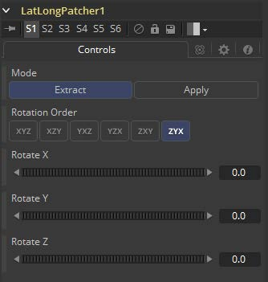

### LatLong Patcher [LLP] 经纬补丁

经纬投影拼接图像通常需要应用一些补丁、绘画作业或其他VFX。LatLong Patcher提取要处理的经纬投影图像的一部分并将其消除变形，然后变形合并回原始图像。这样就可以快速拾取球形图像的一部分进行修补或绘制，然后将其应用回原始图像。注意在Extract和Apply模式下都会使用匹配的旋转，从而使具有相同旋转设置的副本或实例可以轻松地反转工具的操作。

#### Controls 控件

##### Mode 模式

- **Extract 提取：**会从经纬投影图像中提取取消变形的90度方形图像。
- **Apply 应用：**会变形并将90度方形图像合并回经纬投影图像上。因为使用了方形图像的alpha，这使得如在透明的黑背上绘制的笔触或文字会应用于原始经纬投影图像，而避免双重过滤使原始图像取消变形和重新变形。

##### Rotation 旋转

这些将使球形图像绕X、Y和Z轴旋转，分别提供对俯仰/倾斜、平移/偏航和横滚的独立控制。

##### Rotation Order 旋转顺序

这将选择围绕每个轴的旋转顺序。例如，XYZ将首先绕X轴（俯仰/倾斜）旋转，然后绕Y轴（平移/偏航）旋转，最后绕Z轴（滚动）旋转。可以选择六个可能顺序中的任一个。