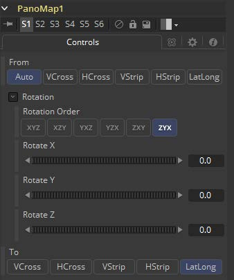

### PanoMap [PaM]

将图像从一种球形布局转换为另一种球形布局，例如将立方图转换为等矩形格式。 转换时，该工具还可以旋转球形图像。

#### Controls 控件

##### From and To 从和至

- **Auto 自动：**会从元数据和图像帧宽高比自动检测输入的图像布局。
- **VCross**和**HCross**是垂直或水平放置的立方体十字展开的六个正方形面，正视图位于十字中间，图像比例为3:4或4:3。
- **VStrip**和**HStrip**是以一条线垂直或水平放置的立方体展开的六个正方形面，顺序为左、右、上、下、后、前（X、-X、+Y、-Y、+Z、-Z），图像比例为1:6或6:1。
- **LatLong**是经纬投影的单张2:1图像。

##### Rotation 旋转

这些将使球形图像绕X、Y和Z轴旋转，分别提供对俯仰/倾斜、平移/偏航和横滚的独立控制。

##### Rotation Order 旋转顺序

这将选择围绕每个轴的旋转顺序。例如，XYZ将首先绕X轴（俯仰/倾斜）旋转，然后绕Y轴（平移/偏航）旋转，最后绕Z轴（滚动）旋转。可以选择六个可能顺序中的任一个。