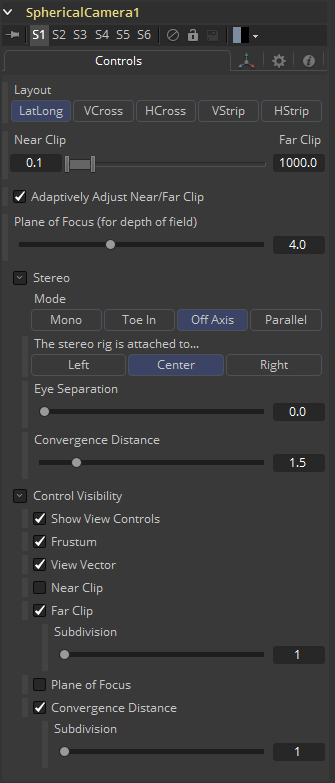

### Spherical Camera [3SC] 球形摄像机

Spherical Camera允许3D Renderer输出覆盖所有视角的图像，并使用几种不同的格式布局。该图像可以用于如天空盒材质、反射贴图或在VR头盔中查看。3D Renderer中的Image Width设置用作每个方形立方体面的大小，所以生成的图像会是水平和垂直方向上此大小的倍数。

#### Controls 控件

##### Layout 布局

- **VCross**和**HCross**是垂直或水平放置的立方体十字展开的六个正方形面，正视图位于十字中间，图像比例为3:4或4:3。
- **VStrip**和**HStrip**是以一条线垂直或水平放置的立方体展开的六个正方形面，顺序为左、右、上、下、后、前（X、-X、+Y、-Y、+Z、-Z），图像比例为1:6或6:1。
- **LatLong**是经纬投影的单张2:1图像。

##### Near/Far Clip 近/远剪切

剪切面用来限制场景中的几何物体，它是根据物体与摄像机的焦点距离来渲染的。这对于确保不渲染非常靠近摄像机的对象以及优化渲染以排除在最终渲染中太过遥远而无用的对象非常有用。

默认视角摄像机忽略此设置，除非取消勾选了Adaptively Adjust Near/Far Clip的复选框控件。

这些值以单位表示，因此，一个距离摄像机20个单位以上的剪切平面对摄像机来说是不可见的。一个0.1的剪切面意味着任何接近0.1单位的物体都是不可见的。

##### Adaptively Adjust Near/Far Clip 自适应调整近/远剪切

当被选中时，渲染器会自动调整摄像机的近/远剪辑平面，以匹配场景的区段。此设置覆盖上面描述的近剪辑范围控件和远剪辑范围控件的值。此选项不适用于正投影(Orthographic)摄像机。

##### Viewing Volume Size 观测体积大小

只有当Projection Type设置为Orthographic（正视）时，才会出现Viewing Volume Size控件。它决定了构成摄像机视场的框的大小。正投影摄像机与它看到的物体的Z距离不会影响这些物体的比例，只有观看的大小会影响。

> **注意：**在近和远剪切平面之间的更小的范围会允许在所有深度计算中具有更高的精度。如果场景开始在远处物体上渲染出奇怪的伪像，尝试增加Near Clip平面的距离。使用垂直光圈大小获取垂直视角，使用水平光圈大小获取水平视角。

##### Plane of Focus (for Depth of Field) 聚焦面（for景深）

OpenGL渲染器使用这个值来计算景深。它定义了摄像机前一个虚拟目标的距离。

#### Stereo Method 立体方法

允许你调整你的立体方法到你喜欢的工作模式。

##### Toe in 内束

两个摄像机都指向一个焦点。虽然结果是立体的，但是这种方法引入的垂直视差会引起观众的不适。

##### Off Axis 离轴

通常被认为是创建立体摄像机对的正确方法，这是Fusion的默认方法。离轴不引入垂直视差，从而产生压力较小的立体图像。

##### Parallel 平行

摄像机是平行移动的。因为这是一个纯粹的平行位移，所以没有收敛距离控制。并行不引入垂直视差，从而创建压力较小的立体图像。

##### Eye Separation 眼睛分离

定义两个立体声摄像机之间的距离。如果将Eye Separation设置为大于0的值，那么当选择此工具时，每个摄像头的控件将显示在查看器中。Parallel模式下不存在Convergence Distance控制。

##### Convergence Distance 收敛距离

这个控制设置了立体的收敛距离，定义为沿着摄像机z轴的点，它决定了左右眼摄像机在哪里交汇。

##### Control Visibility 控件可见性

允许您有选择地激活与摄像机一起显示的屏幕控件。

- **Frustrum 视锥：**显示摄像机的实际视锥。
- **View Vector 视图矢量：**在视图圆锥内显示一条白线，可用于在并行模式下确定位移。
- **Near Clip 近剪切：**近剪切面。这个平面可以细分以提高可见度。
- **Far Clip 远剪切：**远剪切面。这个平面可以细分以提高可见度。
- **Plane of Focus 聚焦面：**Plane of Focus根据上面解释的相应滑块。这个平面可以细分以提高可见度。
- **Convergence Distance 收敛距离:** 使用Stereo模式时的收敛点。这个平面可以细分以提高能见度。