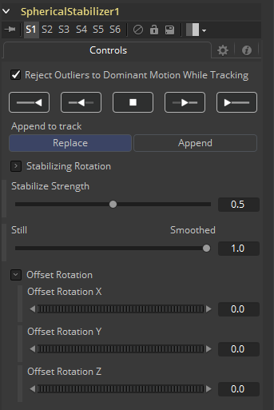

### Spherical Stabilizer [SSt] 球形稳定器

VR实景通常是使用手持摄像机拍摄的，因此镜头可能会晃动。Spherical Stabilizer工具将自动识别并跟踪素材中的视觉特征，然后分析它的运动来识别平移、倾斜和横滚旋转。跟踪之后，可以平滑或稳定素材的旋转。该工具需要球形布局的图像，可以是LatLong（2:1经纬投影）、水平/垂直Cross或水平/垂直Strip中的任何一个。

#### Controls 控件

##### Reject Outliers to Dominant Motion While Tracking 跟踪时拒绝异常值占主导运动

勾选此控件（默认设置）后，与大多数其他特征相反移动的特征将被忽略。这可以帮助忽略拍摄对象的移动，而从周围环境中选择稳定且一致的标记。

##### Track Controls 跟踪控件

这些控件启动对镜头的跟踪和分析。注意，用于稳定的参考帧被设置为跟踪的第一帧。

- **Track Backwards from end frame 从结束帧反向跟踪：**从渲染范围的结束处开始反向跟踪。
- **Track Backwards from current time 从当前帧反向跟踪：**从当前帧开始反向跟踪。
- 停止跟踪，保留目前所有的结果。
- **Track Forward from current time 从当前帧正向跟踪：**从当前帧开始正向跟踪。
- **Track Forward from start frame 从起始帧正向跟踪：**从渲染范围的起始处开始正向跟踪。

##### Append to Track 追加至跟踪

- **Replace 替换：**会导致跟踪控件丢弃任何先前的跟踪结果，并使用新创建的跟踪替换他们。
- **Append 追加：**会向先前的跟踪添加新跟踪的结果。

##### Stabilization Strength 稳定强度

该控件改变所应用的平滑或稳定程度，自0.0（无变化）至1.0（最大值）。

##### Still – Smooth 静止—平滑

Spherical Stabilizer工具可以消除镜头中的所有旋转，固定平视点（Still模式，0.0），或平滑平移、横滚或倾斜来增加观看者的舒适度（Smooth模式，1.0）。此控件允许任一个选项，或介于两者之间的任何选项。

##### Offset Rotation 偏移旋转

通常，镜头无法完全保持水平，需要重新矫正地平线，或者在完全稳定镜头后应重新引入所需的平移。通过Offset Rotation控件，可以分别手动控制素材的稳定器旋转，俯仰/倾斜（X）、平移/偏航（Y）和横滚（Z）。旋转始终以该顺序执行，即XYZ。

