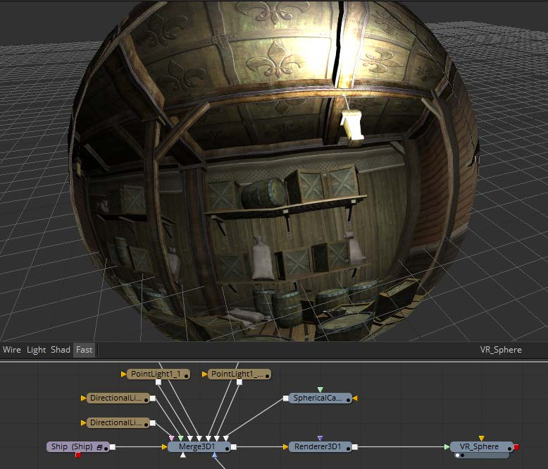

### VR Tools

360°（全景）视频，通常被称为虚拟现实或VR，已在Fusion中出现并修复了十多年。Dome Productions、天象馆和其他特殊场景产品利用Fusion的灵活性及其3D系统来生产和交付特殊内容。

360°视频通常以等矩形（经-纬）格式表示，类似于世界地图表示地球的方式，极点位于图像的顶部和底部边缘，正视点位于中心。立体VR可以从两个堆叠的经纬度图像（每个眼睛一个）创建。也可以从3D CGI场景创建VR视频。

Fusion支持一些常见的球形视频格式，并可以很轻松地相互转换。

- **VCross**和**HCross**是垂直或水平放置的立方体十字展开的六个正方形面，正视图位于十字中间，图像比例为3:4或4:3。
- **VStrip**和**HStrip**是以一条线垂直或水平放置的立方体展开的六个正方形面，顺序为左、右、上、下、后、前（X、-X、+Y、-Y、+Z、-Z），图像比例为1:6或6:1。
- **LatLong**是等矩形映射的单张2:1图像。

Fusion 9内置支持Oculus Rift和HTC Vive等VR头盔。Fusion将直接从合成显示球形视频和实时3D场景到头盔。

Fusion的用于VR的“后期修复”工具可轻松完成这些类型产品中常见的几个重要任务。