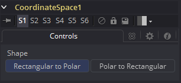

### Coordinate Space [CdS] 坐标空间

Coordinate Space工具更改它输入处图像的坐标空间，从直角坐标更改至极坐标或极坐标至直角坐标。

#### Controls 控件

##### Example 示例

演示一下可以通过该工具完成的基本的隧道效果：

- 创建一些文字并添加动画使之沿着帧顶部至底部的路径移动。
- 将Text+工具的输出连接至Coordinate Space工具。
- 在Shape菜单中悬着Polar to Rectangle（极坐标至直角坐标）。
- 随着文本沿着原始的路径从顶部移动至底部时，它在Coordinate Space工具种看起来就像是从无穷远处移动过来。有时会有必要使用Transform（Xf）工具来翻转文本，让它在Coordinate Space工具中是正确的。另一种Coordinate Space的常见用途是将其成对使用：两个有着不同的Shape设置，并在其中使用Drip或Transform工具。这么用的话，会获得一些修改过的效果而图像仍然是相同的坐标系。

