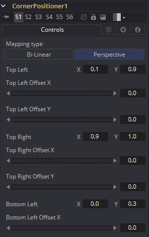
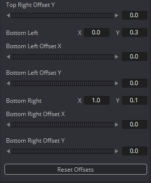

### Corner Positioner [CPn] 角落定位器

Corner Positioner使用交互式的方法来定位图像的四个角落。这通常会用于替换告示牌或其他场景中的一块矩形部分。要添加动画的话，连接所有角落至路径或跟踪器。

#### Controls 控件

##### Mapping Type 映射类型

这确定了用于Corner Positioner投射图像所使用的方法。在Bi-Linear（二次线性）模式中，会使用直接的2D变形。在Perspective（透视）模式中，图像会通过2D空间的偏移来计算并映射进3D透视中。

##### Corners X and Y 角落X和Y

Conrner Positioner中有四个点，交互式地拖动来定位图像每个角落。也可将这些控制点连接到其他一般修改器。

图像会变形并正确地透视来匹配这四个角落。

##### Offset X and Y 偏移X和Y

这些控件可以用于微调角落的偏移位置。通常会用于角落通过图案连接至跟踪器而并没有被理想地定位时。

