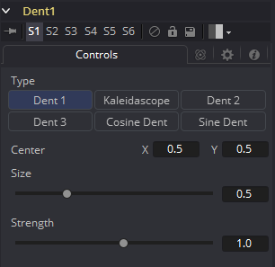

### Dent [Dnt] 凹痕

Dent的功能是创建一种类似鱼眼镜头效果的圆形畸变的图像。

#### Controls 控件

##### Type 类型

从该菜单中选择Dent滤镜使用的类型。Dent使用的所有参数都是可以添加动画的。

- **Dent 1 凹痕1：**创建一个凸起的凹痕。
- **Kaleidoscope 万花筒：**创建一个凹痕、镜像并反转它。
- **Dent 2 凹痕2：**创建一个变形的凹痕。
- **Dent 3 凹痕3：**创建一个畸变的凹痕。
- **Cosine Dent 余弦凹痕：**创建一个至中心点的裂痕。
- **Sine Dent 正弦凹痕：**创建一个平滑变换的凹痕。

##### Center X and Y 中心X和Y

这会定位Dent效果在图像上的中心位置。默认值未`0.5, 0.5`，也就是居中于图像。

##### Size 大小

这会更改Dent在图像上影响区域的大小。为改滑块添加动画可以使Dent增长。

##### Strength 强度

这会更改Dent的整体强度。

