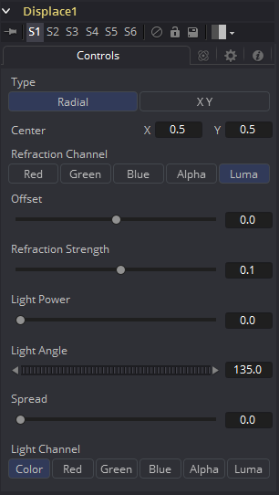

### Displace [Dsp]

该工具使用一个映射图像来置换或折射另一个图像。这会在创建一个大范围的道教效果或玻璃或水的热量畸变效果时十分有用。

#### Controls 控件

##### Type 类型

Type按钮可以用于选择Displace工具运算的模式。Radial（径向）模式使用映射贴图将每个像素从中心向外折射出去，而X/Y模式提供了独立地沿着每个轴的置换量。

> **注意：**在Radial模式中有两组Refraction（折射）控件，而XY模式中有两组，分别用于X和Y通道。

##### Center 中心（仅Radial模式）

Center控件定义了像素朝着或远离哪个点置换的。

##### Refraction Channel 折射通道

该组按钮控制应从前景图像中使用是什么通道来置换图像。可以在Red、Green、Blue、Alpha或Luminance通道中选择。在X/Y模式中，该控件会出现两次，一次是X置换而另一次是Y置换。

##### Refraction Strength (Radial) 折射强度（径向）

控制折射的强度，更高的值会导致更强或更明显的折射。

##### X and Y Refraction (X/Y) X和Y折射（X/Y）

使用两个单独的滑块来单独控制沿着X和Y轴的折射强度。否则它就和Refraction Strength完全一样了。

##### Light Power 光照力度

这控制了模拟光照的强度，使得亮部和暗部根据折射图像的轮廓而形成。更高的值会值得亮部和暗部更加明显。

##### Light Angle 光照角度

这设置了模拟光源的角度。

##### Spread 扩散

这会价款置换效果并使边缘脱离折射贴图。更高的值会使凸起的脊或边缘散开。

##### Light Channel 光照通道

从折射图像中选择会用于模拟光源的通道。可以在Color、Red、Green、Blue、Alpha或Luminance通道中选择。

> **注意：**Radial模式将会基于置换贴图的像素值将像素朝着或背着中心点推动。XY模式会使用贴图的两个不同的通道来水平或垂直置换像素，来获取更精确的结果。使用XY模式，Displace模式甚至可以完成更简单的变形效果。Light控件会允许被折射像素的定向高光来模拟倒角的外观。

