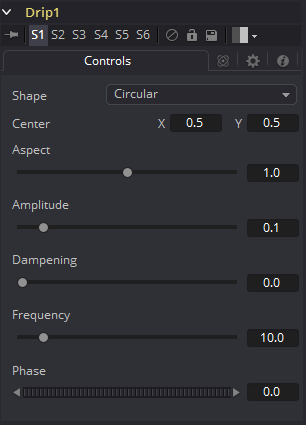

### Drip [Drp] 波纹

Drip的功能使在整个图像上创建一个涟漪的效果，它也可以添加动画使得让涟漪从一个中心源向外运动。有很多种不同的涟漪效果来选择。

#### Controls 控件

##### Shape 形状

使用该控件来选择Drip的形状。

- **Circular 圆形：**创建一个圆形的涟漪。这是默认的Drip形状。
- **Square 方形：**创建一个等边四边形的Drip。
- **Random 随机：**创建随机分散的噪声来扭曲你的图像。类似于粒子效果。
- **Horizontal 水平：**创建沿一个方向运动的水平波纹。
- **Vertical 垂直：**创建沿一个方向运动的垂直波纹。
- **Exponential 指数：**创建一个看起来像拥有了反转扭曲边（就像指数曲线反转并镜像）的菱形的Drip。
- **Star 星形：**创建一个八角的对称星形涟漪，运动起来就像万花筒一样。
- **Radial 径向：**创建从固定图案中发射出的星形涟漪。

##### Center X and Y 中心X和Y

使用该控件来定位图像中Drip效果的中心。默认值为`0.5, 0.5`，也就是将效果在图像中居中。

##### Aspect 宽高比

控制各类Drip形状的宽高比。值为1.0会使形状是对称的。较小的值会使形状变得高高瘦瘦的，而较大的值会使形状变得矮矮宽宽的。

##### Amplitude 幅度

Drip效果的Amplitude指的是每个涟漪中的峰的高度。使用该滑块来更高Drip应用值图像的扭曲量。值为0.0会使涟漪没有高度而且效果也是透明的了。而最大幅度10使每个涟漪的可见度都非常大并完全扭曲图像。更高的值可以通过文本项目框来输入。

##### Dampening 阻尼

控制随着它离开效果中心时Amplitude的阻尼或衰减。它可以用于限制Drip影响到的大小或区域。

##### Frequency 频率

更改Drip效果从中心扩散出去的涟漪数量。值为0.0表示没有涟漪。移动最高值有100滑块，来对应自己想要的涟漪密度。

##### Phase 相位

这控制了从中心开始重复的偏移。为Phase值添加动画来完成涟漪从中心扩散的效果。