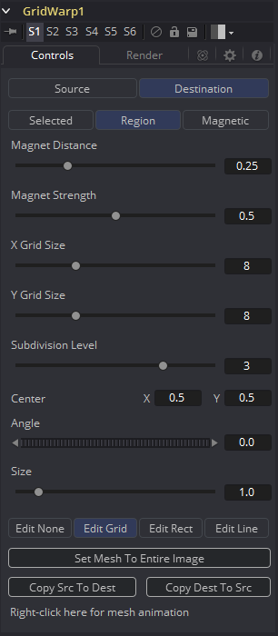
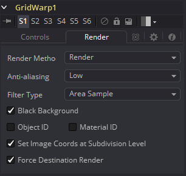
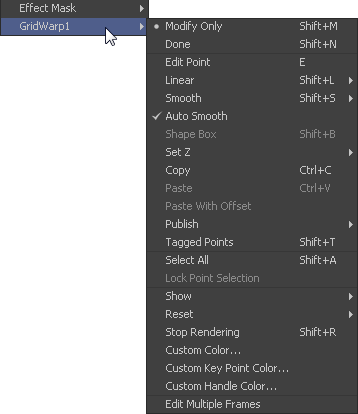
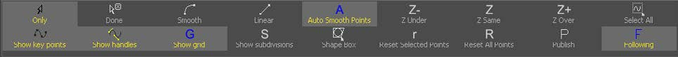

### Grid Warp [Gd] 网格变形

Grid Warp工具是一个简单的拥有可动顶点的2D变形工具。图片会变形来使得源网格匹配至目标网格。

#### Controls 控件

##### Source and Destination 源和目标

Source和Destination按钮确定了源网格和目标网格是否当前活跃。每次只有一个网格可以显示或操纵。所选的按钮会高亮来只是此时的活跃网格。

该选项卡中的所有其他控件都会影响该控件所选的网格。

##### Selection Type 选择类型

这三个按钮确定了用于操纵这些点使用的选择类型。有三个选项：

- **Selected 选择：**在Selected模式中，对网格的操纵只会应用至当前选择的点。该模式与一般的多边线操作是一样的。
- **Reign 区域：**在Reign模式中，鼠标左键单击时指针周围区域中所有的点都会随之移动。移动时新进入的点则会被忽略。
- **Magnetic 磁性：**在Magnetic模式中，鼠标左键单击时指针周围区域中所有的点都会随之移动。移动时新进入的点也会受到影响。选择该选项时还会出现Magnet Distance和Magnet Strength控件来确定区域的大小和衰减。

##### Magnet Distance 磁性距离

选择和操纵网格的默认工具是Magnet（磁性）工具。磁性在查看器中表示为一个鼠标指针周围的圆形。Magnet Distance滑块控制磁性影响的区域有多大，也就是这个圆形的大小。在网格上拖动时该滑块范围内的所有顶点都会移动。

增加该滑块的值来增加磁性的大小。另外，在按住D键时拖动鼠标也可以调整磁性的大小。

##### Magnet Strength 磁性强度

Magnet Strength滑块会增加或减少磁性光标影响的衰减。设置为0.0时，磁性鼠标没有效果，顶点也完全不会移动。增加该值，磁性也会影响到更大范围的顶点移动。使用较小的值来完成较灵敏的调整而较大的值用于对网格的大范围调整。

##### X and Y Grid Size X和Y网格大小

X and Y Grid Size滑块控制网格的分割数量。在X和Y分割交错的地方会创建一个控制顶点。

注意在引用网格的更改后调整任一该控件会重置整个网格。记得要在对网格完成更认真的细节调整前要先设置好X和Y网格为适当的分辨率。

##### Subdivision Level 细分级别

Subdivision Level确定了在每组分割之间有多少细分。细分不会在交错处生成顶点。拥有的细分越多，变形看上去就会越平滑（渲染变形也会越慢）。

##### Center 中心

Center坐标确定了网格的确切中心。在编辑网格的时候，屏上Center控件是不可见的。选中Edit Rect模式时网格中心才会变得可见并可用于编辑。

使用Center控件来在场景中移动网格不会影响到应用至单独顶点的动画。例如，在变形脸上的嘴唇时，使用跟踪器跟踪脸的运动并将网格中心连接至该跟踪器。这会使网格与轻微的头部运动匹配起来同时又可以专注于嘴唇的变形。

##### Angle 角度

Angle控件会旋转整个网格。

##### Size 大小

Size控件增加或减少网格的缩放。

##### Edit Buttons 编辑按钮

可以选择四种编辑模式，每一种都可以通过点击对应的按钮来选择：

- **Edit None 不编辑：**将网格设置为Edit None会禁用所有屏上控件的显示。
- **Edit Grid 编辑网格：**Edit Grid是默认的模式。启用该模式时，网格会绘制在查看器上，而且网格的控制点也可以被直接操纵。
- **Edit Rectangle 编辑矩形：**当网格处于Edit Rectangle模式时屏上控件会显示一个确定网格尺寸的矩形。矩形的四边可以调整来增大会减小网格的尺寸。该模式也会显示网格的屏上Center控件。
- **Edit Line 编辑线：**Edit Line模式在有机物体上创建网格时非常有用。当启用该模式时，所有的屏上控件都会消失，并可以绘制一条围绕要变形形状或物体的样条线。启用该模式时会有额外的控件出现，如Tolerance、Over Size和Snap Distance。这些控件在下方说明。

##### Set Mesh to Entire Image 将网格设置为整个图像

Set Mesh to Entire Image按钮会自动重置网格大小至图像的尺寸。在网格中所有对顶点的调整也会被重置。

##### Copy Buttons 复制按钮

这两个按钮提供了复制源网格的确切形状和尺寸至目标网格的方法（或反过来）。这在进行变形前设置源网格来确保目标网格匹配源网格的初态时尤为有用。

##### Point Tolerance 点容差

该控件只在启用Edit Line模式时可见。Point Tolerance滑块控件确定了网格会应用多少镶嵌来紧密匹配样条上的点密度。值越低，结果网格上就会有越少的顶点，网格也会显得更一致。值越高就会应用越精密变化的网格来记录需要更多细节样条的区域。

##### Oversize Amount 超尺寸量

该控件只在启用Edit Line模式时可见。Oversize Amount滑块用于设置网格周围多大区域来包含样条线。该值越高，创建的范围越大，在将变形混合回源图像时也越有用。

##### Snap Distance 吸附距离

该控件只在启用Edit Line模式时可见。Snap Distance滑块指示了绘制出的样条线吸引周围的顶点多强。如果一个顶点距离样条边缘足够近的话，那么顶点将会移动至与样条平齐。该值越高，样条线的作用范围也越广。

##### Right-Click Here for Mesh Animation 右击此处以创建Mesh动画

网格在默认情况下时静态的。右击Right-Click Here for Mesh Animation标签会提供一个上下文菜单，其中便有为网格添加动画或连接至合成中其他网格的选项。

网格使用了Polychange样条，对控制点做出的任何调整都会向Polychange样条的所有点添加或修改关键帧。

##### Right-Click Here for Shape Animation 右击此处以创建形状动画

该标签只在Edit Line模式中可见。右击Right-Click Here for Shape Animation会显示一个上下文菜单，其中便有为网格添加动画或连接至合成中其他网格的选项。

#### Render Tab 渲染选项卡

##### Render Method 渲染方法

Render Method下拉菜单用于选择应用至mesh渲染的渲染技术与质量。三个选项是按质量的顺序排列的，第一个（Wireframe 线框）是最快的，但质量最差。默认的模式是Render，它提供了最终的分辨率以及完整质量的结果。

##### Anti-Aliasing 抗锯齿

Anti-Aliasing控件在Wireframe渲染模式中是以一个复选框。

而在其他模式中是一个下拉菜单，可选三级质量。较高的抗锯齿度数会大幅改进图像质量但同样也巨大地增加了渲染时间。Low设置在设置一个大密度的网格或预览流程是会是一个合适的向，但几乎永远不会用于最终渲染。

##### Filter Type 滤镜类型

该控件只在渲染模式不为Wireframe时可见。Area Sample（区域采样）可以极大地提高渲染质量，但代价是速度。

##### Wireframe Width 线框宽度

该控件只在渲染模式设置为Wireframe时出现。它确定了编织线框的线的宽度。

##### Anti-Aliased 抗锯齿

该控件只在渲染模式设置为Wireframe时出现。使用该复选框来启用/禁用对编织线框的线的抗锯齿。

##### Black Background 黑背

Black Background复选框确定了源图像中网格外部的像素会设置为黑色或被保留。

##### Object ID and Material ID 物体ID和材质ID

启用Object ID或Material ID复选框来使网格再最终渲染时输出合适的ID通道。

##### Set Image Coordinates at Subdivision Level 在细分级别处设置图像坐标

该复选框默认勾选。

##### Force Destination Render 强制目标渲染

该复选框默认勾选。

#### Right Click Menu 右键菜单

Grid Warp工具会为源和目标网格在查看器中的上下文菜单中添加一个子菜单。这些菜单拥有完全相同的名字，其中只有被激活的网格才拥有选项，而另一个是空的。该上下文菜单选项在所有查看器中出现的工具栏中可用。

##### Modify Only/Done 仅修改/已完成

这两个选项分别将网格设置为仅修改和已完成模式。选择Modify Only来编辑网格，而Done用于防止对网格的其他修改。

##### Smooth/Linear 平滑/线性

应用或移除使用Smooth和Linear对选中点的平滑。

##### Auto Smooth Points 自动平滑点

档启用Auto Smooth Points是，网格中的点会在移动时自动被平滑。这在默认情况是开启的。

##### Z Under/Z Same/Z Over Z之下/Z相同/Z之上

当两个顶点在网格覆叠中，其中一个会最终裁剪掉另一个。Z Under、Z Same和Z Over用于选择哪个顶点会被渲染在顶部而哪一个会被渲染在底部。

##### Select All 选择全部

该选项会选择网格中的所有点。

##### Show Key Points, Handles, Grid and Subdivisions 显示关键点、手柄和细分

使用这四个选项来启用或禁用对网格、关键点（顶点）、贝塞尔手柄和细分在查看器中的显示。

##### Reset Selected Points 重置所选点。

将所选点（顶点）重置到他们默认的位置。

##### Reset All Points 重置所有点

将网格中所有的点（顶点）重置到他们默认的位置。

##### Stop Rendering 停止渲染

该选项会启用Stop Rendering，也就是禁用Grid Warp工具中所有的渲染直至该模式关闭。这在做一系列对复杂网格的精细调整时有用。

#### Screen Controls 屏上控件

Grid Warp被选中并处于Edit Grid模式时，视图中会显示Grid Warp工具栏，该工具栏会提供各种用于对网格的操纵和调整。该工具栏中的按钮在上述上下文菜单中有描述。

