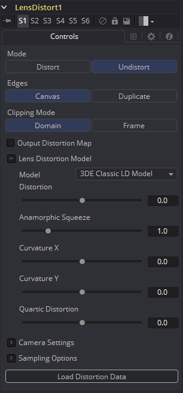

### Lens Distort [Lens]

该工具可用于项图像添加或移除镜头畸变。图像中镜头畸变的量和类型取决于多种因素，如实际使用的镜头、该镜头中镜头组的质量和量以及像移轴镜头之类的调整等等。

移除镜头畸变一个原因是合成进无畸变的图层，比如在3D渲染中，顶部是一个畸变的图层（如真实世界中的摄像机镜头）。当没有移除畸变就结合图层的话，会产生像是前景和背景的直线没对齐等不期望的效果。合成结果也看起来没有可信度。

在典型的工作流中，向原始图层应用Undistort模式的Lens Distort，向其添加3D元素红石做别的一些合成工作，最后再重新以相同的设置应用Lens Distort，但这次是使用Distort模式来得到图像原始的外观和畸变。

#### Controls 控件

##### Mode 模式

Undistort移除镜头畸变来创建扁平化图像。Distort使图像变回原始的镜头畸变。

##### Edges 边缘

确定如何处理落在帧外部的像素。

- **Canvas 画布：**帧外部的像素被置为默认的画布颜色。再多数情况下是不带alpha的黑色。
- **Duplicate 复制：**帧外部的像素会被复制。这会导致“涂抹的”边缘，但是在例如应用模糊时很实用，因为黑色的像素会在此时导致不想要的实际图像和黑色画布之间的模糊。

##### Clipping Mode 裁剪模式

- **Domain 域：**保持所有可能移动出帧外的像素一边之后重新畸变。
- **Frame 帧：**移动出帧的像素会被丢弃。

##### Output Distort Map 输出畸变贴图

将像素的位置输出为变形的屏幕坐标贴图。

##### Camera Settings 摄像机设置

该选项是Camera3D中的副本。它们可以通过手动设置或连接至现存的Camera3D。

##### Lens Distortion Model 镜头畸变模型

在此处选择合适的3D Equalizer镜头畸变模型：3DE经典模型、3DE4变形、3DE4径向鱼眼、3DE4径向。更详细的解释请参阅3D Equalizer手册。3DE经典LD模型最可能适合手动应用（取消）畸变，而不用导入镜头数据。

##### Supersampling [HiQ] 超级采样[HiQ]

设置用于确定每个目标像素的采样数。越高的超级采样几乎总是会导致更长的渲染时间。1×1二次线性总是拥有足够的质量，但是使用更高的设置会在镜头边缘的较大镜头畸变处找到明显的差别。

##### Supersampling Mode [HiQ] 超级采样模式[HiQ]

每个超级采样使用的采样类型。Nearest会产生较干脆但是有锯齿的图像。Bilinear会产生较模糊的结果。

##### Load Distortion Data 加载畸变数据

允许用户加载创建的镜头畸变档案，例如使用3D Equalizer。

##### How to Manually Determine Lens Distortion 如何手动确定镜头畸变

在理想的世界中，我们会拥有每次拍摄时确切的镜头参数并可以使用这些值来取消畸变图像。然而，在实际世界中，我们并不能获取到这些值，或者无法匹配。另一种方法时使用诸如3D Equalizer等可以分析场景并生成可以直接导入Lens Distort工具的数据集。

最后，我们也可以尝试用肉眼手动调整控件滑块。我们盯着素材中的应该为笔直水平或垂直线，使用这些控件来将它们拉直，或者也可以拍摄完整的一帧棋盘格图案来作为参考。