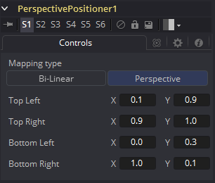

### Perspective Positioner [PPn] 透视定位器

Perspective Positioner工具是对Corner Positioner工具的补充。在图像上定位一些角落点并移动，从图像中移除透视。该功能也可以用于通过向点添加动画来随时间变化摇摆并扭曲图像。

#### Controls 控件

##### Corners X and Y 角落X和Y

在Perspective Positioner工具中有四个控件点。在视图中可以交互式地移动这些点来定位图像的每个角落。