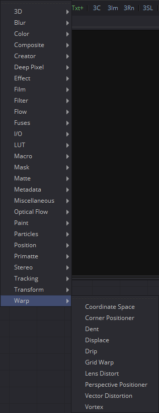
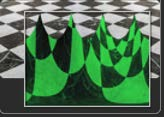
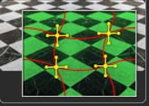
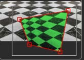
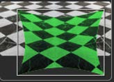
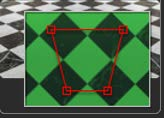
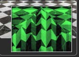
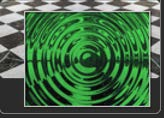

## 第二十九章 Warp Tools 变形工具

- [Coordinate Space [CdS] 坐标空间](./Coordinate%20Space%20[CdS].md) 
- [Corner Positioner [CPn] 角落定位器](./Corner%20Positioner%20[CPn].md) 
- [Dent [Dnt] 凹痕](./Dent%20[Dnt].md) 
- [Displace [Dsp]置换](./Displace%20[Dsp].md) 
- [Drip [Drp] 波纹](./Drip%20[Drp].md) 
- [Grid Warp [Grd] 网格变形](./Grid%20Warp%20[Grd].md) 
- [Lens Distort [Lens] 镜头畸变](./Lens%20Distort%20[Lens].md) 
- [Perspective Positioner [PPn] 透视定位器](./Perspective%20Positioner%20[PPn].md)
- [Vector Distortion
   [Dst] 矢量畸变](./Vector%20Distortion%20[Dst].md) 
- [Vortex [Vtx] 漩涡](./Vortex%20[Vtx].md)

<table id="img">
  <tr>
	<td rowspan="5"></td>
    <td></td>
    <td></td>
  </tr>
  <tr>
    <td></td>
    <td></td>
  </tr>
  <tr>
    <td></td>
    <td></td>
  </tr>
  <tr>
    <td></td>
    <td></td>
  </tr>
  <tr>
    <td></td>
    <td></td>
  </tr>
</table>
