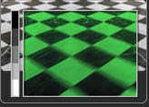

## 第二十九章 Warp Tools 变形工具

- [Coordinate Space [CdS]](./Coordinate%20Space%20[CdS].md) 
- [Corner Positioner [CPn]](./Corner%20Positioner%20[CPn].md) 
- [Dent [Dnt]](./Dent%20[Dnt].md) 
- [Displace [Dsp]](./Displace%20[Dsp].md) 
- [Drip [Drp]](./Drip%20[Drp].md) 
- [Grid Warp [Grd]](./Grid%20Warp%20[Grd].md) 
- [Lens Distort [Lens]](./Lens%20Diatort%20[Lens].md) 
- [Positive Positioner [PPn]](./Positive%20Positioner%20[PPn].md)
- [Vector Distortion
   [Dst]](./Vector%20Distortion%20[Dst].md) 
- [Vortex [Vtx]](./Vortex%20[Vtx].md)

<table id="img">
  <tr>
	<td rowspan="5"></td>
    <td></td>
    <td></td>
  </tr>
  <tr>
    <td></td>
    <td></td>
  </tr>
  <tr>
    <td></td>
    <td></td>
  </tr>
  <tr>
    <td></td>
    <td></td>
  </tr>
  <tr>
    <td></td>
    <td></td>
  </tr>
</table>

