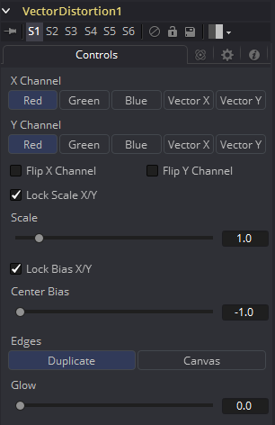

### Vector Distortion [Dst]

Vector Distortion工具基于源图像中矢量通道的数据（或第二张图像或参考图像的通道）来分别对X和Y轴进行畸变。

#### Controls 控件

##### X Channel and Y Channel X通道和Y通道

使用这些按钮来选择参考图像上的哪个通道会被用于畸变X和Y通道。如果第二（绿色）输入上没有连接畸变参考图像，那么则会使用主输入中的通道来代替。

##### Flip X and Y Channel 翻转X和Y通道

使用这些复选框来沿特定的轴翻转畸变的方向。

##### Lock Scale X/Y 锁定缩放X/Y

选中该复选框来将Scale滑块分离成单独的Scale X和Scale Y滑块。

##### Scale 缩放

使用Scale滑块来向畸变参考图像应用倍数缩放。

##### Lock Bias X/Y 锁定偏置X/Y

选中该复选框来将Bias滑块分离成单独的Bias X和Bias Y滑块。

##### Center Bias 中心偏置

使用Center Bias滑块来沿着给定的轴平移微调。

##### Edges 边缘

Edges按钮用于设定该工具如何处理接触屏幕边缘的像素。

##### Glow 发光

使用该滑块来向矢量畸变的结果添加一些发光。