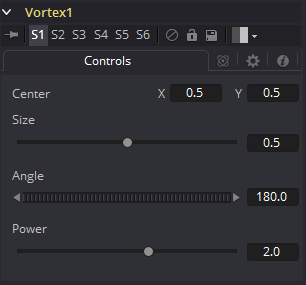

### Vortex [Vtx] 漩涡

Vortex效果会可以在图像中的特定区域显示一片漩涡。Vortex可以通过向各种控件添加动画来完成移动或变大。

#### Controls 控件

##### Center X and Y 中心X和Y

该控件用于定位图片上Vortex效果的的中心。默认值为`0.5, 0.5`，也就是将效果放置在图像的中心。

##### Size 大小

通过拖动效果的圆周或使用Size滑块来更改显示窗口中Vortex作用的范围。

##### Angle 角度

拖动查看器中的旋转手柄或使用拨轮控件来更改Vortex的旋转量。角度值越高，漩涡效果就越强。

##### Power 强度

增加Power滑块会使Vortex变得更小但更紧致。它可以有效地将漩涡集中在给定的图像区域中。

